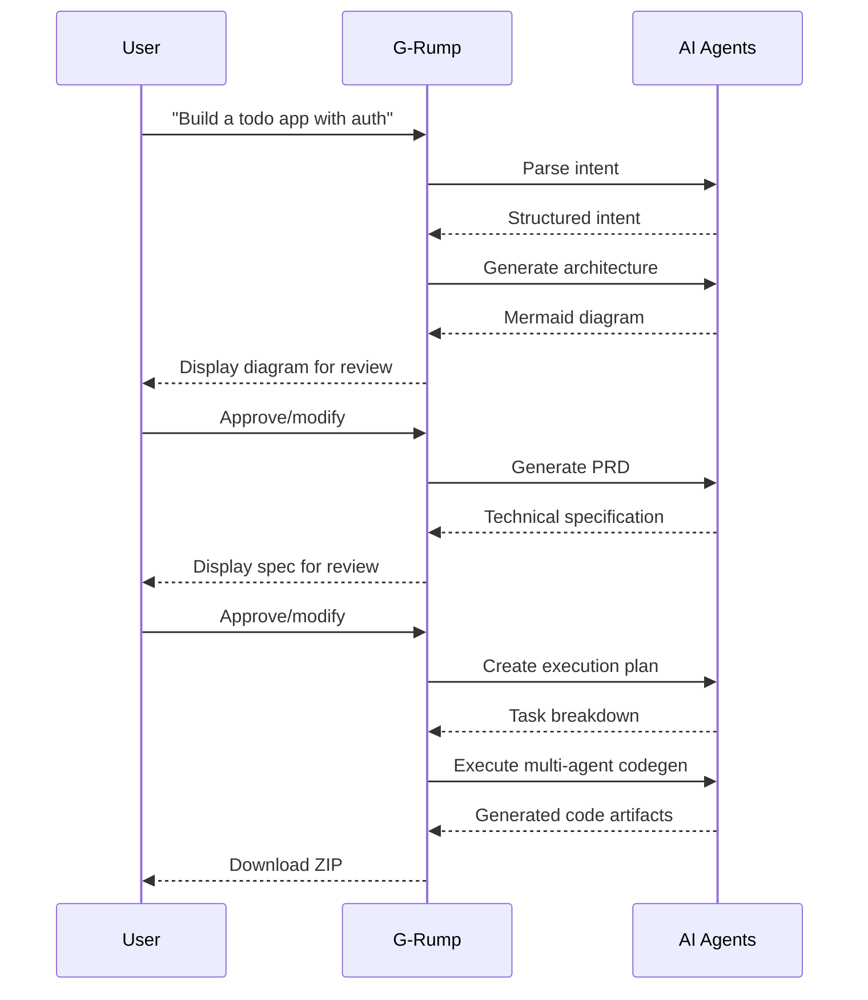
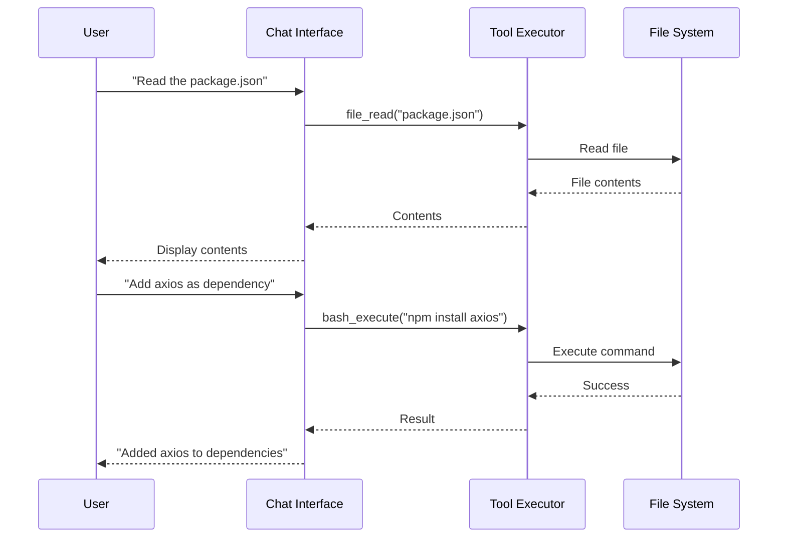

# G-Rump Product Requirements Document (PRD)

**Version:** 2.1.0  
**Last Updated:** February 4, 2026  
**Status:** Active Development  
**Document Owner:** G-Rump Product Team

---

## Table of Contents

1. [Executive Summary](#1-executive-summary)
2. [Product Vision](#2-product-vision)
3. [Target Users](#3-target-users)
4. [Core Features](#4-core-features)
5. [System Architecture](#5-system-architecture)
6. [User Workflows](#6-user-workflows)
7. [Technical Requirements](#7-technical-requirements)
8. [API Specification](#8-api-specification)
9. [Security Requirements](#9-security-requirements)
10. [Performance Requirements](#10-performance-requirements)
11. [Integration Requirements](#11-integration-requirements)
12. [Deployment Options](#12-deployment-options)
13. [Success Metrics](#13-success-metrics)
14. [Roadmap](#14-roadmap)
15. [Appendix](#15-appendix)

---

## 1. Executive Summary

### 1.1 Product Overview

**G-Rump** is an AI-powered development platform that transforms natural language descriptions into production-ready applications. Branded as "The AI Product Operating System," it bridges the gap between business requirements and deployable software by automatically generating architecture diagrams, technical specifications, and full-stack code.

### 1.2 Problem Statement

Traditional software development requires extensive manual effort to translate business requirements into technical implementations. Developers spend significant time on:

- Creating architecture documentation
- Writing technical specifications
- Scaffolding project structures
- Implementing boilerplate code
- Setting up DevOps configurations

### 1.3 Solution

G-Rump addresses these challenges through:

- **Natural Language Processing**: Convert plain English descriptions into actionable development artifacts
- **Multi-Agent AI Orchestration**: Specialized AI agents for frontend, backend, DevOps, testing, and documentation
- **Architecture-as-Code Philosophy**: Treat architecture diagrams as the source of truth for code generation
- **Intelligent Model Routing**: Cost-aware selection of optimal AI providers for each task

### 1.4 Key Value Propositions

| Benefit | Description |
|---------|-------------|
| **Speed** | Reduce project scaffolding from days to minutes |
| **Consistency** | Enforce architectural patterns across generated code |
| **Quality** | Built-in quality assurance with auto-fix capabilities |
| **Flexibility** | Support for multiple languages, frameworks, and deployment targets |

---

## 2. Product Vision

### 2.1 Mission Statement

To democratize software development by enabling anyone to transform ideas into production-ready applications through natural language interaction with AI.

### 2.2 Core Philosophy: Architecture-as-Code

G-Rump treats the architecture diagram and specification as the single source of truth, similar to how Terraform treats infrastructure definitions. AI is used to enforce architectural decisions during code generation, ensuring consistency between design and implementation.

### 2.3 Operating Modes

#### Mode 1: Architecture Mode (Design-First)
```
Describe → Architecture (Mermaid) → Spec (PRD) → (optional) Code
```
Lead with design; code generation is optional. Ideal for architects and technical leads who need documentation before implementation.

#### Mode 2: Code Mode (Tool-Enabled Chat)
AI-powered chat with workspace-aware tools for interactive development:
- File operations (read, write, edit)
- Command execution (sandboxed bash)
- Version control (git operations)
- Directory exploration

---

## 3. Target Users

### 3.1 Primary Personas

#### Persona 1: Independent Developer (Alex)
- **Role**: Full-stack freelance developer
- **Goals**: Rapid prototyping, client demos, MVP development
- **Pain Points**: Time spent on boilerplate, keeping up with best practices
- **Use Case**: Generate complete project scaffolds from client requirements

#### Persona 2: Technical Architect (Jordan)
- **Role**: Senior architect at mid-size company
- **Goals**: System design documentation, architecture standardization
- **Pain Points**: Manual diagram creation, spec-to-code drift
- **Use Case**: Generate and maintain architecture documentation

#### Persona 3: Development Team Lead (Sam)
- **Role**: Engineering manager leading a team of 8
- **Goals**: Consistent code quality, faster onboarding, reduced technical debt
- **Pain Points**: Code review overhead, inconsistent patterns across team
- **Use Case**: Standardized project generation with team conventions

#### Persona 4: DevOps Engineer (Casey)
- **Role**: Infrastructure and deployment specialist
- **Goals**: Automated CI/CD setup, containerization, cloud deployment
- **Pain Points**: Manual configuration, environment drift
- **Use Case**: Auto-generate Docker, Kubernetes, and CI/CD configurations

### 3.2 Secondary Personas

#### Persona 5: Product Manager (Taylor)
- **Role**: Non-technical product owner
- **Goals**: Clear technical specifications from feature descriptions
- **Use Case**: PRD generation for developer handoff

#### Persona 6: Startup Founder (Morgan)
- **Role**: Technical founder with limited resources
- **Goals**: Ship MVP quickly with minimal team
- **Use Case**: Full-stack generation from product vision

---

## 4. Core Features

### 4.1 SHIP Workflow

The flagship feature that transforms ideas into code through four phases:

| Phase | Description | Output |
|-------|-------------|--------|
| **Design** | Generate architecture diagrams from description | Mermaid C4/ERD/Sequence diagrams |
| **Spec** | Create comprehensive technical specification | PRD with user stories, API specs, data models |
| **Plan** | Break down into executable tasks | Task list with dependencies and priorities |
| **Code** | Multi-agent code generation | Full-stack application with tests and docs |

### 4.2 G-Agent Orchestration System

Multi-agent AI system with specialized capabilities:

| Agent | Responsibility | Outputs |
|-------|---------------|---------|
| **Architect** | Validates PRD, creates generation plan | Architecture validation, task breakdown |
| **Frontend** | UI components, routing, state management | Vue/React/Svelte components |
| **Backend** | APIs, database models, business logic | Node/Python/Go services |
| **DevOps** | Docker, CI/CD, deployment configs | Dockerfile, docker-compose, GitHub Actions |
| **Test** | Unit, integration, E2E tests | Jest/Vitest/Playwright tests |
| **Docs** | README, API docs, setup guides | Markdown documentation |
| **Security** | Security validation and hardening | Security audit report, fixes |
| **WRunner** | Quality assurance and auto-fix | Issue detection, automated fixes |

### 4.3 Chat Interface

Interactive AI-powered development assistant with:

- **Streaming Responses**: Real-time token streaming for immediate feedback
- **Tool Execution**: Execute commands, read/write files, manage git
- **Context Awareness**: Understands project structure and history
- **Multi-Model Support**: Switch between AI providers based on task

### 4.4 Architecture Diagram Generation

Automatic generation of multiple diagram types:

- **C4 Model Diagrams**: Context, Container, Component, Code levels
- **Entity Relationship Diagrams**: Database schema visualization
- **Sequence Diagrams**: API flow and interaction patterns
- **Flowcharts**: Business logic and decision trees

### 4.5 RAG-Enhanced Context

Retrieval-Augmented Generation for improved accuracy:

- **Codebase Indexing**: Vector embeddings of project files
- **Hybrid Search**: Combined semantic and keyword search
- **Cross-Encoder Reranking**: Improved relevance scoring
- **Graph RAG**: Relationship-aware document retrieval

### 4.6 Template System

Pre-built templates for common project types:

- REST API (Node.js/Express, Python/FastAPI, Go/Gin)
- Web Application (React, Vue, Svelte)
- Mobile Application (React Native, Flutter)
- Microservices Architecture
- CLI Tool
- Chrome Extension

### 4.7 Quality Assurance

Built-in quality enforcement:

- **Work Reports**: Detailed output from each agent
- **WRunner Analysis**: Automatic issue detection
- **Auto-Fix System**: Automated remediation of identified issues
- **Code Validation**: Syntax and lint checks before delivery

---

## 5. System Architecture

### 5.1 High-Level Architecture

```
┌─────────────────────────────────────────────────────────────────┐
│                         Clients                                  │
│   CLI │ Desktop (Electron) │ VS Code │ Web │ Bots (Discord)    │
└──────────────────────────────┬──────────────────────────────────┘
                               │
┌──────────────────────────────▼──────────────────────────────────┐
│                    API Gateway (Express 5)                       │
│   Middleware: CORS → Helmet → Compression → Rate Limit          │
│              → Agent Governance → Auth → Routes                 │
└──────────────────────────────┬──────────────────────────────────┘
                               │
┌──────────────────────────────▼──────────────────────────────────┐
│                      Core Services                               │
│   Intent Compiler │ LLM Gateway │ 3-Tier Cache │ RAG Engine    │
│   Agent Orchestrator │ Tool Execution │ Path Policy             │
└──────────────────────────────┬──────────────────────────────────┘
                               │
┌──────────────────────────────▼──────────────────────────────────┐
│                      AI Providers                                │
│   NVIDIA NIM │ Kimi K2.5 │ OpenRouter │ Anthropic │ Ollama          │
│              │ Ollama (Local) │ GitHub Copilot │ Mistral        │
└──────────────────────────────┬──────────────────────────────────┘
                               │
┌──────────────────────────────▼──────────────────────────────────┐
│                       Data Layer                                 │
│   SQLite/PostgreSQL │ Redis │ Pinecone │ File Storage          │
└─────────────────────────────────────────────────────────────────┘
```

### 5.2 Monorepo Structure

```
g-rump/
├── frontend/                 # Svelte 5 + Electron desktop app
│   ├── src/
│   │   ├── lib/             # Svelte components
│   │   ├── routes/          # SvelteKit routes
│   │   └── electron/        # Electron main process
│   └── package.json
│
├── backend/                  # Express 5 API server
│   ├── src/
│   │   ├── routes/          # API endpoints
│   │   ├── services/        # Business logic
│   │   ├── middleware/      # Express middleware
│   │   ├── gAgent/          # Agent orchestration
│   │   └── db/              # Database layer
│   └── package.json
│
├── packages/
│   ├── ai-core/             # Model router & registry
│   ├── cli/                 # @g-rump/cli (global CLI tool)
│   ├── shared-types/        # Shared TypeScript types
│   ├── rag/                 # RAG engine
│   ├── memory/              # Conversation memory
│   └── vscode-extension/    # VS Code extension
│
├── intent-compiler/          # Rust NL→JSON parser
│   ├── src/
│   └── Cargo.toml
│
├── services/
│   ├── nemo-curator/        # NVIDIA NeMo synthetic data
│   └── nemo-training/       # NVIDIA NeMo fine-tuning
│
├── deploy/                   # Deployment configurations
│   ├── docker/
│   ├── kubernetes/
│   └── ngc/                 # NVIDIA NGC cloud
│
└── docs/                     # Documentation
```

### 5.3 Technology Stack

#### Frontend
| Technology | Version | Purpose |
|------------|---------|---------|
| Svelte | 5.x | UI framework |
| Electron | 28.x | Desktop app shell |
| Vite | 5.x | Build tool |
| TailwindCSS | 3.4.x | Styling |
| Mermaid.js | 10.x | Diagram rendering |
| TypeScript | 5.3.x | Type safety |

#### Backend
| Technology | Version | Purpose |
|------------|---------|---------|
| Node.js | 20.x LTS | Runtime |
| Express | 5.x | Web framework |
| SWC | 1.3.x | TypeScript compilation |
| Pino | 8.x | Logging |
| BullMQ | 5.x | Job queue |
| Zod | 3.x | Schema validation |

#### AI/ML
| Technology | Purpose |
|------------|---------|
| Rust Intent Parser | SIMD-accelerated NL parsing |
| NVIDIA NIM | Primary LLM inference |
| OpenTelemetry | Observability |
| Pinecone | Vector database |

#### Data
| Technology | Purpose |
|------------|---------|
| SQLite | Development database |
| PostgreSQL/Supabase | Production database |
| Redis | Caching & job queue |
| Pinecone | Vector embeddings |

---

## 6. User Workflows

### 6.1 Full Project Generation (SHIP Workflow)



### 6.2 Interactive Chat Development



### 6.3 Architecture Documentation

1. User describes existing or planned system
2. G-Rump analyzes description for components and relationships
3. Generates appropriate diagram type (C4, ERD, sequence)
4. User reviews and iterates on diagram
5. Export to Mermaid, PNG, or SVG

### 6.4 PRD Generation

1. User provides high-level product description
2. G-Rump generates comprehensive PRD including:
   - Executive summary
   - User personas
   - Feature specifications
   - User stories with acceptance criteria
   - API endpoint definitions
   - Data model schemas
   - Success metrics
3. User reviews and refines
4. Export to Markdown or PDF

### 6.5 CLI Automation

```bash
# Full ship workflow
grump ship "Build a REST API with JWT authentication"

# Generate specific artifacts
grump generate --type=frontend "React dashboard with charts"
grump generate --type=backend "FastAPI microservice"

# Interactive chat mode
grump chat -i

# Architecture only
grump architect "E-commerce platform with microservices"
```

---

## 7. Technical Requirements

### 7.1 Functional Requirements

#### FR-001: Natural Language Processing
- **Description**: System shall parse natural language descriptions into structured intents
- **Acceptance Criteria**:
  - Parse rate >= 1000 intents/second
  - Accuracy >= 95% on standard test set
  - Support for 10+ languages

#### FR-002: Architecture Diagram Generation
- **Description**: System shall generate valid Mermaid diagrams from descriptions
- **Acceptance Criteria**:
  - Support C4, ERD, sequence, and flowchart types
  - Diagrams render without errors
  - Export to PNG, SVG, and Mermaid source

#### FR-003: Multi-Agent Code Generation
- **Description**: System shall coordinate specialized agents for code generation
- **Acceptance Criteria**:
  - Support frontend, backend, DevOps, test, and docs agents
  - Agents operate in parallel where possible
  - Generated code passes lint checks

#### FR-004: Tool Execution
- **Description**: System shall execute tools in sandboxed environment
- **Acceptance Criteria**:
  - Support file read/write/edit operations
  - Support command execution with timeout
  - Prevent path traversal attacks
  - Log all tool executions

#### FR-005: Streaming Responses
- **Description**: System shall stream AI responses in real-time
- **Acceptance Criteria**:
  - First token latency < 500ms
  - Support for multiple concurrent streams
  - Graceful handling of connection drops

### 7.2 Non-Functional Requirements

#### NFR-001: Performance
- Backend build time < 5 seconds
- Intent parsing < 20ms
- API response time p95 < 2 seconds
- Support 1000 concurrent users

#### NFR-002: Availability
- 99.9% uptime for cloud deployment
- Graceful degradation when AI providers unavailable
- Automatic failover between providers

#### NFR-003: Scalability
- Horizontal scaling for API servers
- Queue-based processing for long-running tasks
- Caching at multiple levels

#### NFR-004: Security
- See Section 9 for detailed security requirements

---

## 8. API Specification

### 8.1 Core Endpoints

#### Ship Workflow
```
POST /api/ship/start
POST /api/ship/design
POST /api/ship/spec
POST /api/ship/plan
POST /api/ship/code
GET  /api/ship/status/:sessionId
GET  /api/ship/download/:sessionId
```

#### Chat Interface
```
POST /api/chat/message
POST /api/chat/stream
GET  /api/chat/history/:sessionId
DELETE /api/chat/session/:sessionId
```

#### Code Generation
```
POST /api/codegen/generate
POST /api/codegen/stream
GET  /api/codegen/status/:jobId
```

#### Architecture
```
POST /api/architecture/generate
POST /api/architecture/analyze
GET  /api/architecture/templates
```

### 8.2 Authentication Endpoints
```
GET  /auth/google
GET  /auth/google/callback
GET  /auth/github
GET  /auth/github/callback
GET  /auth/discord
GET  /auth/discord/callback
POST /auth/logout
GET  /auth/me
```

### 8.3 Integration Endpoints
```
POST /api/github/push
GET  /api/github/repos
POST /api/webhooks/github
POST /api/webhooks/slack
```

### 8.4 Administrative Endpoints
```
GET  /api/health/live
GET  /api/health/ready
GET  /api/metrics
GET  /api/models
GET  /api/settings
PUT  /api/settings
```

---

## 9. Security Requirements

### 9.1 Authentication & Authorization

| Requirement | Implementation |
|-------------|----------------|
| User Authentication | OAuth 2.0 (Google, GitHub, Discord) |
| API Authentication | JWT tokens with refresh |
| Session Management | Secure, HTTP-only cookies |
| Role-Based Access | User, Admin, API roles |

### 9.2 Data Protection

| Requirement | Implementation |
|-------------|----------------|
| Encryption at Rest | AES-256 for sensitive data |
| Encryption in Transit | TLS 1.3 minimum |
| Secret Management | Environment variables, vault integration |
| PII Handling | Minimal collection, user consent |

### 9.3 Application Security

| Requirement | Implementation |
|-------------|----------------|
| Input Validation | Zod schema validation on all inputs |
| Path Traversal Prevention | Path Policy Service with allowlists |
| Command Injection Prevention | Sandboxed execution, input sanitization |
| XSS Prevention | CSP headers, output encoding |
| CSRF Prevention | Token-based protection |
| Rate Limiting | Per-endpoint and global limits |

### 9.4 Infrastructure Security

| Requirement | Implementation |
|-------------|----------------|
| Network Security | VPC isolation, security groups |
| Container Security | Non-root users, minimal base images |
| Secrets Rotation | Automated rotation policies |
| Audit Logging | Comprehensive activity logs |

---

## 10. Performance Requirements

### 10.1 Response Time Targets

| Operation | Target | Measurement |
|-----------|--------|-------------|
| API Health Check | < 50ms | p99 |
| Intent Parsing | < 20ms | p95 |
| Chat Response (First Token) | < 500ms | p95 |
| Architecture Generation | < 10s | p95 |
| Full Code Generation | < 5min | p95 |
| File Operations | < 100ms | p95 |

### 10.2 Throughput Targets

| Metric | Target |
|--------|--------|
| Concurrent Users | 1,000 |
| Requests per Second | 500 |
| Concurrent Streams | 200 |
| Daily Active Users | 10,000 |

### 10.3 Resource Utilization

| Resource | Target |
|----------|--------|
| Memory per Instance | < 2GB |
| CPU per Instance | < 2 cores average |
| Disk I/O | < 1000 IOPS |
| Network Bandwidth | < 100 Mbps |

### 10.4 Caching Strategy

Three-tier caching architecture:

| Tier | Technology | TTL | Use Case |
|------|------------|-----|----------|
| L1 | In-Memory (LRU) | 5 min | Hot data, session state |
| L2 | Redis | 1 hour | Shared cache, rate limits |
| L3 | Disk | 24 hours | Large responses, embeddings |

---

## 11. Integration Requirements

### 11.1 AI Provider Integrations

| Provider | Purpose | Priority |
|----------|---------|----------|
| NVIDIA NIM | Primary inference, Nemotron models | P0 |
| Anthropic Claude | High-quality reasoning | P0 |
| OpenRouter | Multi-model access | P1 |
| Anthropic | Claude models | P1 |
| Kimi K2.5 | Long context, multilingual | P1 |
| Ollama | Local/offline models | P1 |
| GitHub Copilot | Code completion | P2 |
| Mistral | European compliance | P2 |

### 11.2 Third-Party Integrations

| Service | Integration Type | Status |
|---------|-----------------|--------|
| GitHub | OAuth, API, Webhooks | Active |
| Google | OAuth | Active |
| Discord | OAuth, Bot | Active |
| Telegram | Bot | Active |
| Slack | OAuth, Webhooks | Planned |
| Notion | API | Planned |
| Jira | API | Planned |
| VS Code | Extension | Active |

### 11.3 Infrastructure Integrations

| Service | Purpose | Status |
|---------|---------|--------|
| Supabase | Database, Auth | Active |
| Redis | Cache, Queue | Active |
| Pinecone | Vector DB | Active |
| Prometheus | Metrics | Active |
| Grafana | Dashboards | Active |
| Sentry | Error Tracking | Planned |

---

## 12. Deployment Options

### 12.1 Desktop Application (Electron)

**Best for**: Individual developers, local development

Features:
- System tray integration
- Global shortcut (Ctrl+Shift+G)
- OS notifications
- Offline capability (with Ollama)
- Protocol handling (grump:// URLs)

Requirements:
- Windows 10+, macOS 11+, Ubuntu 20.04+
- 4GB RAM minimum
- 500MB disk space

### 12.2 CLI Tool

**Best for**: Automation, CI/CD pipelines, terminal workflows

```bash
npm install -g @g-rump/cli
grump --help
```

Features:
- All core functionality via command line
- Scriptable for automation
- Pipeline integration

### 12.3 Self-Hosted (Docker)

**Best for**: Teams, enterprise deployments

```bash
docker-compose up -d
```

Requirements:
- Docker 20.x+
- 4GB RAM minimum
- Persistent storage for data

### 12.4 Cloud Deployment (NGC)

**Best for**: Production, high availability

Supported platforms:
- Google Cloud Platform (GKE)
- Amazon Web Services (EKS)
- NVIDIA NGC

Features:
- Auto-scaling
- High availability
- GPU acceleration
- Managed updates

### 12.5 Kubernetes

**Best for**: Large-scale enterprise deployments

```bash
helm install g-rump ./deploy/helm
```

Features:
- Horizontal pod autoscaling
- Rolling updates
- Service mesh integration
- Multi-region support

---

## 13. Success Metrics

### 13.1 User Engagement Metrics

| Metric | Target | Measurement |
|--------|--------|-------------|
| Daily Active Users | 10,000 | Unique users per day |
| Weekly Active Users | 50,000 | Unique users per week |
| Session Duration | > 15 min | Average time in app |
| Projects Generated | 5,000/day | Successful completions |
| Return Rate | > 40% | Users returning within 7 days |

### 13.2 Product Quality Metrics

| Metric | Target | Measurement |
|--------|--------|-------------|
| Code Generation Success | > 95% | Builds without errors |
| User Satisfaction (NPS) | > 50 | Net Promoter Score |
| Support Ticket Volume | < 0.5% | Tickets per active user |
| Error Rate | < 0.1% | Failed requests |

### 13.3 Technical Metrics

| Metric | Target | Measurement |
|--------|--------|-------------|
| API Availability | 99.9% | Uptime percentage |
| Response Time p95 | < 2s | 95th percentile latency |
| Error Rate | < 0.1% | 5xx responses |
| Build Success Rate | > 99% | CI/CD pipeline |

### 13.4 Business Metrics

| Metric | Target | Measurement |
|--------|--------|-------------|
| Cost per User | < $0.10 | Infrastructure cost |
| Conversion Rate | > 5% | Free to paid |
| Churn Rate | < 5% | Monthly churn |
| Revenue Growth | > 20% MoM | Monthly growth |

---

## 14. Roadmap

### 14.1 Version History

| Version | Release | Key Features |
|---------|---------|--------------|
| v1.0 | Q3 2025 | Core SHIP workflow, Electron app |
| v2.0 | Q4 2025 | G-Agent orchestration, Express 5 |
| v2.1 | Q1 2026 | RAG, VS Code extension (Current) |

### 14.2 Upcoming Releases

#### v2.2 (Q2 2026)
- [ ] Intent Optimizer feature module
- [ ] JetBrains IDE plugin
- [ ] Enhanced GitHub integration
- [ ] Team collaboration features
- [ ] Usage analytics dashboard

#### v2.3 (Q3 2026)
- [ ] Slack integration
- [ ] Notion integration
- [ ] Custom template marketplace
- [ ] Agent customization
- [ ] Multi-language documentation

#### v3.0 (Q4 2026)
- [ ] Enhanced G-Agent with self-improvement
- [ ] Full offline capability
- [ ] Enterprise SSO (SAML, OIDC)
- [ ] On-premise deployment option
- [ ] Custom model fine-tuning

### 14.3 Long-Term Vision

- **AI-Native IDE**: Fully integrated development environment
- **Collaborative Workspaces**: Real-time team collaboration
- **Custom Agent Training**: Train agents on company codebases
- **Enterprise Platform**: Full enterprise feature set
- **Marketplace**: Community templates and plugins

---

## 15. Appendix

### 15.1 Glossary

| Term | Definition |
|------|------------|
| **G-Agent** | G-Rump's multi-agent AI orchestration system |
| **SHIP** | The four-phase workflow: Design, Spec, Plan, Code |
| **Intent** | Structured representation of user's request |
| **RAG** | Retrieval-Augmented Generation for context enhancement |
| **WRunner** | Quality assurance and auto-fix agent |
| **NIM** | NVIDIA Inference Microservice |

### 15.2 References

- [NVIDIA NIM Documentation](https://docs.nvidia.com/nim/)
- [Mermaid.js Documentation](https://mermaid.js.org/)
- [C4 Model](https://c4model.com/)
- [Express.js Documentation](https://expressjs.com/)
- [Svelte Documentation](https://svelte.dev/)

### 15.3 Change Log

| Date | Version | Author | Changes |
|------|---------|--------|---------|
| 2026-02-04 | 2.1.0 | G-Rump Team | Initial PRD creation |

---

*This document is maintained by the G-Rump Product Team and is subject to updates as the product evolves.*
