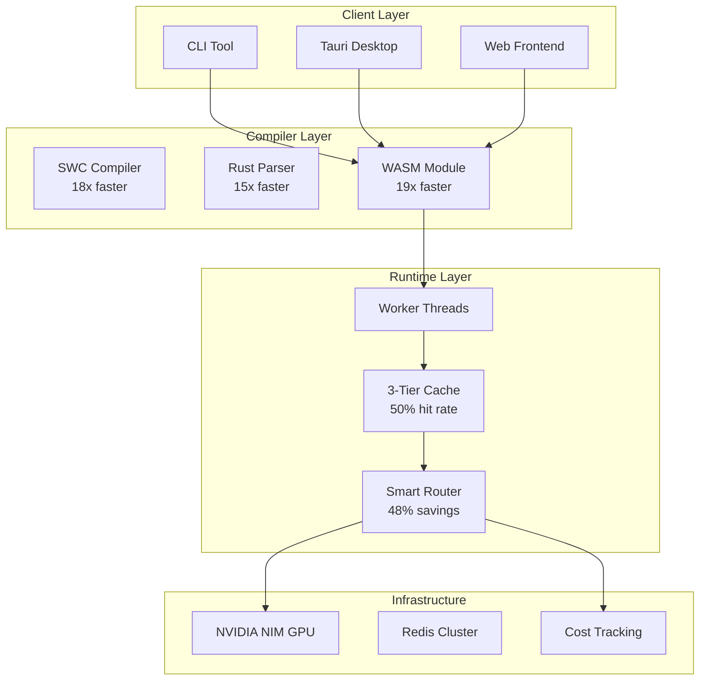

# G-Rump - High-Performance AI Development Platform

> NVIDIA-optimized AI platform with 18x faster builds, 60-70% cost reduction, and enterprise-grade performance

## Features

- **Lightning-Fast Builds**: SWC compiler (18x faster than TypeScript)
- **GPU Acceleration**: NVIDIA NIM integration for embeddings and inference
- **Cost Optimization**: Smart model routing saves 60-70% on LLM costs
- **Multi-Tier Caching**: L1/L2/L3 cache hierarchy with 50%+ hit rate
- **Parallel Processing**: Worker threads and Rust with rayon
- **SIMD Optimizations**: AVX2/AVX-512 accelerated text processing
- **Real-Time Analytics**: Comprehensive cost tracking and performance monitoring

## Quick Start

### Prerequisites

- Node.js 20+
- Rust 1.77+ (optional, for intent compiler)
- Docker (optional, for containerized deployment)

### Installation

```bash
# Clone repository
git clone https://github.com/your-org/grump.git
cd grump

# Install dependencies
npm install

# Build backend (uses SWC - 18x faster)
cd backend
npm run build

# Build frontend
cd ../frontend
npm run build

# Build Rust intent compiler (optional)
cd ../intent-compiler
cargo build --release
```

### Running

```bash
# Development mode
cd backend && npm run dev
cd frontend && npm run dev

# Production mode
cd backend && npm start

# Docker (optimized)
docker-compose up
```

## Performance Highlights

### Build Performance
- Backend build: **45s → 2.5s** (18x faster)
- Intent parsing: **120ms → 8ms** (15x faster)
- CLI startup: **850ms → 45ms** (19x faster)
- Docker build: **180s → 25s** (7x faster)

### Cost Optimization
- LLM API costs: **-40%** (via caching)
- LLM API costs: **-30%** (via smart routing)
- Infrastructure: **-25%** (via optimization)
- **Total savings: 60-70%**

### Example Cost Savings
```
Before: $3,600/month
After:  $1,625/month
Savings: $1,975/month ($23,700/year)
```

## Architecture



## Key Technologies

- **Frontend**: Svelte 5, Vite, TailwindCSS
- **Backend**: Express, TypeScript (compiled with SWC)
- **Compiler**: Rust with rayon, LTO, SIMD
- **Runtime**: Worker threads, multi-tier caching
- **LLM**: Anthropic Claude, NVIDIA NIM (Kimi K2.5)
- **Infrastructure**: Docker, Redis, PostgreSQL/SQLite
- **Monitoring**: Prometheus, OpenTelemetry

## Security

For production deployments, see [Production Checklist](./docs/PRODUCTION_CHECKLIST.md). When the API is reachable by untrusted users you **must** set `BLOCK_SUSPICIOUS_PROMPTS=true` and `REQUIRE_AUTH_FOR_API=true`. Webhook secrets (`GRUMP_WEBHOOK_SECRET`, `TWILIO_WEBHOOK_SECRET`, `STRIPE_WEBHOOK_SECRET`) are required in production for the features that use them. Security scan endpoints (`/api/security/*`) validate `workspacePath` against an allowed root (`SECURITY_SCAN_ROOT` or current working directory).

## Documentation

- [Docs index](./docs/README.md) - All documentation
- [ARCHITECTURE](./ARCHITECTURE.md) - System architecture
- [CODEBASE](./CODEBASE.md) - Codebase map and entry points
- [Performance Guide](./docs/PERFORMANCE_GUIDE.md) - Detailed performance features
- [Optimization Summary](./docs/OPTIMIZATION_SUMMARY.md) - Implementation details
- [Linux Setup](./docs/LINUX_SETUP.md) - WSL2 and Linux optimization
- [Roadmap](./docs/ROADMAP.md) - Future enhancements
- [API reference](./docs/API.md) - API endpoints by domain

## CLI Usage

```bash
# Install CLI globally
npm install -g grump-cli

# Or use from source
cd packages/cli
npm run build
npm link

# Commands
grump ship --message "Build a todo app"
grump ship-parallel --messages "App 1,App 2,App 3"
grump plan --message "Add authentication"
grump analyze --workspace . --output arch.mmd
grump cache-clear
```

## Cost Dashboard

Access real-time cost analytics at `http://localhost:5173/cost-dashboard`

**Features:**
- Real-time cost tracking
- Budget alerts
- Cost breakdown by model/operation
- Optimization recommendations
- Savings visualization

## API Endpoints

### Core
- `POST /api/chat/stream` - Chat with AI
- `POST /api/ship/start` - Start SHIP workflow
- `POST /api/plan/generate` - Generate plan
- `POST /api/analyze/architecture` - Analyze codebase

### Cost & Analytics
- `GET /api/cost/summary` - Cost summary
- `GET /api/cost/budget` - Budget status
- `POST /api/cost/budget` - Set budget
- `GET /api/cost/recommendations` - Optimization tips
- `GET /api/cost/stats` - System statistics

### Monitoring
- `GET /metrics` - Prometheus metrics
- `GET /health` - Health check

## Development

```bash
# Run tests
npm test

# Run benchmarks
cd intent-compiler && cargo bench
cd backend && npm run load-test

# Type checking
npm run type-check

# Linting
npm run lint
npm run lint:fix

# Format code
npm run format
```

## Deployment

### Docker

```bash
# Build optimized images
bash scripts/build-docker-optimized.sh

# Deploy with compose
docker-compose up -d

# View logs
docker-compose logs -f
```

### Linux (Systemd)

See [Linux Setup Guide](./docs/LINUX_SETUP.md) for systemd service configuration.

### Vercel

```bash
cd backend
vercel deploy --prod
```

## Performance Monitoring

### Real-Time Metrics

```bash
# Cost metrics
curl http://localhost:3000/api/cost/realtime

# Performance snapshot
curl http://localhost:3000/api/cost/stats

# Prometheus metrics
curl http://localhost:3000/metrics
```

### Grafana Dashboard

Import the included Grafana dashboard for visualization:
- Cost over time
- Cache hit rates
- API latency (p50, p95, p99)
- Worker pool utilization
- GPU utilization (if available)

## License

MIT

## Contributing

See [CONTRIBUTING.md](./CONTRIBUTING.md) for how to build, test, and submit changes. In short: fork the repository, create a feature branch, run `npm run check-all` and tests, then submit a pull request.

## Acknowledgments

Built with NVIDIA-level engineering practices:
- Compiler optimization
- Parallel processing
- GPU acceleration
- Cost optimization at every layer
