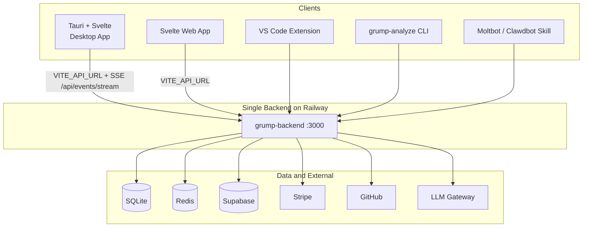
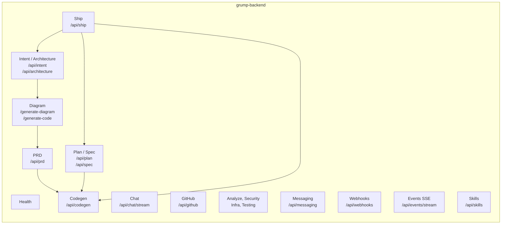
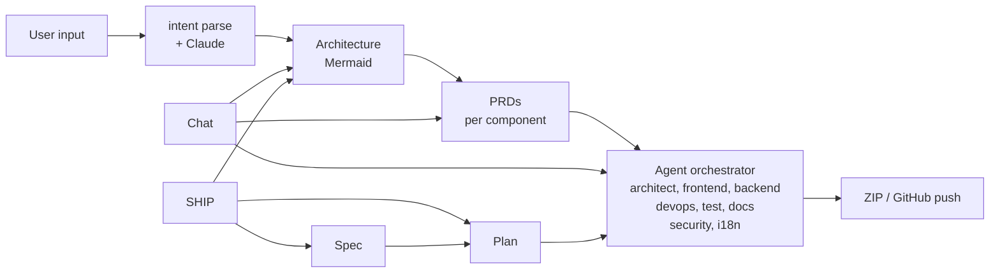
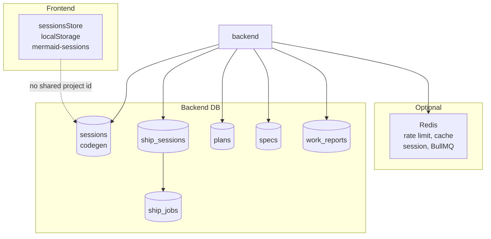

# G-Rump - Capabilities

## Core Workflow

1. **User Input** – Natural language intent + optional constraints
2. **AI Intent Understanding** – Rust Intent Compiler + Claude extract features, users, data flows, tech stack
3. **Mermaid Diagram** – Auto-create architecture (components, data flow, frontend/backend/DB)
4. **User Confirmation** – Interactive review/edit of diagram + summary (inline Mermaid + ASCII in chat)
5. **PRD Generation** – One PRD per major system/component (e.g. Auth, Core API, Frontend UI); AI suggests, user adds/removes
6. **Agent Orchestration** – Sub-agents (Backend, UI, Test, etc.) break PRDs into sub-tasks, build incrementally; each reads its PRD only
7. **Iteration & Completion** – Auto test, code download (ZIP), GitHub create + push

---

## Backend: single service on Railway

G-Rump uses **one backend** (grump-backend) for all clients. See [BACKENDS.md](BACKENDS.md).

| Service | Package name | Used by | Purpose |
|---------|--------------|---------|---------|
| **backend** | grump-backend | Desktop app, Web app, VS Code, CLI, Moltbot | Full API: intent, architecture, PRD, codegen, chat, plan, spec, ship, GitHub, health, auth, billing (Stripe webhook), collaboration, analytics, templates. SQLite + optional Redis. Default URL: `http://localhost:3000`. |

- **Desktop app:** Talks to **backend** via `VITE_API_URL` (default `http://localhost:3000`). Desktop receives ship.completed / codegen.ready via `GET /api/events/stream` (SSE).
- **Web app:** Talks to the same **backend** via `VITE_API_URL` for auth, billing, chat, codegen, collaboration, and templates.

---

## Architecture Overview

### System context (clients, backends, data, external)

### Backend API domains & pipeline

### Core workflow pipeline

### Data & sessions

- **backend** uses SQLite (better-sqlite3) for sessions, ship_sessions, plans, specs, work_reports, ship_jobs. Optional Redis for rate limiting, cache, session storage, and BullMQ job queue when `REDIS_HOST` is set. Stripe (billing webhook), collaboration, analytics, and templates are implemented in backend.
- **intent-compiler** is a Rust binary invoked by backend for intent parsing; backend enriches with Claude via LLM gateway.
- **Desktop** receives ship.completed / codegen.ready (and failures) in real time via `GET /api/events/stream` (SSE); no need to run a local webhook server.

---

## Canonical Flows

Three ways to go from idea to code; they are **not** linked by a shared project/session today.

| Flow | When to use | Path |
|------|-------------|------|
| **Chat-first** | Free-form exploration; architecture and diagrams appear in the chat thread. | User describes intent in Design mode → architecture in chat → (optional) move to phase bar for PRD/codegen, or stay in chat. |
| **Phase bar** | You already have (or will generate) architecture and want explicit PRD → codegen steps. | Architecture → PRD → codegen via WorkflowPhaseBar and workflowStore. |
| **SHIP** | Fully automated pipeline: design → spec → plan → code in one run, no chat. | User chooses SHIP submode → single run design→spec→plan→code → outcome in ShipMode. |

- **SHIP** and **phase-bar codegen** use different session types and backends (ship_sessions vs codegen sessions); they do not share or continue each other’s state.
- **Chat sessions** (localStorage) are not tied to ship or codegen sessions. A future “project” or “workspace” id could link them; that is not implemented today.

---

## Session Model

| Concept | Where it lives | Shape |
|--------|----------------|--------|
| **Chat session** | Frontend only: `sessionsStore`, localStorage key `mermaid-sessions` | `{ id, messages, name, updatedAt }`. One thread of messages; no backend persistence. |
| **Ship session** | Backend DB table `ship_sessions` | `ShipSession`: id, projectDescription, phase, status, designResult, specResult, planResult, codeResult, preferences, etc. One run of Design→Spec→Plan→Code. |
| **Codegen session** | Backend DB table `sessions`, type `generation` | Used by `/api/codegen/start`, status, download. One code-generation job. |

There is **no** shared “project” or “workspace” id linking chat ↔ ship ↔ codegen. The gap is intentional for current scope; adding an optional `projectId` (or similar) is possible later.

---

## API Summary (Backend – Desktop)

All routes below are on **backend** (grump-backend). Mount prefix is shown as first path segment.

### Health

| Method | Endpoint | Description |
|--------|----------|-------------|
| GET | `/health` | Health root |
| GET | `/health/quick` | Health check |
| GET | `/health/live` | Liveness |
| GET | `/health/ready` | Readiness (e.g. DB) |
| GET | `/health/detailed` | Detailed health |

### Intent & Architecture

| Method | Endpoint | Description |
|--------|----------|-------------|
| POST | `/api/intent/parse` | Parse NL + constraints via Intent Compiler, enrich with Claude |
| POST | `/api/architecture/generate` | Generate architecture (non-streaming) |
| POST | `/api/architecture/generate-stream` | Generate architecture (SSE) |
| POST | `/api/architecture/refine` | Refine architecture (body: `architectureId?`, `refinements[]`) |

### Diagram (mounted at `/api`)

| Method | Endpoint | Description |
|--------|----------|-------------|
| POST | `/api/generate-diagram` | Generate diagram (non-streaming) |
| POST | `/api/generate-diagram-stream` | Generate diagram (SSE) |
| POST | `/api/generate-code` | Generate downloadable ZIP from diagram |

### PRD

| Method | Endpoint | Description |
|--------|----------|-------------|
| POST | `/api/prd/generate` | Generate PRD (non-streaming) |
| POST | `/api/prd/generate-stream` | Generate PRD (SSE) |
| POST | `/api/prd/components-from-diagram` | Suggest components from architecture |
| POST | `/api/prd/generate-for-component` | Generate one PRD per component |
| POST | `/api/prd/refine` | Refine PRD |

### Codegen

| Method | Endpoint | Description |
|--------|----------|-------------|
| POST | `/api/codegen/start` | Start multi-agent code generation |
| GET | `/api/codegen/status/:sessionId` | Poll generation status |
| GET | `/api/codegen/download/:sessionId` | Download generated ZIP |
| POST | `/api/codegen/preview/:sessionId` | Preview file (body: `filePath`) |

### Chat

| Method | Endpoint | Description |
|--------|----------|-------------|
| POST | `/api/chat/stream` | Chat with streaming (Design/Code/Argument) |

### Plan

| Method | Endpoint | Description |
|--------|----------|-------------|
| POST | `/api/plan/generate` | Generate plan |
| GET | `/api/plan/:id` | Get plan |
| POST | `/api/plan/:id/approve` | Approve plan |
| POST | `/api/plan/:id/reject` | Reject plan |
| POST | `/api/plan/:id/edit` | Edit plan |
| POST | `/api/plan/:id/execute` | Execute plan |
| POST | `/api/plan/:id/complete` | Mark plan complete |
| POST | `/api/plan/:id/phase/:phaseId/status` | Update phase status |

### Spec

| Method | Endpoint | Description |
|--------|----------|-------------|
| POST | `/api/spec/start` | Start spec session |
| GET | `/api/spec/:id` | Get spec session |
| POST | `/api/spec/:id/answer` | Answer spec Q&A |
| POST | `/api/spec/:id/generate` | Generate specification |

### Ship

| Method | Endpoint | Description |
|--------|----------|-------------|
| POST | `/api/ship/start` | Start SHIP session (body: `projectDescription`, `preferences?`) |
| GET | `/api/ship/:sessionId` | Get SHIP session status and phase results |
| POST | `/api/ship/:sessionId/execute` | Run SHIP workflow (async; poll or use stream) |
| POST | `/api/ship/:sessionId/execute/stream` | Run SHIP workflow with SSE updates |

### Webhooks

| Method | Endpoint | Description |
|--------|----------|-------------|
| POST | `/api/webhooks/trigger` | Inbound trigger (CI, Slack). Auth: `X-Webhook-Secret` or body.secret. Body: `{ action: 'ship'|'chat', params }`. Returns 202 + jobId. |
| POST | `/api/webhooks/outbound` | Register outbound webhook URL (in-memory). Body: `{ url, events? }`. |

Outbound events (POST to configured URLs): `ship.completed`, `ship.failed`, `codegen.ready`, `codegen.failed`. Configure `GRUMP_WEBHOOK_URLS` (comma-separated) or use `/api/webhooks/outbound`.

### Expo test

| Method | Endpoint | Description |
|--------|----------|-------------|
| POST | `/api/expo-test/run` | Enqueue Expo test job. Body: `{ projectPath }`. Returns `{ jobId }`. |
| GET | `/api/expo-test/status/:jobId` | Get job status and result. |

### GitHub

| Method | Endpoint | Description |
|--------|----------|-------------|
| GET | `/api/github/auth-url` | OAuth authorize URL for frontend to open |
| GET | `/api/github/callback?code=...` | OAuth callback; exchange code, store token, redirect |
| GET | `/api/github/token` | Check if token stored (`{ hasToken }`) |
| POST | `/api/github/create-and-push` | Create repo, push generated code (body: `sessionId`, `repoName`, optional `token`) |

### Auth (mounted at `/auth`)

| Method | Endpoint | Description |
|--------|----------|-------------|
| POST | `/auth/signup` | Create account |
| POST | `/auth/login` | Sign in |
| POST | `/auth/logout` | Sign out (requires auth) |
| GET | `/auth/me` | Current user (requires auth) |
| GET | `/auth/status` | Auth configuration (public) |

### Analyze (codebase analysis)

| Method | Endpoint | Description |
|--------|----------|-------------|
| POST | `/api/analyze/project` | Analyze project |
| POST | `/api/analyze/architecture` | Analyze architecture |
| POST | `/api/analyze/dependencies` | Dependencies |
| POST | `/api/analyze/metrics` | Metrics |
| POST | `/api/analyze/code-smells` | Code smells |
| GET | `/api/analyze/health` | Feature health |

### Security

| Method | Endpoint | Description |
|--------|----------|-------------|
| POST | `/api/security/scan` | Security scan |
| POST | `/api/security/sbom` | SBOM |
| POST | `/api/security/compliance` | Compliance |
| POST | `/api/security/secrets-audit` | Secrets audit |
| GET | `/api/security/standards` | Standards |
| GET | `/api/security/health` | Feature health |

### Infra

| Method | Endpoint | Description |
|--------|----------|-------------|
| POST | `/api/infra/kubernetes` | Kubernetes |
| POST | `/api/infra/terraform` | Terraform |
| POST | `/api/infra/docker` | Docker |
| POST | `/api/infra/cicd` | CI/CD |
| GET | `/api/infra/templates` | Templates |
| GET | `/api/infra/health` | Feature health |

### Testing

| Method | Endpoint | Description |
|--------|----------|-------------|
| POST | `/api/testing/generate` | Generate tests |
| POST | `/api/testing/load-plan` | Load plan |
| POST | `/api/testing/coverage-analysis` | Coverage analysis |
| POST | `/api/testing/mocks` | Mocks |
| GET | `/api/testing/frameworks` | Frameworks |
| GET | `/api/testing/health` | Feature health |

Additional routes may be mounted by the **skills** system at runtime (see backend `skillRegistry.mountRoutes(app)`).

---

## Beta runtime: job queue and Redis

**Job queue:** SHIP jobs use an in-process, SQLite-backed queue (`ship_jobs` table). One worker runs per backend instance and processes one job at a time. Long-running SHIP jobs run on the **same instance that received the request**. For beta this is acceptable when running a single backend replica. For horizontal scaling, use PostgreSQL and an external queue (e.g. Bull/BullMQ with Redis) and separate workers.

**Redis:** For beta, **wire Redis** in the environment where backend runs (staging/production). Set `REDIS_HOST` (and `REDIS_PORT` if not default 6379) so rate limiting is shared across restarts and, when you scale, across replicas. Without Redis, the rate limiter falls back to in-memory limits that are not shared. Docker Compose and Railway (or other PaaS) configs should set `REDIS_HOST` to the Redis service.

---

## Messaging (Twilio) – text/call G-Rump

**Inbound webhook:** `POST /api/messaging/inbound` receives Twilio webhooks (SMS or voice). When configured, the backend runs the chat pipeline on the inbound message and can reply via Twilio.

**Config:** `MESSAGING_PROVIDER=twilio`, `TWILIO_ACCOUNT_SID`, `TWILIO_AUTH_TOKEN`, `TWILIO_REPLY_TO_NUMBER`. Optional: `TWILIO_WEBHOOK_SECRET` (if set, require `X-Webhook-Secret` header); `PHONE_TO_USER_ID` as JSON map `{"+1234567890":"user-id"}` to route phone → user. Without `PHONE_TO_USER_ID`, all numbers use user key `default`.

**Flow:** Verify webhook → resolve phone → user → append message to in-memory conversation → call chat stream → send reply via Twilio Messages API.

---

## CLI – grump-analyze

**Package:** `packages/cli`. Run `grump-analyze` to analyze a codebase and write a Mermaid architecture diagram to a file.

**Usage:** Backend must be running. `grump-analyze --workspace <path> --output <path> --url <backend>`. Defaults: cwd, `./architecture.mmd`, `http://localhost:3000`. Env: `GRUMP_API_URL`, `GRUMP_API_KEY` (optional).

---

## Integrations & extras

- **VS Code extension** (`integrations/vscode-extension`): Commands “G-Rump: New from description” and “G-Rump: Open chat”; Chat view streams from `/api/chat/stream`. Settings: `grump.apiUrl`, `grump.apiKey`.
- **Cursor / G-Rump API**: See [CURSOR_GRUMP_API.md](CURSOR_GRUMP_API.md) for when to call G-Rump (full app generation, SHIP, codegen) and key endpoints.
- **Moltbot / Clawdbot**: [integrations/moltbot-skill](../integrations/moltbot-skill) provides a SKILL.md and README so Moltbot can invoke G-Rump (SHIP, chat, codegen, status) from Telegram, WhatsApp, Discord, etc. Config: `GRUMP_API_URL`, `GRUMP_API_KEY`.
- **Webhooks**: Outbound events (`ship.completed`, `codegen.ready`, `ship.failed`, `codegen.failed`) POST to URLs in `GRUMP_WEBHOOK_URLS` or registered via `POST /api/webhooks/outbound`. Inbound `POST /api/webhooks/trigger` with `{ action: 'ship', params: { sessionId } }` enqueues a ship job and returns 202. Moltbot (or any client) can trigger ship jobs via the webhook and register an outbound URL to receive completion events.
- **ART / Blob**: GRumpBlob supports states `idle`, `thinking`, `speaking`, `success`, `error` and sizes `xs`, `sm`, `md`, `lg`, `xl` with matching animations.
- **More agents**: Codegen pipeline includes optional **security** and **i18n** agents (prompts in `backend/src/prompts/agents/`); sessions initialize with security and i18n tasks.
- **Claude Code inside G-Rump**: The codegen pipeline ([agentOrchestrator](backend/src/services/agentOrchestrator.ts)) uses [claudeCodeService](backend/src/services/claudeCodeService.ts) for post-generation analysis (patterns, complexity, security scan, performance). Plan/spec phases feed into codegen; agent outputs follow a "Claude Code" quality standard (type safety, tests, security, maintainability).

---

## Workflow optimizations (checklist)

- **Design:** Use head + design prompt; diagram streaming and refine flows use the same prompt source. Consider caching last architecture per session.
- **Code:** Unify router vs specialist behind head + code prompt; keep tool results concise; optional 1-sentence previous-turn summary for long threads.
- **Plan:** Head + plan prompt; “output a numbered plan only”; after approval, auto-suggest Execute and pass `planId` into next Code request.
- **Spec:** Head + spec prompt; optional batch questions (2–3 per turn) when low risk; configurable.
- **Argument:** Head + argument prompt; robust “do it” detection (e.g. “do it”, “go”, “use yours”).
- **SHIP:** Reuse head + design/spec/plan/code prompts; phase transitions pass full context; ShipMode UI consumes execute/stream and updates phase bar and status per event. Optional: idempotent “resume from phase X” if a phase fails.

---

## Requirements

- Node.js 20+
- Rust (Tauri + Intent Compiler)
- Anthropic API key
- Windows (standalone app target)

Optional LLM providers (chat/codegen): **Zhipu** (`ZHIPU_API_KEY`), **Copilot/Codex** (`COPILOT_API_URL`, `COPILOT_API_KEY`), **OpenRouter** (`OPENROUTER_API_KEY`). For OpenRouter, use `provider: 'openrouter'` and `modelId` e.g. `anthropic/claude-3.5-sonnet` or `openai/gpt-4o`. See [llmGateway](backend/src/services/llmGateway.ts).

Guardrailing: set `BLOCK_SUSPICIOUS_PROMPTS=true` to block requests containing prompt-injection–style patterns (default: log only). Output filters (chat stream, tool results): secrets are always redacted; set `OUTPUT_FILTER_PII=true` to redact emails/SSN-like data, `OUTPUT_FILTER_HARMFUL=true` to flag harmful code patterns. Set `STRICT_COMMAND_ALLOWLIST=true` to restrict `bash_execute` to allowed commands only (e.g. npm, npx, git).
