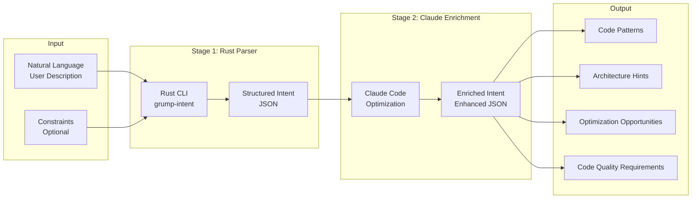

# Intent Compiler Documentation

## Overview

The Intent Compiler is a two-stage system that transforms natural language descriptions into structured, code-optimized project requirements. It combines a fast Rust-based parser with Claude Code-optimized enrichment to extract comprehensive project insights.

## Architecture



## Stage 1: Rust Parser

The Rust parser (`grump-intent`) is a fast, native CLI tool that performs initial parsing.

### Input

- **Raw Text**: Natural language description of the project
- **Constraints** (optional): Additional constraints to guide parsing

### Output: Structured Intent

```typescript
interface StructuredIntent {
  actors: string[];              // User roles/actors
  features: string[];             // Product features
  data_flows: string[];          // Data flow patterns
  tech_stack_hints: string[];    // Technology suggestions
  constraints: Record<string, unknown>;  // Parsed constraints
  raw: string;                   // Original input
}
```

### Usage

```typescript
import { parseIntent } from './services/intentCompilerService';

const intent = await parseIntent(
  "Build a todo app with user authentication",
  { complexity: 'mvp' }
);
```

## Stage 2: Claude Code Enrichment

The Claude enrichment stage uses Claude Code-optimized prompts to enhance the structured intent with code-specific insights.

### Enhanced Output: Enriched Intent

```typescript
interface EnrichedIntent extends StructuredIntent {
  enriched?: {
    features?: string[];                    // Prioritized, deduplicated features
    users?: string[];                        // User roles/actors
    data_flows?: string[];                   // Data flow patterns (REST, WebSocket, etc.)
    tech_stack?: string[];                   // Recommended technologies
    code_patterns?: string[];                // Detected patterns (REST, GraphQL, etc.)
    architecture_hints?: CodePattern[];      // Architecture pattern suggestions
    optimization_opportunities?: OptimizationOpportunity[];  // Optimization suggestions
    code_quality_requirements?: CodeQualityRequirements;    // Quality requirements
  };
}
```

### Code Patterns Detected

- **REST API**: RESTful endpoints, CRUD operations, resource-based URLs
- **GraphQL**: Complex queries, schema-first design, resolvers
- **Microservices**: Service boundaries, inter-service communication
- **Event-Driven**: Event sourcing, CQRS, message queues, pub/sub
- **Monolithic**: Single deployment, shared database
- **Serverless**: Function-as-a-Service, event triggers
- **Real-time**: WebSockets, Server-Sent Events, polling

### Architecture Hints

```typescript
interface CodePattern {
  pattern: string;              // Pattern name
  description: string;          // When and why to use
  applicability: 'high' | 'medium' | 'low';
}
```

Examples:
- Scalability patterns (horizontal/vertical scaling, caching)
- Data patterns (ACID, eventual consistency, CQRS)
- Security patterns (authentication, authorization, encryption)
- Integration patterns (API Gateway, Service Mesh, Circuit Breaker)
- Deployment patterns (blue-green, canary, rolling updates)

### Optimization Opportunities

```typescript
interface OptimizationOpportunity {
  area: 'performance' | 'security' | 'scalability' | 'maintainability';
  suggestion: string;          // Specific optimization
  impact: 'high' | 'medium' | 'low';
}
```

### Code Quality Requirements

```typescript
interface CodeQualityRequirements {
  type_safety?: 'strict' | 'moderate' | 'loose';
  testing?: {
    unit?: boolean;
    integration?: boolean;
    e2e?: boolean;
    coverage_target?: number;  // e.g., 80
  };
  documentation?: string[];    // ['code_comments', 'api_docs', 'readme']
  performance?: {
    response_time_ms?: number;
    throughput_rps?: number;
  };
  security?: string[];         // ['authentication', 'authorization', 'encryption']
}
```

## Usage

### Complete Flow

```typescript
import { parseAndEnrichIntent } from './services/intentCompilerService';

const enrichedIntent = await parseAndEnrichIntent(
  "Build a SaaS analytics platform with real-time dashboards, user management, and billing",
  {
    complexity: 'enterprise',
    focusAreas: ['scalability', 'security']
  }
);

// Access enriched data
console.log(enrichedIntent.enriched?.code_patterns);
// ['Microservices', 'Event-Driven', 'Real-time']

console.log(enrichedIntent.enriched?.architecture_hints);
// [{ pattern: 'Microservices', description: '...', applicability: 'high' }]

console.log(enrichedIntent.enriched?.code_quality_requirements);
// { type_safety: 'strict', testing: { coverage_target: 80 }, ... }
```

### Integration with Agent System

The enriched intent is automatically used by the agent orchestrator to:
1. Guide architecture decisions
2. Optimize tech stack selection
3. Apply code quality requirements
4. Implement detected patterns
5. Apply optimization opportunities

## Configuration

### Environment Variables

- `GRUMP_INTENT_PATH`: Override path to grump-intent executable
- `ANTHROPIC_API_KEY`: Required for Claude enrichment

### Path Resolution

The system automatically finds the grump-intent executable:
1. Checks `GRUMP_INTENT_PATH` environment variable
2. Production: Checks app data directory
3. Development: Checks `intent-compiler/target/release/`
4. Windows fallback: Checks `intent-compiler/target/x86_64-pc-windows-msvc/release/`

## Examples

### Example 1: Simple Todo App

**Input**:
```
"Build a simple todo app where users can create, edit, and delete tasks"
```

**Enriched Output**:
```json
{
  "enriched": {
    "code_patterns": ["REST API", "Monolithic"],
    "architecture_hints": [
      {
        "pattern": "Monolithic",
        "description": "Simple single-deployment architecture",
        "applicability": "high"
      }
    ],
    "code_quality_requirements": {
      "type_safety": "strict",
      "testing": {
        "unit": true,
        "coverage_target": 70
      }
    }
  }
}
```

### Example 2: Enterprise SaaS Platform

**Input**:
```
"Build a SaaS analytics platform with real-time dashboards, user management, and billing"
```

**Enriched Output**:
```json
{
  "enriched": {
    "code_patterns": ["Microservices", "Event-Driven", "Real-time"],
    "architecture_hints": [
      {
        "pattern": "Microservices",
        "description": "Separate services for analytics, users, billing",
        "applicability": "high"
      },
      {
        "pattern": "Event-Driven",
        "description": "Event sourcing for analytics data",
        "applicability": "high"
      }
    ],
    "optimization_opportunities": [
      {
        "area": "performance",
        "suggestion": "Implement caching for dashboard queries",
        "impact": "high"
      },
      {
        "area": "scalability",
        "suggestion": "Use message queue for async processing",
        "impact": "high"
      }
    ],
    "code_quality_requirements": {
      "type_safety": "strict",
      "testing": {
        "unit": true,
        "integration": true,
        "e2e": true,
        "coverage_target": 85
      },
      "performance": {
        "response_time_ms": 200,
        "throughput_rps": 1000
      },
      "security": ["authentication", "authorization", "encryption"]
    }
  }
}
```

## Best Practices

1. **Be Specific**: Provide detailed descriptions for better pattern detection
2. **Include Constraints**: Use constraints to guide parsing and enrichment
3. **Review Enriched Output**: Check code patterns and architecture hints
4. **Iterate**: Refine input based on enriched output
5. **Use Quality Requirements**: Let the system guide code quality standards

## Troubleshooting

### Parser Not Found

- Ensure `grump-intent` is built: `cargo build --release` in `intent-compiler/`
- Check `GRUMP_INTENT_PATH` environment variable
- Verify executable exists in expected location

### Enrichment Fails

- Check `ANTHROPIC_API_KEY` is set
- Verify API key is valid
- Check network connectivity
- Review error logs for details

### Unexpected Patterns

- Provide more context in input
- Use constraints to guide detection
- Review architecture hints for alternatives
