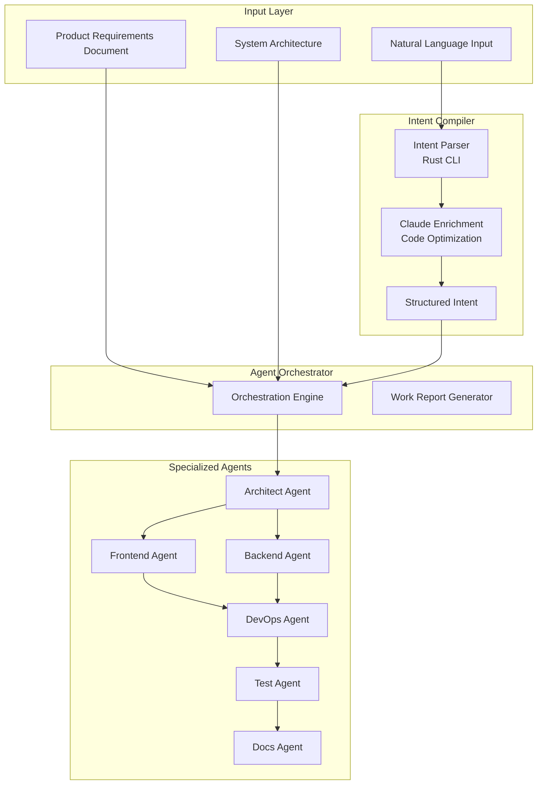

# Agent System Documentation

## Overview

The G-Rump agent system is a multi-agent code generation pipeline that uses specialized AI agents to generate complete, production-ready applications from Product Requirements Documents (PRDs).

## System Architecture



## Agent Types

### 1. Architect Agent
**Role**: Validates PRD and creates detailed code generation plan

**Responsibilities**:
- Validates PRD completeness and consistency
- Creates detailed generation plan with tasks for each agent
- Defines dependencies between components
- Suggests optimizations and best practices

### 2. Frontend Agent
**Role**: Generates production-ready frontend code (Vue/React)

**Tech Stack Support**:
- Vue 3 with Composition API + TypeScript
- React 18+ with TypeScript
- TailwindCSS for styling
- Vite as build tool

### 3. Backend Agent
**Role**: Generates production-ready backend code (Node/Python/Go)

**Tech Stack Support**:
- Node.js/Express.js with TypeScript
- Python 3.11+ with FastAPI/Django
- Go 1.21+ with Gin/Echo
- PostgreSQL or MongoDB

### 4. DevOps Agent
**Role**: Generates Docker, CI/CD, and deployment configurations

### 5. Test Agent
**Role**: Generates comprehensive test suites

**Testing Frameworks**:
- Backend: Jest with Supertest
- Frontend: Vitest with Vue Test Utils / React Testing Library
- E2E: Playwright

### 6. Docs Agent
**Role**: Generates comprehensive documentation

## Work Reports

After each agent completes code generation, it generates a work report:

1. **Summary**: Brief overview of work completed
2. **Files Generated**: List of all files with purposes
3. **Architecture Decisions**: Decisions made with rationale
4. **Code Quality Metrics**: Coverage, complexity, issues
5. **Integration Points**: Components, dependencies, contracts
6. **Testing Strategy**: Approach to testing
7. **Known Issues**: Issues found with severity
8. **Recommendations**: Suggestions for improvements

## WRunner: Quality Assurance Agent

WRunner analyzes all agent work reports and identifies issues.

### Analysis Categories

1. **Missing Components**: Features, files, API endpoints, tests
2. **Inconsistencies**: API contracts, naming, architecture
3. **Integration Gaps**: Missing connections, auth issues
4. **Quality Concerns**: Test coverage, complexity, security
5. **Security Issues**: Missing auth, vulnerabilities

### Auto-Fix System

Issues that can be automatically fixed:
- Missing files or components
- Code quality improvements
- Inconsistencies between agents

## Usage

```typescript
// Initialize session
const session = initializeSessionMulti({
  prds: [{ prd: myPRD, componentLabel: 'Frontend' }],
  architecture: myArchitecture,
  preferences: {
    frontendFramework: 'vue',
    backendRuntime: 'node',
    database: 'postgres',
    includeTests: true,
    includeDocs: true
  }
});

// Execute code generation
await executeCodeGenerationMulti(session);

// Access results
const files = session.generatedFiles;
const workReports = session.workReports;
const wrunnerAnalysis = session.wrunnerAnalysis;
```

## Best Practices

1. **PRD Quality**: Ensure PRD is complete and detailed
2. **Architecture First**: Generate architecture before code
3. **Review Work Reports**: Check agent reports for insights
4. **Review WRunner Analysis**: Address critical issues
5. **Iterate**: Use feedback to improve and regenerate
