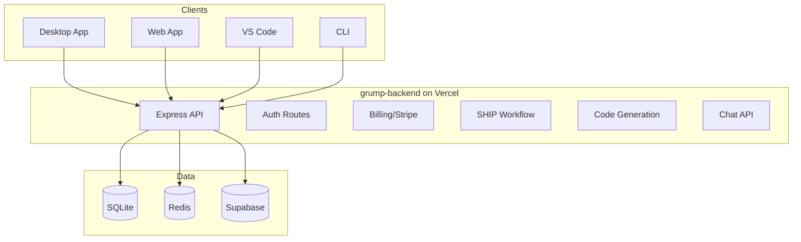

# One Backend on Vercel

G-Rump uses a **single backend** (grump-backend) deployed on Vercel. Desktop and web app both use it via `VITE_API_URL` (the Vercel URL in production, or `http://localhost:3000` in development).

## Summary

| Service | Package | Used by | Purpose |
|---------|---------|---------|---------|
| **backend** | grump-backend | Desktop (Electron), Web app, VS Code, CLI, Moltbot | Full API: intent, architecture, PRD, codegen, chat, plan, spec, ship, GitHub, health, auth, billing (Stripe webhook), collaboration, analytics, templates. SQLite + optional Redis. |

## Client Connections

- **Desktop app** talks to **backend** via `VITE_API_URL` (default `http://localhost:3000`). Auth routes (`/auth/*`) and all product APIs live on backend.
- **Web app** talks to the same **backend** via its `VITE_API_URL` for auth, billing, chat, codegen, collaboration, and templates.

## Architecture

## Environment Variables

| Variable | Description |
|----------|-------------|
| `VITE_API_URL` | Backend URL (e.g., `http://localhost:3000`) |
| `REDIS_HOST` | Redis host for caching and rate limiting |
| `SUPABASE_URL` | Supabase project URL |
| `SUPABASE_ANON_KEY` | Supabase anonymous key |
| `STRIPE_SECRET_KEY` | Stripe API key |

## See Also

- [Capabilities](/docs/capabilities) – architecture, data flow, API domains
- [Production Checklist](/guide/production) – env vars, Redis, migrations, auth
