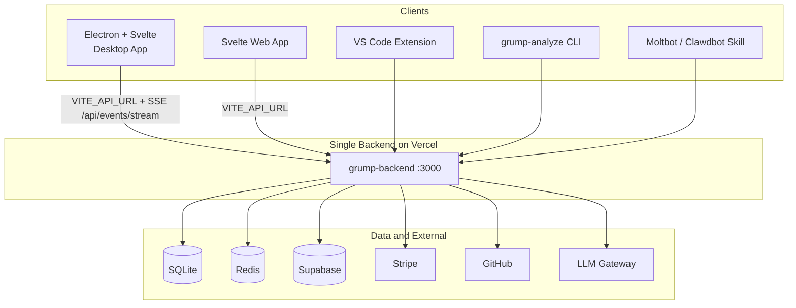

# G-Rump Capabilities

## Why G-Rump

G-Rump is the one app that combines design-first architecture and PRD, full app generation (SHIP: design → spec → plan → code in one run), and tool-enabled code chat with workspace, plan mode, and specialist agents.

Use it from:
- **Desktop** - Electron app for Windows and Linux
- **Web** - Browser-based interface
- **VS Code** - Extension for your editor
- **CLI** - Command-line interface
- **Chat bots** - Moltbot/Clawdbot integration

### Key Features

- **Large context:** Chat accepts up to 200K chars per message and 100 messages per request when using models that support it.
- **Autonomous (Yolo) mode:** Skip tool confirmations for faster workflows.
- **MCP server:** G-Rump can run as an MCP server so Cursor/Claude Code can call SHIP, architecture, codegen, intent.
- **Scheduled agents (24/7):** Run SHIP on a cron schedule.

## Core Workflow

1. **User Input** – Natural language intent + optional constraints
2. **AI Intent Understanding** – Rust Intent Compiler + Claude extract features, users, data flows, tech stack
3. **Mermaid Diagram** – Auto-create architecture (components, data flow, frontend/backend/DB)
4. **User Confirmation** – Interactive review/edit of diagram + summary
5. **PRD Generation** – One PRD per major system/component
6. **Agent Orchestration** – Sub-agents break PRDs into sub-tasks, build incrementally
7. **Iteration & Completion** – Auto test, code download (ZIP), GitHub create + push

## Architecture Overview

## Canonical Flows

Three ways to go from idea to code:

| Flow | When to use | Path |
|------|-------------|------|
| **Chat-first** | Free-form exploration; architecture and diagrams appear in the chat thread. | User describes intent in Design mode → architecture in chat → (optional) move to phase bar for PRD/codegen. |
| **Phase bar** | You already have architecture and want explicit PRD → codegen steps. | Architecture → PRD → codegen via WorkflowPhaseBar. |
| **SHIP** | Fully automated pipeline: design → spec → plan → code in one run. | User chooses SHIP submode → single run → outcome in ShipMode. |

## Session Model

| Concept | Where it lives | Shape |
|--------|----------------|--------|
| **Chat session** | Frontend only: `sessionsStore`, localStorage | `{ id, messages, name, updatedAt }` |
| **Ship session** | Backend DB table `ship_sessions` | `ShipSession`: id, projectDescription, phase, status, results |
| **Codegen session** | Backend DB table `sessions`, type `generation` | Used by `/api/codegen/start`, status, download |

## Requirements

- Node.js 20+
- Rust (Intent Compiler)
- Anthropic API key
- Windows (standalone app target)

Optional LLM providers: **Zhipu**, **Copilot/Codex**, **OpenRouter**
