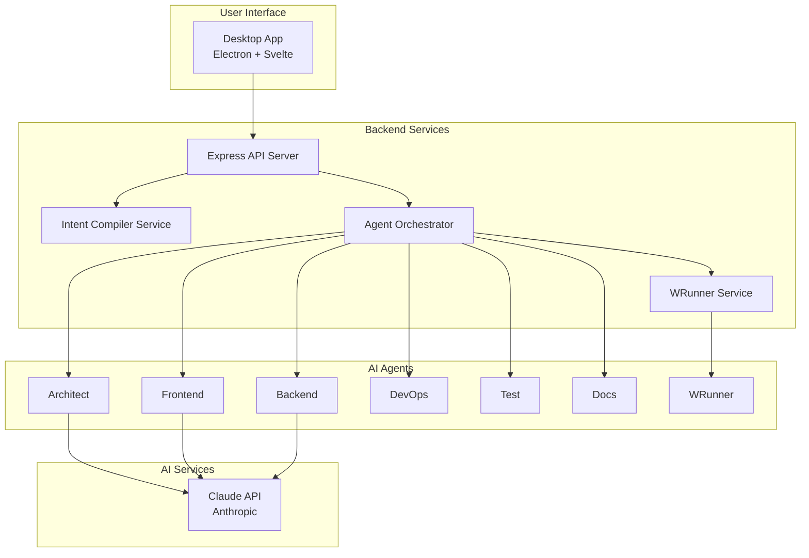

# How It Works: Complete System Guide

## System Overview

G-Rump is an AI-powered development assistant that transforms natural language descriptions into complete, production-ready applications. The system uses a multi-agent architecture with specialized AI agents, each optimized for Claude Code best practices.

## High-Level Architecture



## Complete Workflow

### Step 1: Intent Parsing

1. User provides natural language description
2. Rust parser extracts basic structure (actors, features, data flows)
3. Claude Code enrichment adds:
   - Code patterns (REST, GraphQL, microservices, etc.)
   - Architecture hints
   - Optimization opportunities
   - Code quality requirements

### Step 2: Architecture & PRD Generation

1. User requests architecture generation
2. System creates C4 diagrams (Context, Container, Component)
3. User requests PRD generation from architecture
4. System creates comprehensive PRD with features, user stories, APIs, data models

### Step 3: Code Generation Pipeline

**Detailed Agent Flow:**

1. **Architect Agent** - Validates PRD, creates generation plan, defines task dependencies
2. **Frontend Agent** - Generates Vue/React components, routing, state management
3. **Backend Agent** - Generates API endpoints, database models, business logic
4. **DevOps Agent** - Creates Dockerfiles, docker-compose, CI/CD workflows
5. **Test Agent** - Generates unit, integration, and E2E tests
6. **Docs Agent** - Generates README, API documentation, setup guides

### Step 4: Work Reports

After each agent completes, a comprehensive work report is generated containing:
- Summary of work completed
- Files generated with purposes
- Architecture decisions and rationale
- Code quality metrics
- Integration points
- Testing strategy
- Known issues
- Recommendations

### Step 5: WRunner Quality Assurance

After all agents complete, WRunner analyzes all work reports:
- Identifies missing components
- Detects inconsistencies
- Finds integration gaps
- Identifies quality concerns
- Detects security issues
- Generates fix recommendations

## How to Use

### 1. Start the Application

```bash
# Development
start-app.bat

# Or manually
cd backend && npm start

# Desktop app (Electron)
cd frontend && npm run electron:dev
```

### 2. Create a Project

1. **Describe Your Project**: Enter natural language description
2. **Generate Architecture**: Click "Generate Architecture"
3. **Generate PRD**: Click "Generate PRD"
4. **Start Code Generation**: Click "Generate Code"

### 3. Download Project

Click "Download Project" to get a ZIP file with:
- All generated code
- Documentation
- Configuration files
- Work reports
- WRunner analysis

## Key Features

### Claude Code Optimization

All prompts are optimized for Claude Code:
- **Type Safety**: Strict typing throughout
- **Best Practices**: Industry-standard patterns
- **Code Quality**: High-quality, maintainable code
- **Documentation**: Self-documenting code
- **Testing**: Comprehensive test coverage
- **Security**: Security-first approach

### Design Mode

Design mode automatically generates work reports for each agent:
- **Transparency**: See what each agent did
- **Traceability**: Track decisions and rationale
- **Quality**: Identify issues early
- **Learning**: Understand agent reasoning

### WRunner Quality Assurance

WRunner provides automatic quality assurance:
- **Comprehensive Analysis**: Checks all aspects
- **Issue Detection**: Finds problems automatically
- **Auto-Fixes**: Applies fixes when possible
- **Recommendations**: Suggests improvements

## Best Practices

1. **Be Specific**: Detailed descriptions yield better results
2. **Review Architecture**: Ensure architecture matches your needs
3. **Check PRD**: Verify all features are captured
4. **Review Work Reports**: Understand agent decisions
5. **Address WRunner Issues**: Fix critical issues before deployment
6. **Iterate**: Refine and regenerate as needed
