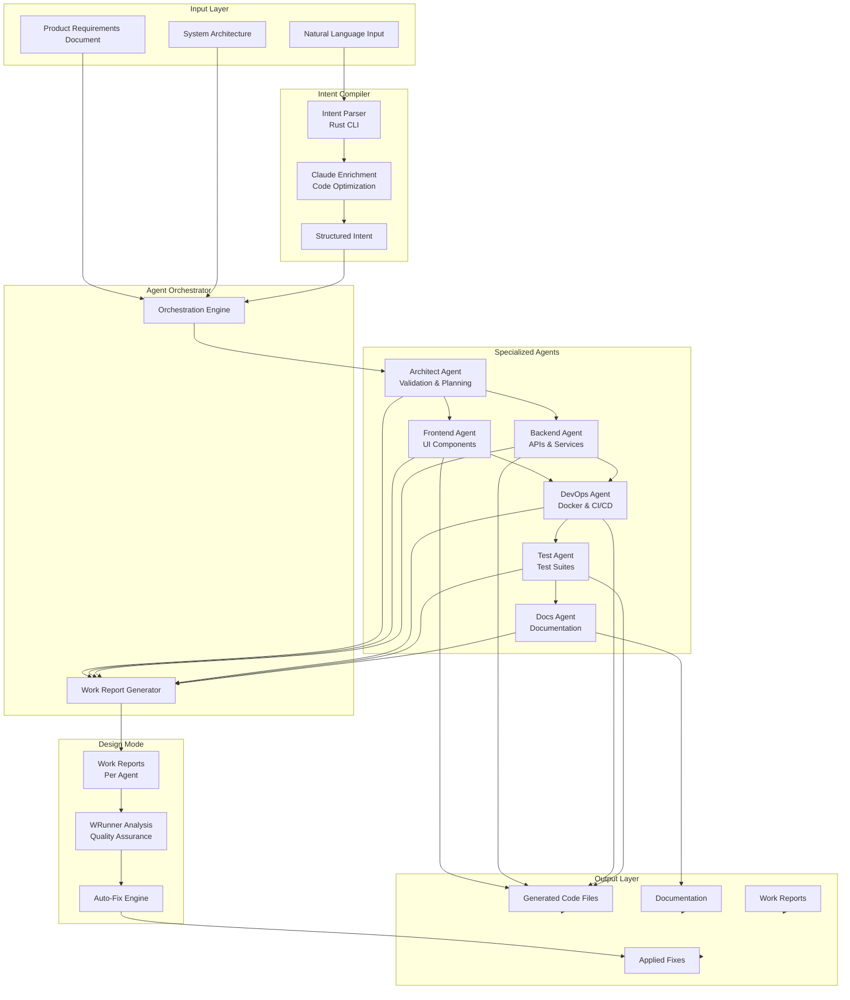
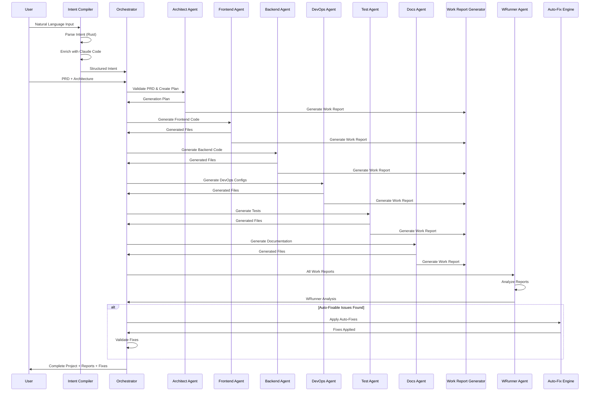

# Agent System Documentation

## Overview

The G-Rump agent system is a multi-agent code generation pipeline that uses specialized AI agents to generate complete, production-ready applications from Product Requirements Documents (PRDs). The system includes design mode documentation generation and automatic quality assurance through the WRunner agent.

## System Architecture



## Agent Types

### 1. Architect Agent
**Role**: Validates PRD and creates detailed code generation plan

**Responsibilities**:
- Validates PRD completeness and consistency
- Identifies potential issues or missing specifications
- Creates detailed generation plan with tasks for each agent
- Defines dependencies between components
- Suggests optimizations and best practices
- Applies Claude Code patterns and architecture principles

**Output**: Generation plan with task breakdown, tech stack validation, risk assessment, and architecture patterns

### 2. Frontend Agent
**Role**: Generates production-ready frontend code (Vue/React)

**Responsibilities**:
- Generates page components for each user flow
- Creates reusable component library
- Implements routing based on features
- Sets up state management
- Creates API client/services
- Adds form handling and validation
- Implements error handling UI
- Adds loading states and optimistic updates

**Tech Stack Support**:
- Vue 3 with Composition API + TypeScript
- React 18+ with TypeScript
- TailwindCSS for styling
- Vite as build tool
- Pinia/Zustand for state management

### 3. Backend Agent
**Role**: Generates production-ready backend code (Node/Python/Go)

**Responsibilities**:
- Generates API endpoints for all features
- Creates database schema/models
- Implements business logic services
- Adds authentication and authorization
- Implements error handling
- Adds input validation
- Creates database migrations
- Adds logging and monitoring
- Implements caching strategies

**Tech Stack Support**:
- Node.js/Express.js with TypeScript
- Python 3.11+ with FastAPI/Django
- Go 1.21+ with Gin/Echo
- PostgreSQL or MongoDB

### 4. DevOps Agent
**Role**: Generates Docker, CI/CD, and deployment configurations

**Responsibilities**:
- Generates Dockerfiles for frontend and backend
- Creates docker-compose.yml for local development
- Creates GitHub Actions workflows for CI/CD
- Generates deployment configurations
- Creates environment configuration files
- Adds health checks and monitoring setup
- Implements logging configuration

### 5. Test Agent
**Role**: Generates comprehensive test suites

**Responsibilities**:
- Generates unit tests for services and components
- Creates integration tests for API endpoints
- Generates E2E tests for critical user flows
- Sets up test infrastructure and fixtures
- Creates test utilities and helpers
- Adds code coverage configuration
- Generates test documentation

**Testing Frameworks**:
- Backend: Jest with Supertest
- Frontend: Vitest with Vue Test Utils / React Testing Library
- E2E: Playwright

### 6. Docs Agent
**Role**: Generates comprehensive documentation

**Responsibilities**:
- Generates comprehensive README.md
- Creates API documentation
- Creates setup and installation guides
- Generates architecture documentation
- Creates deployment guides
- Generates contributing guidelines
- Creates troubleshooting guides

## Intent Compiler

The Intent Compiler is a two-stage system that parses natural language and enriches it with code-specific insights.

### Stage 1: Rust Parser
- Parses raw natural language input
- Extracts structured intent (actors, features, data flows, tech stack hints)
- Returns structured JSON

### Stage 2: Claude Code Enrichment
- Analyzes structured intent with Claude Code optimization
- Detects code patterns (REST, GraphQL, microservices, etc.)
- Identifies architecture hints and optimization opportunities
- Extracts code quality requirements
- Suggests optimal tech stack

**Enhanced Output Fields**:
- `code_patterns`: Detected architectural patterns
- `architecture_hints`: Suggested architecture patterns with applicability
- `optimization_opportunities`: Performance/security/scalability suggestions
- `code_quality_requirements`: Type safety, testing, documentation, performance, security requirements

## Design Mode: Work Reports

After each agent completes code generation, it automatically generates a comprehensive work report documenting:

1. **Summary**: Brief overview of work completed
2. **Files Generated**: List of all files with purposes and key decisions
3. **Architecture Decisions**: Decisions made, rationale, and alternatives considered
4. **Code Quality Metrics**: Coverage, complexity, and identified issues
5. **Integration Points**: Components, dependencies, and contracts
6. **Testing Strategy**: Approach to testing
7. **Known Issues**: Issues found with severity and suggested fixes
8. **Recommendations**: Suggestions for improvements

These reports are stored in the session and used by WRunner for analysis.

## WRunner: Quality Assurance Agent

WRunner is a specialized quality assurance agent that analyzes all agent work reports and identifies issues.

### Analysis Categories

1. **Missing Components**: Features, files, API endpoints, database models, tests, or documentation that should exist but don't
2. **Inconsistencies**: Mismatched API contracts, naming conventions, architecture decisions, tech stack mismatches, data model inconsistencies
3. **Integration Gaps**: Missing API client implementations, unconnected components, missing authentication integration, database connection issues
4. **Quality Concerns**: Low test coverage, high complexity, missing error handling, performance issues, security vulnerabilities, code style inconsistencies
5. **Security Issues**: Missing authentication, insecure API endpoints, SQL injection risks, XSS vulnerabilities, missing input validation

### Output

WRunner generates a comprehensive analysis with:
- **Issues**: Detailed list of issues with severity, category, affected agents, and suggested fixes
- **Missing Components**: List of missing components
- **Integration Gaps**: Components with missing connections
- **Quality Concerns**: List of quality issues
- **Recommendations**: Actionable recommendations
- **Auto-Fixable Flag**: Indicates if issues can be automatically fixed

## Auto-Fix System

The auto-fix system automatically applies fixes for issues identified by WRunner.

### Auto-Fixable Criteria

An issue is auto-fixable if:
- It can be fixed by adding/editing code files
- The fix is clear and unambiguous
- No human judgment required
- Can be automated via code generation

### Fix Process

1. **Fix Plan Generation**: WRunner analysis is processed to create a fix plan
2. **Auto-Fix Application**: Fixes are applied automatically
3. **Validation**: Applied fixes are validated
4. **Reporting**: Fix status is stored in the session

### Fix Categories

- **Missing**: Missing files, components, or configurations
- **Quality**: Code quality improvements (formatting, error handling, etc.)
- **Inconsistency**: Fixing inconsistencies between agents

## Workflow



## Usage

### Basic Usage

1. **Create PRD**: Generate or provide a Product Requirements Document
2. **Generate Architecture**: Create system architecture
3. **Start Code Generation**: Initiate the agent orchestration
4. **Review Work Reports**: Check agent work reports in the session
5. **Review WRunner Analysis**: Check quality assurance analysis
6. **Review Applied Fixes**: Check automatically applied fixes
7. **Download Project**: Download the complete generated project

### API Usage

```typescript
// Initialize session
const session = initializeSessionMulti({
  prds: [{ prd: myPRD, componentLabel: 'Frontend' }],
  architecture: myArchitecture,
  preferences: {
    frontendFramework: 'vue',
    backendRuntime: 'node',
    database: 'postgres',
    includeTests: true,
    includeDocs: true
  }
});

// Execute code generation
await executeCodeGenerationMulti(session);

// Access results
const files = session.generatedFiles;
const workReports = session.workReports;
const wrunnerAnalysis = session.wrunnerAnalysis;
const autoFixes = session.autoFixesApplied;
```

### Session Structure

```typescript
interface GenerationSession {
  sessionId: string;
  status: 'initializing' | 'running' | 'completed' | 'failed';
  prdId: string;
  architectureId: string;
  agents: Record<AgentType, AgentTask>;
  generatedFiles?: GeneratedFile[];
  
  // Design Mode
  workReports?: Record<AgentType, AgentWorkReport>;
  wrunnerAnalysis?: WRunnerAnalysis;
  autoFixesApplied?: Array<{
    issueId: string;
    fix: string;
    status: 'applied' | 'failed';
  }>;
}
```

## Best Practices

1. **PRD Quality**: Ensure PRD is complete and detailed for best results
2. **Architecture First**: Generate architecture before code generation
3. **Review Work Reports**: Check agent work reports for insights
4. **Review WRunner Analysis**: Address critical and high-severity issues
5. **Iterate**: Use feedback to improve PRD and regenerate

## Configuration

### Agent Preferences

```typescript
interface GenerationPreferences {
  frontendFramework?: 'vue' | 'react';
  backendRuntime?: 'node' | 'python' | 'go';
  database?: 'postgres' | 'mongodb';
  includeTests?: boolean;
  includeDocs?: boolean;
  styleGuide?: 'airbnb' | 'google' | 'standard';
}
```

### Intent Compiler Constraints

```typescript
interface Constraints {
  complexity?: 'simple' | 'detailed' | 'mvp' | 'standard' | 'enterprise';
  focusAreas?: string[];
  excludeAreas?: string[];
  style?: 'technical' | 'business';
}
```

## Troubleshooting

### Common Issues

1. **Agent Failures**: Check agent task error messages in session
2. **Missing Files**: Review WRunner analysis for missing components
3. **Integration Issues**: Check integration gaps in WRunner analysis
4. **Quality Issues**: Review quality concerns and apply recommendations

### Debugging

- Check session status and agent task statuses
- Review work reports for detailed agent output
- Review WRunner analysis for identified issues
- Check auto-fix status for applied fixes

## Future Enhancements

- Enhanced auto-fix implementation with actual code generation
- Agent regeneration with fixes applied
- Real-time progress updates
- Custom agent configurations
- Agent collaboration patterns
