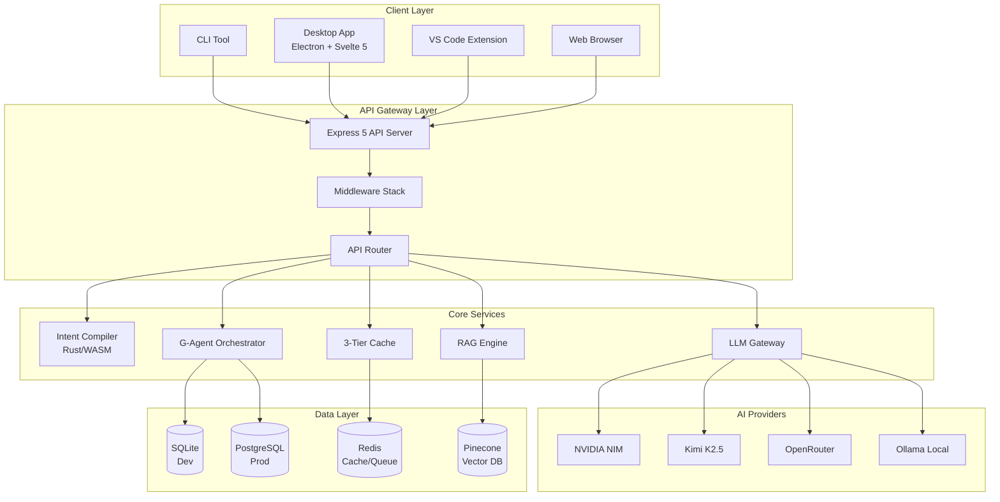
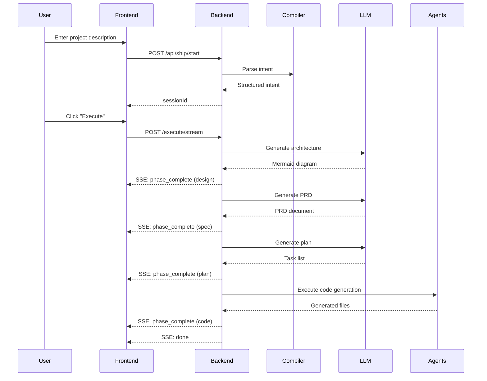
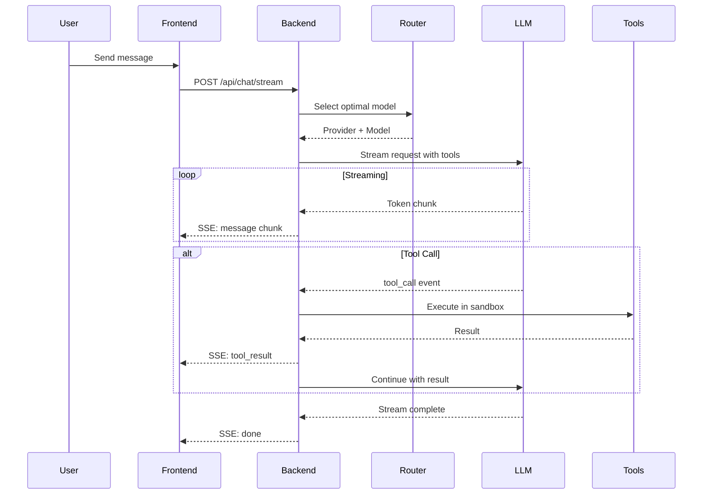

# G-Rump Architecture

> **Version:** 2.1.0 | **Last Updated:** February 2026

Comprehensive system architecture documentation for the G-Rump platform.

---

## Table of Contents

- [Philosophy](#philosophy)
- [System Overview](#system-overview)
- [Tech Stack](#tech-stack)
- [Frontend Architecture](#frontend-architecture)
- [Backend Architecture](#backend-architecture)
- [Intent Compiler](#intent-compiler)
- [Data Flow](#data-flow)
- [Caching Architecture](#caching-architecture)
- [Security Model](#security-model)
- [Deployment Architecture](#deployment-architecture)
- [Performance Optimizations](#performance-optimizations)

---

## Philosophy: Architecture-as-Code

G-Rump follows an **Architecture-as-Code** philosophy. Rather than treating architecture as static documentation that drifts from reality, G-Rump embeds architectural decisions directly into the codebase and uses AI to enforce them during code generation.

### Core Principles

1. **Natural language to production code** - Describe what you want, get deployable software
2. **Multi-agent orchestration** - Specialized AI agents handle different concerns
3. **Quality assurance built-in** - Automatic analysis and fixes for generated code
4. **Performance-first** - Rust compiler, SWC builds, SIMD acceleration, multi-tier caching

---

## System Overview



---

## Tech Stack

| Layer | Technologies | Purpose |
|-------|--------------|---------|
| **Desktop** | Electron 28, Svelte 5, Vite 5, TailwindCSS 3.4 | Cross-platform desktop app |
| **Frontend** | TypeScript 5.3, Mermaid.js, Shiki, Lucide | Web UI components |
| **Backend** | Node.js 20+, Express 5, TypeScript, SWC, Pino | API server |
| **Compiler** | Rust 1.77+, rayon, SIMD (AVX2/AVX-512), WASM | Intent parsing |
| **AI/ML** | NVIDIA NIM, Kimi K2.5, OpenRouter, Anthropic, Ollama | LLM inference |
| **Database** | SQLite (dev), Supabase/PostgreSQL (prod) | Data persistence |
| **Queue** | BullMQ, Redis, ioredis | Job processing |
| **Vector DB** | Pinecone | RAG document storage |
| **Infrastructure** | Docker, Kubernetes, NGC (GCP/AWS) | Deployment |
| **Observability** | Prometheus, OpenTelemetry, Grafana, Pino | Monitoring |
| **Testing** | Vitest, Playwright, k6 | Test automation |
| **Payments** | Stripe | Billing |

---

## Frontend Architecture

The frontend is a Svelte 5 application packaged as an Electron desktop application.

### Component Hierarchy

```
App.svelte
├── ChatInterface.svelte
│   ├── MessageList.svelte
│   ├── MessageInput.svelte
│   ├── ToolCallCard.svelte
│   └── ToolResultCard.svelte
├── DiagramRenderer.svelte
│   └── MermaidDiagram.svelte
├── WorkflowPhaseBar.svelte
├── ModelPicker.svelte
├── RAGScreen.svelte
└── SettingsPanel.svelte
```

### State Management (Svelte Stores)

| Store | Purpose | Persistence |
|-------|---------|-------------|
| `sessionsStore` | Chat sessions and history | localStorage |
| `workflowStore` | 3-phase workflow state | session |
| `chatModeStore` | Design mode vs Code mode | localStorage |
| `workspaceStore` | Current workspace root | localStorage |
| `authStore` | Authentication state | localStorage |
| `preferencesStore` | User preferences | localStorage |
| `connectionStatusStore` | Backend connection | memory |

### Electron Integration

```javascript
// Main process features
const createWindow = () => {
  const mainWindow = new BrowserWindow({
    width: 1400,
    height: 900,
    webPreferences: {
      contextIsolation: true,  // Security: Isolate renderer
      nodeIntegration: false,   // Security: No direct Node access
      preload: path.join(__dirname, 'preload.cjs')
    }
  });
};

// System tray
const tray = new Tray(iconPath);
tray.setContextMenu(Menu.buildFromTemplate([
  { label: 'New Chat', click: () => createNewChat() },
  { label: 'Settings', click: () => openSettings() },
  { type: 'separator' },
  { label: 'Quit', click: () => app.quit() }
]));

// Global shortcut
globalShortcut.register('CommandOrControl+Shift+G', () => {
  mainWindow.show();
});
```

---

## Backend Architecture

### Request Pipeline

Every API request flows through this middleware stack:

```
Request
  │
  ▼
┌─────────────────┐
│ CORS            │ Validates allowed origins
└────────┬────────┘
         ▼
┌─────────────────┐
│ Helmet          │ Security headers (CSP)
└────────┬────────┘
         ▼
┌─────────────────┐
│ Compression     │ Gzip/Brotli responses
└────────┬────────┘
         ▼
┌─────────────────┐
│ JSON Parser     │ Parse request body
└────────┬────────┘
         ▼
┌─────────────────┐
│ Request Timeout │ Enforce route timeouts
└────────┬────────┘
         ▼
┌─────────────────┐
│ Rate Limiting   │ Per-endpoint limits
└────────┬────────┘
         ▼
┌─────────────────┐
│ Agent Governance│ Block automated abuse
└────────┬────────┘
         ▼
┌─────────────────┐
│ Authentication  │ JWT validation (if required)
└────────┬────────┘
         ▼
┌─────────────────┐
│ Route Handler   │ Process request
└─────────────────┘
```

### Core Services

```
services/
├── claudeServiceWithTools.ts    # Tool-enabled chat
├── llmGateway.ts                 # Unified LLM interface
├── modelRouter.ts                # Cost-aware routing
├── shipModeService.ts            # SHIP workflow orchestration
├── agentOrchestrator.ts          # G-Agent coordination
├── tieredCache.ts                # L1/L2/L3 caching
├── ragService.ts                 # Document retrieval
├── intentCompilerService.ts      # NL → JSON parsing
├── toolExecutionService.ts       # Sandboxed tool execution
└── pathPolicyService.ts          # Security path validation
```

---

## Intent Compiler

The Intent Compiler is a Rust-based tool that parses natural language into structured JSON.

### Processing Modes

| Mode | Description | Use Case |
|------|-------------|----------|
| `rust-first` | Parse with Rust, fall back to LLM | Default, fastest |
| `hybrid` | Rust + LLM disambiguation | Complex inputs |
| `llm-first` | LLM-only extraction | Unstructured input |

### Pipeline

```
User Input
    │
    ▼
┌─────────────────┐     ┌─────────────────┐
│  Rust Parser    │────▶│ Structured JSON │
│  (~8ms)         │     │ (actors,        │
└─────────────────┘     │  features,      │
                        │  data flows)    │
                        └────────┬────────┘
                                 ▼
                        ┌─────────────────┐
                        │ LLM Enrichment  │
                        │ (patterns,      │
                        │  architecture   │
                        │  hints)         │
                        └────────┬────────┘
                                 ▼
                        ┌─────────────────┐
                        │ Code-Optimized  │
                        │ Intent          │
                        └─────────────────┘
```

### Performance

| Operation | LLM-Only | Rust + LLM | Improvement |
|-----------|----------|------------|-------------|
| Parsing | 120ms | 8ms | **15x faster** |

---

## Data Flow

### SHIP Workflow Flow



### Chat Mode Flow



---

## Caching Architecture

G-Rump uses a three-tier caching system:

```
┌─────────────────────────────────────────────────────────────┐
│                      CACHE HIERARCHY                        │
├─────────────────────────────────────────────────────────────┤
│                                                             │
│  ┌─────────────┐    ┌─────────────┐    ┌─────────────┐     │
│  │    L1       │───▶│    L2       │───▶│    L3       │     │
│  │  Memory     │    │   Redis     │    │    Disk     │     │
│  │  (LRU)      │◀───│             │◀───│             │     │
│  └─────────────┘    └─────────────┘    └─────────────┘     │
│       TTL: 5 min         TTL: 1 hour       TTL: 24 hours    │
│       Latency: <1ms      Latency: ~2ms     Latency: ~10ms   │
│                                                             │
└─────────────────────────────────────────────────────────────┘
```

### Cache Tiers

| Tier | Storage | TTL | Use Case |
|------|---------|-----|----------|
| **L1** | In-memory LRU | 5 min | Hot data, sub-millisecond access |
| **L2** | Redis | 1 hour | Shared across instances |
| **L3** | Disk (compressed) | 24 hours | Persistent fallback |

### Cache Key Strategy

Cache keys are content-addressed using SHA-256 hashes:

```typescript
function generateCacheKey(request: Request): string {
  const content = JSON.stringify({
    prompt: request.prompt,
    model: request.modelId,
    temperature: request.temperature
  });
  return crypto.createHash('sha256').update(content).digest('hex');
}
```

### Cost-Aware Eviction

```typescript
// High-computation results kept longer
if (result.computationCost > COST_THRESHOLD) {
  cache.set(key, result, { ttl: EXTENDED_TTL });
}
```

---

## Security Model

### Defense in Depth

```
┌─────────────────────────────────────────┐
│           Security Layers               │
├─────────────────────────────────────────┤
│                                         │
│  1. Network Layer                       │
│     - HTTPS enforcement                 │
│     - CORS policies                     │
│                                         │
│  2. Application Layer                   │
│     - Helmet security headers           │
│     - Rate limiting                     │
│     - Input validation (Zod)            │
│                                         │
│  3. Authentication Layer                │
│     - JWT verification                  │
│     - Session management                │
│                                         │
│  4. Authorization Layer                 │
│     - Role-based access                 │
│     - Path policies                     │
│                                         │
│  5. Execution Layer                     │
│     - Sandboxed tool execution          │
│     - Path traversal protection         │
│                                         │
└─────────────────────────────────────────┘
```

### Path Policy Service

```typescript
// Validates all file operations
class PathPolicyService {
  validatePath(requestedPath: string, workspaceRoot: string): boolean {
    const resolved = path.resolve(requestedPath);
    const workspace = path.resolve(workspaceRoot);
    
    // Prevent path traversal
    if (!resolved.startsWith(workspace)) {
      throw new SecurityError('Path outside workspace');
    }
    
    // Block sensitive paths
    if (isSensitivePath(resolved)) {
      throw new SecurityError('Access denied');
    }
    
    return true;
  }
}
```

---

## Deployment Architecture

### Docker Compose (Development)

```yaml
version: '3.8'
services:
  backend:
    build: ./backend
    environment:
      - NODE_ENV=production
      - NVIDIA_NIM_API_KEY=${NVIDIA_NIM_API_KEY}
    ports:
      - "3000:3000"
    volumes:
      - ./data:/app/data
    depends_on:
      - redis
      
  frontend:
    build: ./frontend
    ports:
      - "5173:80"
    environment:
      - VITE_API_URL=http://localhost:3000
      
  redis:
    image: redis:7-alpine
    volumes:
      - redis-data:/data
```

### Kubernetes (Production)

```yaml
apiVersion: apps/v1
kind: Deployment
metadata:
  name: grump-backend
spec:
  replicas: 3
  selector:
    matchLabels:
      app: grump-backend
  template:
    spec:
      containers:
      - name: backend
        image: grump/backend:2.1.0
        resources:
          requests:
            memory: "512Mi"
            cpu: "500m"
          limits:
            memory: "2Gi"
            cpu: "2000m"
        env:
        - name: NODE_ENV
          value: "production"
        - name: REDIS_HOST
          valueFrom:
            configMapKeyRef:
              name: grump-config
              key: redis-host
```

### NGC-Ready Deployment

```bash
# GCP
cd deploy/ngc/gcp
./provision.sh  # Creates GKE cluster with GPU nodes
./deploy.sh     # Deploys G-Rump with NVIDIA operators

# AWS
cd deploy/ngc/aws
./provision.sh  # Creates EKS cluster with GPU nodes
./deploy.sh
```

---

## Performance Optimizations

### Benchmarks

| Operation | Traditional | G-Rump | Improvement |
|-----------|-------------|--------|-------------|
| Backend Build | 45s | 2.5s | **18x** |
| Intent Parsing | 120ms | 8ms | **15x** |
| CLI Startup | 850ms | 45ms | **19x** |
| Docker Build | 180s | 25s | **7x** |
| Cache Hit | - | <1ms | Instant |

### Optimization Strategies

1. **SWC Compilation**
   - Replaces ts-node for 18x faster builds
   - Native Rust-based TypeScript compiler

2. **Rust Intent Parser**
   - SIMD-accelerated text processing
   - 15x faster than LLM-only parsing

3. **3-Tier Caching**
   - 50%+ cache hit rate in production
   - Content-addressed keys prevent duplication

4. **Worker Pool**
   - Parallel task execution
   - CPU-intensive work offloaded from main thread

5. **Smart Model Routing**
   - Cost-aware provider selection
   - Automatic model selection based on complexity

---

## Related Documentation

- [HOW_IT_WORKS.md](./HOW_IT_WORKS.md) - Request pipeline details
- [AGENT_SYSTEM.md](./AGENT_SYSTEM.md) - G-Agent orchestration
- [API.md](./API.md) - API reference
- [SECURITY.md](./SECURITY.md) - Security configuration
- [PRODUCTION.md](./PRODUCTION.md) - Deployment guide
- [adr/](./adr/) - Architecture Decision Records
