# Complete System Guide: How G-Rump Works

> **⚠️ LEGACY DOCUMENT**: This document may contain outdated references to Claude as the primary LLM. The current stack uses **NVIDIA NIM (Kimi K2.5)** or **OpenRouter** as the LLM provider. For up-to-date architecture documentation, see [ARCHITECTURE.md](./ARCHITECTURE.md) and [OVERVIEW.md](./OVERVIEW.md).

## Table of Contents

1. [System Overview](#system-overview)
2. [Complete Architecture](#complete-architecture)
3. [How It Works](#how-it-works)
4. [Agent System](#agent-system)
5. [Intent Compiler](#intent-compiler)
6. [Design Mode & WRunner](#design-mode--wrunner)
7. [Usage Guide](#usage-guide)
8. [Mermaid Diagrams](#mermaid-diagrams)

## System Overview

G-Rump is an AI-powered development assistant that transforms natural language into complete, production-ready applications. It uses a multi-agent architecture where specialized AI agents work together to generate code, each optimized for Claude Code best practices.

### Key Components

1. **Intent Compiler**: Parses natural language and enriches it with code-specific insights
2. **Agent Orchestrator**: Coordinates multiple specialized agents
3. **Specialized Agents**: 6 agents (Architect, Frontend, Backend, DevOps, Test, Docs)
4. **Design Mode**: Automatic work report generation
5. **WRunner**: Quality assurance and auto-fix system

## Complete Architecture

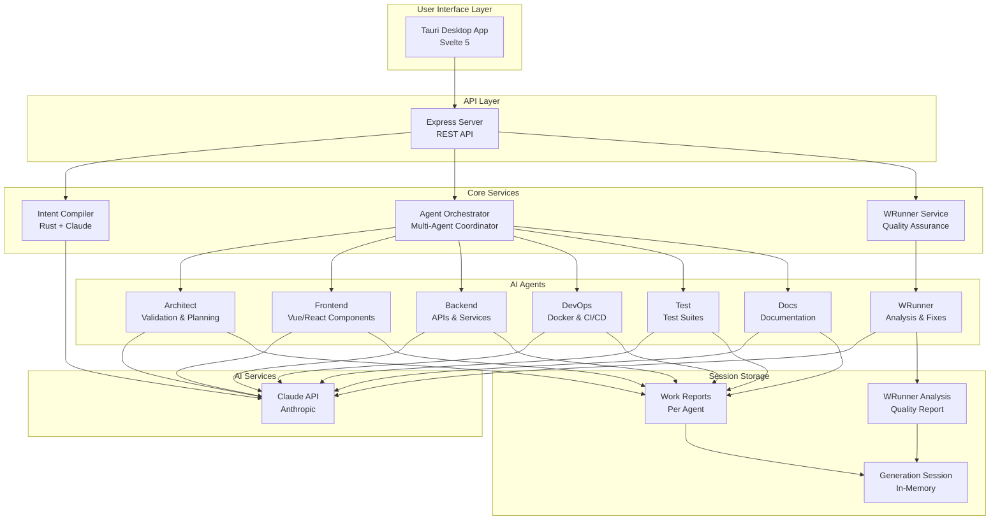

## How It Works

### Complete Workflow

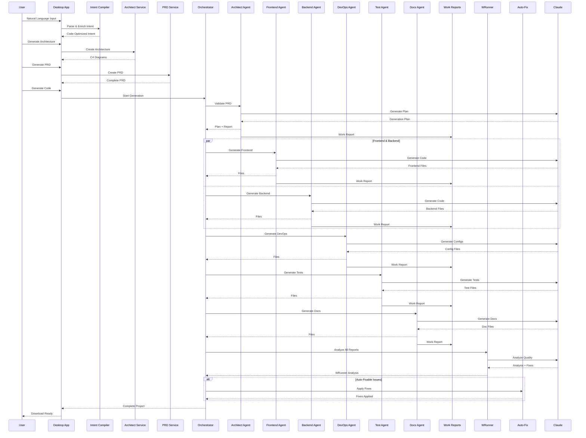

## Agent System

### Agent Types and Responsibilities

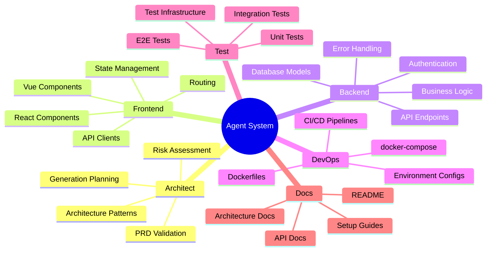

### Agent Execution Flow

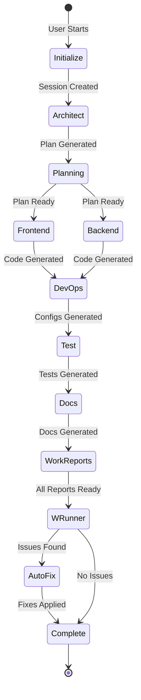

## Intent Compiler

### Two-Stage Process

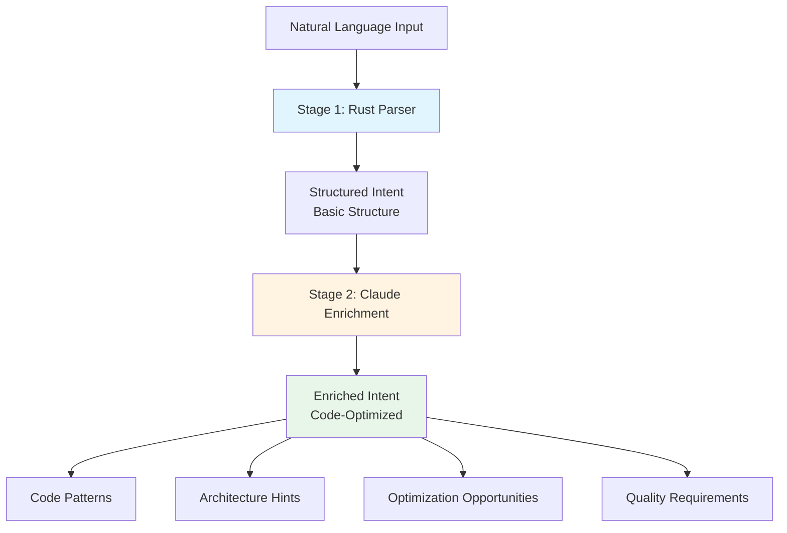

### Enrichment Process

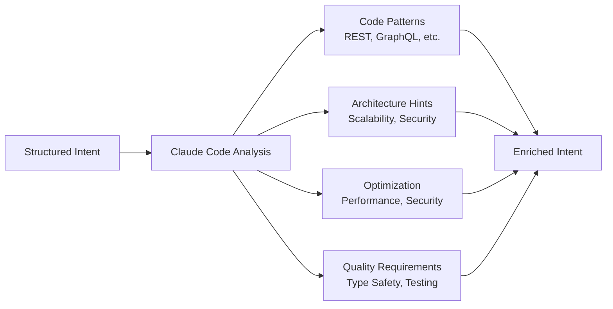

## Design Mode & WRunner

### Work Report Generation

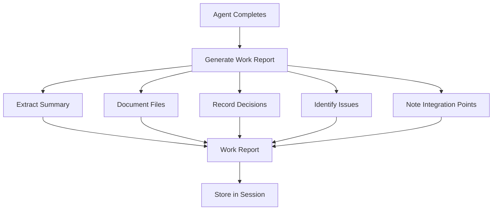

### WRunner Analysis Flow

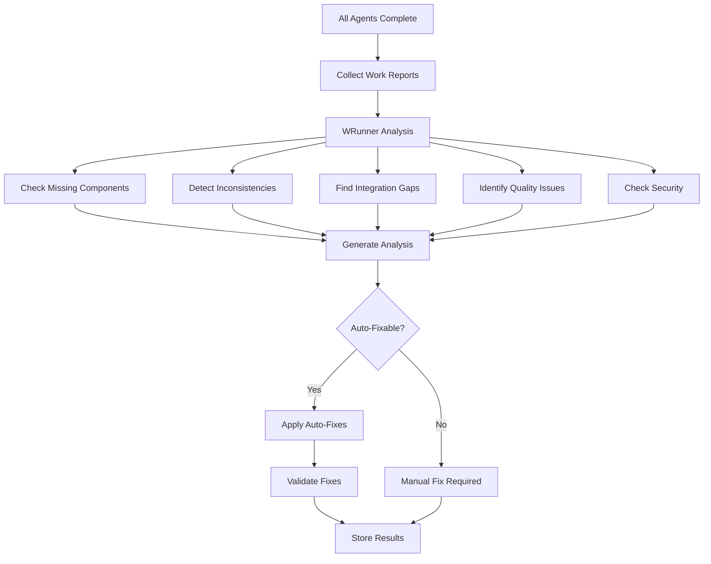

## Usage Guide

### Step-by-Step Process

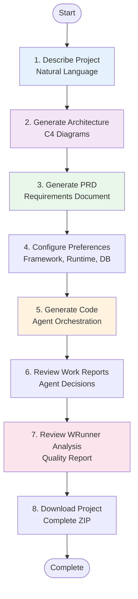

### Session Lifecycle

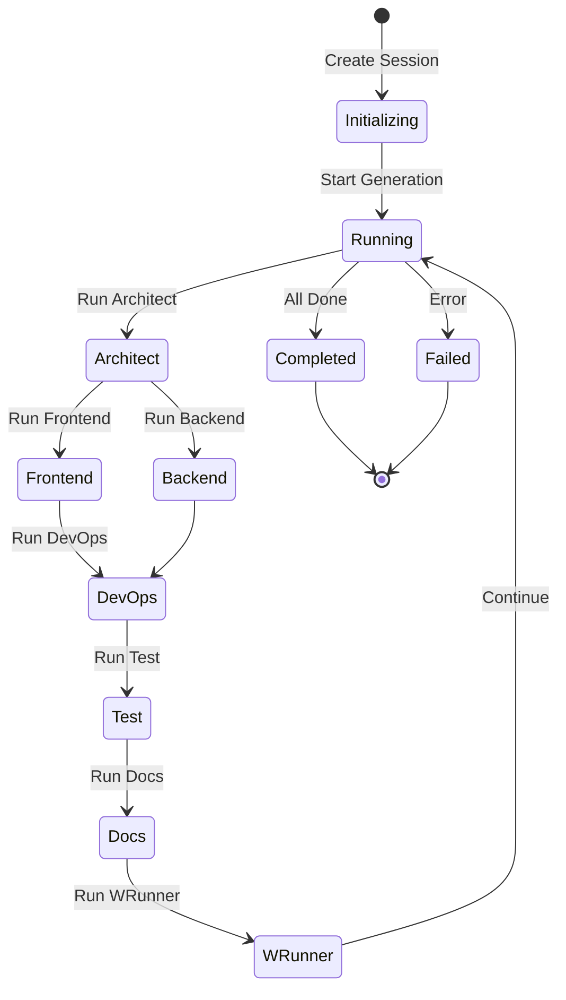

## Mermaid Diagrams

### System Architecture Overview

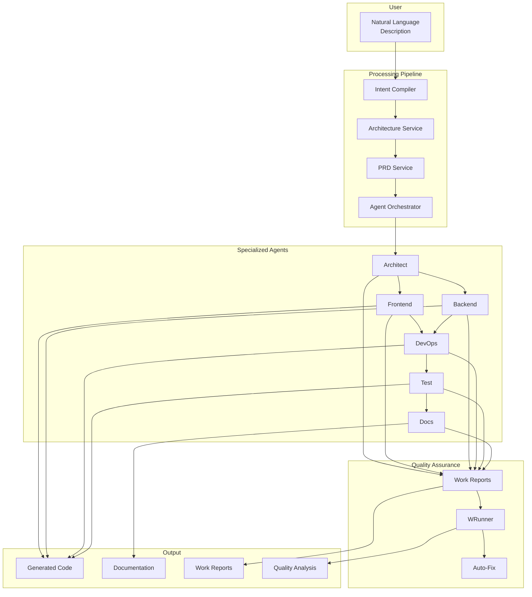

### Data Flow

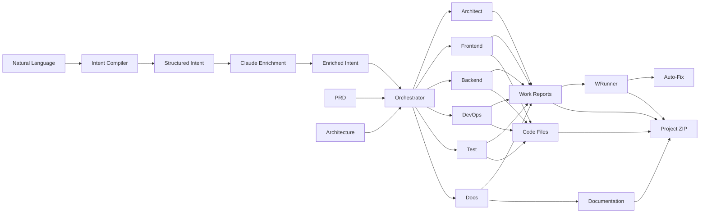

## Key Features Explained

### 1. Claude Code Optimization

All prompts are optimized for Claude Code, ensuring:
- **Type Safety**: Strict typing throughout
- **Best Practices**: Industry-standard patterns
- **Code Quality**: High-quality, maintainable code
- **Documentation**: Self-documenting code
- **Testing**: Comprehensive test coverage
- **Security**: Security-first approach

### 2. Design Mode

Automatic work report generation provides:
- **Transparency**: See what each agent did
- **Traceability**: Track decisions and rationale
- **Quality**: Identify issues early
- **Learning**: Understand agent reasoning

### 3. WRunner Quality Assurance

Automatic quality assurance includes:
- **Comprehensive Analysis**: Checks all aspects
- **Issue Detection**: Finds problems automatically
- **Auto-Fixes**: Applies fixes when possible
- **Recommendations**: Suggests improvements

## Best Practices

1. **Be Specific**: Detailed descriptions yield better results
2. **Review Architecture**: Ensure architecture matches your needs
3. **Check PRD**: Verify all features are captured
4. **Review Work Reports**: Understand agent decisions
5. **Address WRunner Issues**: Fix critical issues before deployment
6. **Iterate**: Refine and regenerate as needed

## Next Steps

- [QUICK_START.md](QUICK_START.md) - Get started quickly
- [HOW_IT_WORKS.md](HOW_IT_WORKS.md) - Detailed explanation
- [AGENT_SYSTEM.md](AGENT_SYSTEM.md) - Agent documentation
- [INTENT_COMPILER.md](INTENT_COMPILER.md) - Intent compiler details
