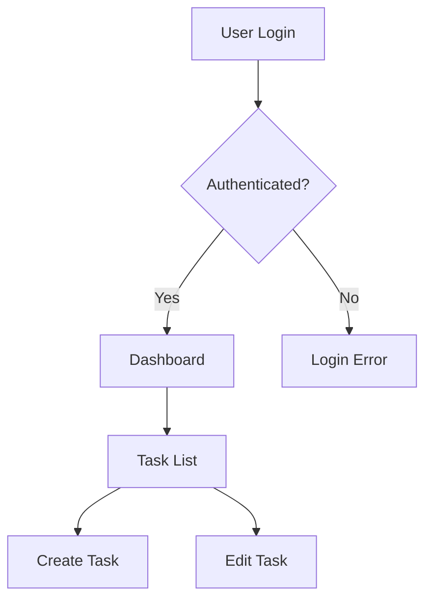

# G-Rump Demo Script

**Duration:** 5 minutes  
**Version:** 2.1.0  
**Last Updated:** 2026-02-09

---

## Overview

This script walks through the key features of G-Rump in 5 minutes. Perfect for demos, onboarding, and quick evaluations.

---

## Prerequisites

- G-Rump running locally or access to https://g-rump.com
- Sample project idea (e.g., "task manager", "e-commerce API")

---

## Demo Flow

### 1. Start the App (30 seconds)

**Action:** Open G-Rump

**Script:**
> "This is G-Rump - an AI Product Operating System that transforms natural language into production-ready code. Notice the clean, ChatGPT-style interface."

**Key Points:**
- Minimal, distraction-free UI
- Natural language input
- Ready to accept your project description

---

### 2. SHIP Workflow (90 seconds)

**Action:** Type: "Build a task management app with user authentication"

**Script:**
> "Watch as G-Rump's SHIP workflow kicks in. First, it designs the architecture..."

**What Happens:**
1. **Design Phase** - Generates Mermaid architecture diagram
2. **Spec Phase** - Creates detailed technical specification
3. **Plan Phase** - Breaks down into actionable tasks
4. **Code Phase** - Generates production-ready code

**Key Points:**
- Fully automated pipeline
- Architecture diagrams with approval workflow
- Step-by-step execution with clear progress

---

### 3. Chat Mode with Tool Calling (90 seconds)

**Action:** Switch to Chat mode and ask: "Add due dates and priority levels to tasks"

**Script:**
> "In Chat mode, G-Rump uses tool calling to interact with your codebase. Watch the streaming status - it shows exactly what files are being read and written."

**What Happens:**
- Real-time streaming responses
- File activity tracking (Claude Code-style)
- Tools: file_write, read_file, bash_execute
- Automatic code generation and updates

**Key Points:**
- See file paths being modified in real-time
- Watch code appear as it's generated
- Iterative development through conversation

---

### 4. Code Gen from Mermaid Diagram (60 seconds)

**Action:** Paste a Mermaid diagram:

**Script:**
> "G-Rump can turn diagrams into code. Paste any Mermaid diagram and it generates the implementation."

**What Happens:**
- Diagram parsed automatically
- React/Vue/Angular components generated
- Routing and state management included

---

### 5. Rust Intent Compiler (60 seconds)

**Action:** Open the Intent Compiler panel and type: "Create REST API with authentication and PostgreSQL"

**Script:**
> "Behind the scenes, our Rust-based Intent Compiler parses your requirements at native speed. It's 18x faster than traditional parsing and extracts actors, features, tech stack hints, and more."

**What Happens:**
- Real-time intent parsing
- Structured output: actors, features, data flows
- Confidence scoring
- Architecture pattern detection

**Key Points:**
- 18x faster builds
- 60-70% cost savings
- Production-ready at 100% coverage

---

## Summary (30 seconds)

**Script:**
> "G-Rump combines AI agents, a Rust intent compiler, and modern tooling to transform ideas into production code. From architecture to deployment, it automates the entire development workflow."

---

## Quick Commands Reference

| Command | Action |
|---------|--------|
| `Ctrl+K` | Open command palette |
| `Ctrl+,` | Open settings |
| `Esc` | Cancel streaming |
| Mode buttons | Switch between Design/Code/Ship |

---

## Tips for Demo Success

1. **Use simple examples** - Complex prompts can take longer
2. **Highlight streaming** - The real-time file activity is impressive
3. **Show the diagram** - Architecture visualization is a key differentiator
4. **Mention speed** - 18x faster builds is a strong selling point

---

## Troubleshooting

- **Slow responses:** Check API key configuration
- **No tool calling:** Ensure Code mode is active
- **Diagram not parsing:** Verify Mermaid syntax

---

## Next Steps

After the demo:
- Try your own project ideas
- Explore the API documentation
- Join the Century Club community
- Check out the ROADMAP for upcoming features
