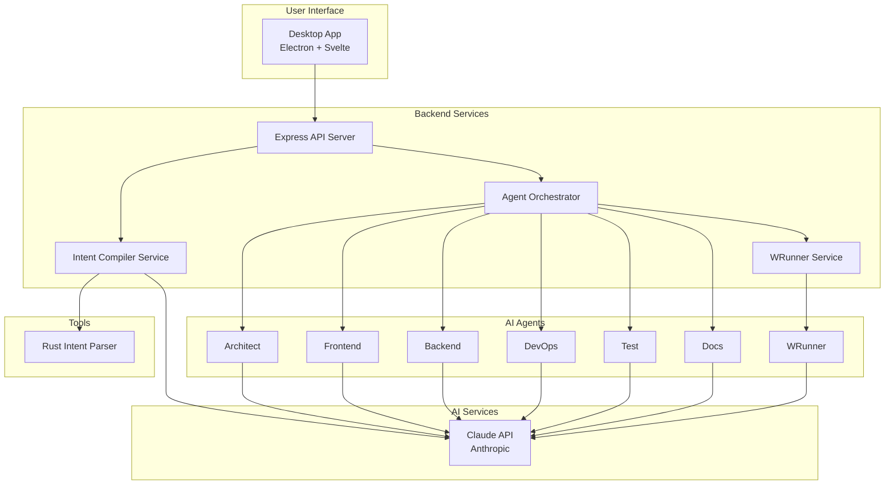
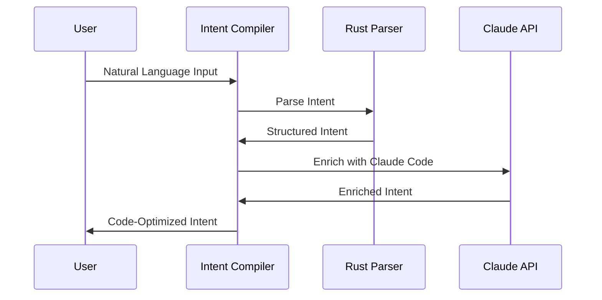
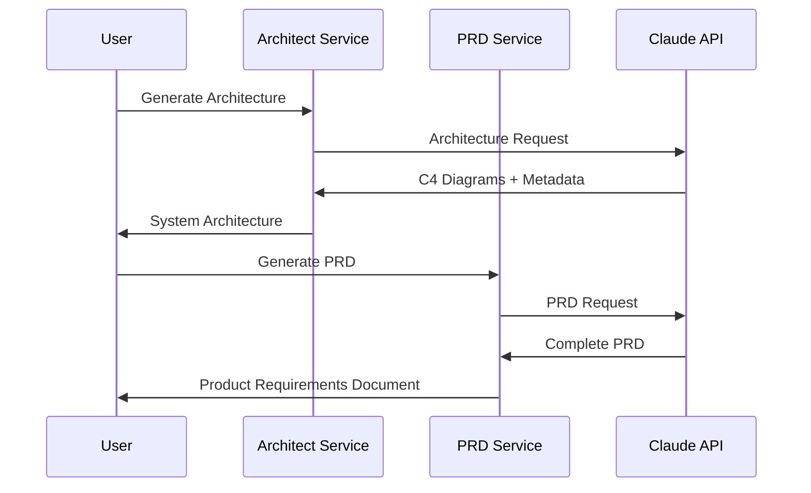
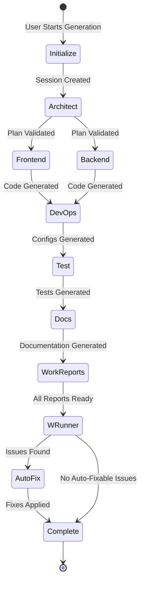
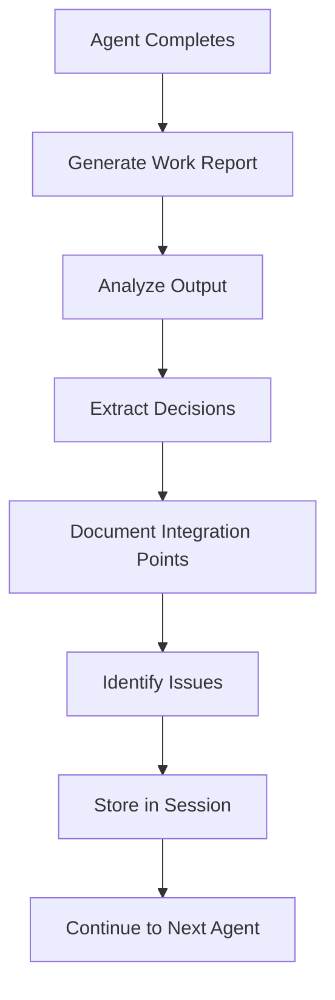
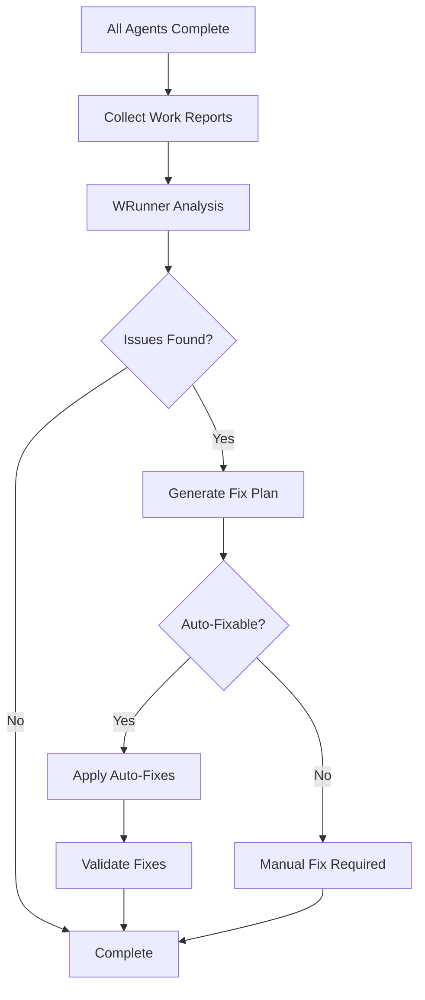
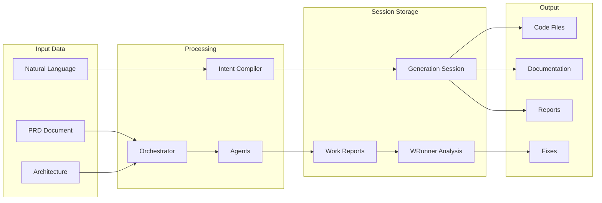
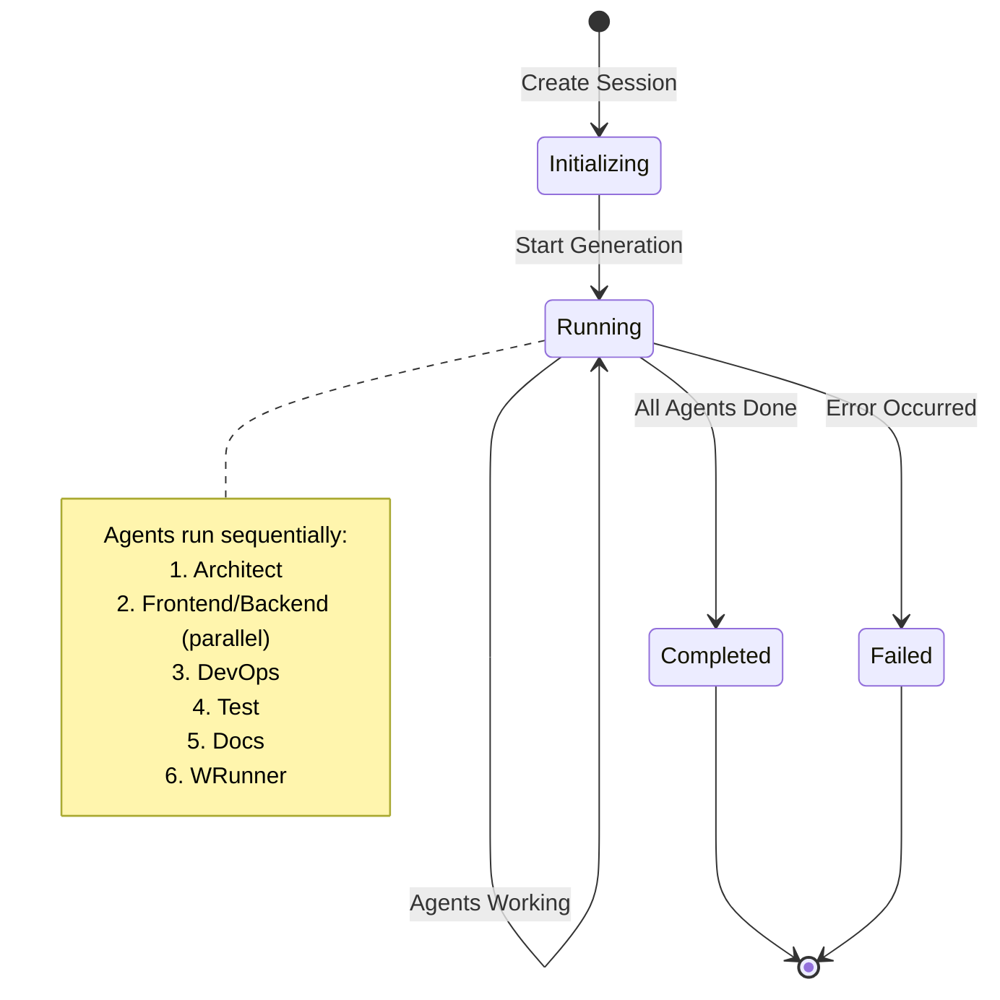
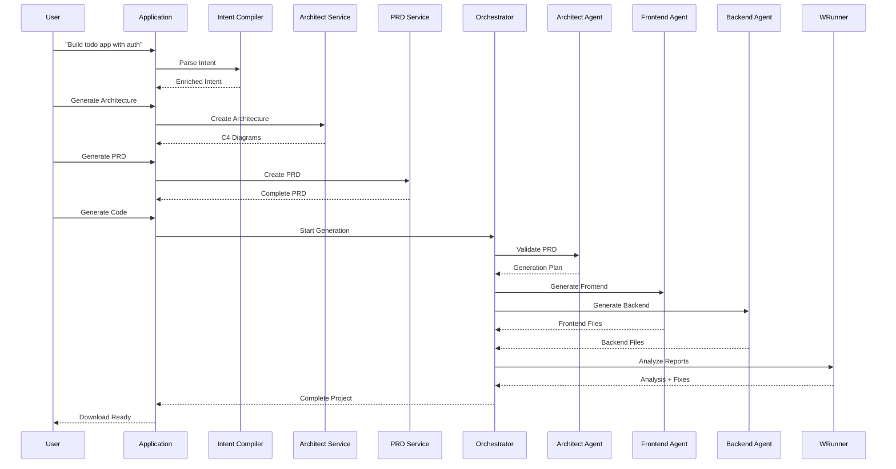

# How It Works: Complete System Guide

## System Overview

G-Rump is an AI-powered development assistant that transforms natural language descriptions into complete, production-ready applications. The system uses a multi-agent architecture with specialized AI agents, each optimized for Claude Code best practices.

## High-Level Architecture



## Complete Workflow

### Step 1: Intent Parsing



**What Happens**:
1. User provides natural language description
2. Rust parser extracts basic structure (actors, features, data flows)
3. Claude Code enrichment adds:
   - Code patterns (REST, GraphQL, microservices, etc.)
   - Architecture hints
   - Optimization opportunities
   - Code quality requirements

### Step 2: Architecture & PRD Generation



**What Happens**:
1. User requests architecture generation
2. System creates C4 diagrams (Context, Container, Component)
3. User requests PRD generation from architecture
4. System creates comprehensive PRD with features, user stories, APIs, data models

### Step 3: Code Generation Pipeline



**Detailed Agent Flow**:

1. **Architect Agent**:
   - Validates PRD completeness
   - Creates generation plan
   - Defines task dependencies
   - Identifies risks and mitigations
   - Generates work report

2. **Frontend Agent** (runs in parallel with Backend):
   - Generates Vue/React components
   - Creates routing structure
   - Sets up state management
   - Implements API clients
   - Generates work report

3. **Backend Agent** (runs in parallel with Frontend):
   - Generates API endpoints
   - Creates database models
   - Implements business logic
   - Adds authentication
   - Generates work report

4. **DevOps Agent**:
   - Creates Dockerfiles
   - Generates docker-compose.yml
   - Creates CI/CD workflows
   - Sets up environment configs
   - Generates work report

5. **Test Agent**:
   - Generates unit tests
   - Creates integration tests
   - Generates E2E tests
   - Sets up test infrastructure
   - Generates work report

6. **Docs Agent**:
   - Generates README
   - Creates API documentation
   - Generates setup guides
   - Creates architecture docs
   - Generates work report

### Step 4: Design Mode - Work Reports

After each agent completes, a comprehensive work report is automatically generated:



**Work Report Contains**:
- Summary of work completed
- Files generated with purposes
- Architecture decisions and rationale
- Code quality metrics
- Integration points
- Testing strategy
- Known issues
- Recommendations

### Step 5: WRunner Quality Assurance

After all agents complete, WRunner analyzes all work reports:



**WRunner Analysis**:
- Identifies missing components
- Detects inconsistencies
- Finds integration gaps
- Identifies quality concerns
- Detects security issues
- Generates fix recommendations

**Auto-Fix Process**:
- Determines which issues are auto-fixable
- Applies fixes automatically
- Validates fixes were applied
- Reports fix status

## Data Flow



## Session Lifecycle



## How to Use

### 1. Start the Application

```bash
# Development
start-app.bat

# Or manually
cd backend && npm start

# Desktop app (Electron)
cd frontend && npm run electron:dev
```

### 2. Create a Project

1. **Describe Your Project**: Enter natural language description
   - Example: "Build a todo app with user authentication and real-time sync"

2. **Generate Architecture**: Click "Generate Architecture"
   - System creates C4 diagrams
   - Review and adjust if needed

3. **Generate PRD**: Click "Generate PRD"
   - System creates comprehensive PRD
   - Review features, user stories, APIs

4. **Start Code Generation**: Click "Generate Code"
   - Select preferences (framework, runtime, database)
   - System starts agent orchestration

### 3. Monitor Progress

- Watch agent status in real-time
- Each agent shows: pending → running → completed
- View generated files as they're created

### 4. Review Results

After completion, you'll have:

1. **Generated Code**: Complete project files
2. **Work Reports**: Detailed reports from each agent
3. **WRunner Analysis**: Quality assurance report
4. **Applied Fixes**: List of auto-fixes applied

### 5. Download Project

- Click "Download Project"
- System creates ZIP file with:
  - All generated code
  - Documentation
  - Configuration files
  - Work reports
  - WRunner analysis

## Example: Complete Flow



## Key Features Explained

### Claude Code Optimization

All prompts are optimized for Claude Code, which means:
- **Type Safety**: Strict typing throughout
- **Best Practices**: Industry-standard patterns
- **Code Quality**: High-quality, maintainable code
- **Documentation**: Self-documenting code
- **Testing**: Comprehensive test coverage
- **Security**: Security-first approach

### Design Mode

Design mode automatically generates work reports for each agent:
- **Transparency**: See what each agent did
- **Traceability**: Track decisions and rationale
- **Quality**: Identify issues early
- **Learning**: Understand agent reasoning

### WRunner Quality Assurance

WRunner provides automatic quality assurance:
- **Comprehensive Analysis**: Checks all aspects
- **Issue Detection**: Finds problems automatically
- **Auto-Fixes**: Applies fixes when possible
- **Recommendations**: Suggests improvements

## Best Practices

1. **Be Specific**: Detailed descriptions yield better results
2. **Review Architecture**: Ensure architecture matches your needs
3. **Check PRD**: Verify all features are captured
4. **Review Work Reports**: Understand agent decisions
5. **Address WRunner Issues**: Fix critical issues before deployment
6. **Iterate**: Refine and regenerate as needed

## Troubleshooting

### Agents Fail

- Check API key is valid
- Review agent error messages
- Check network connectivity
- Verify PRD is complete

### Missing Files

- Check WRunner analysis for missing components
- Review work reports for gaps
- Regenerate with more specific PRD

### Quality Issues

- Review WRunner analysis
- Check work reports for known issues
- Apply recommended fixes
- Regenerate if needed

## Next Steps

- Read [AGENT_SYSTEM.md](AGENT_SYSTEM.md) for detailed agent documentation
- Read [INTENT_COMPILER.md](INTENT_COMPILER.md) for intent compiler details
- Read [AI_WORKFLOWS.md](AI_WORKFLOWS.md) for workflow patterns
