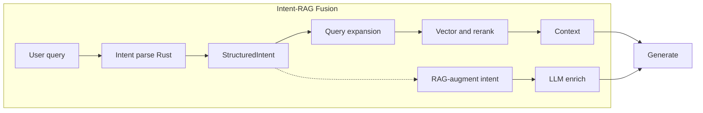

# Intent-RAG Fusion (IRF)

> **Version:** 2.1.0 | **Last Updated:** February 2026

Intent-RAG Fusion (IRF) is a workflow that couples the Intent Compiler and RAG system so both perform better: intent guides retrieval (query expansion), and RAG augments intent enrichment (consistency with the knowledge base).

## Purpose

- **Intent-guided retrieval**: Parse the user query or project description with the Rust Intent Compiler, then expand the search query with features, tech stack, and data flows before embedding and retrieving. This improves relevance for "feature + tech" questions (e.g. "auth with React").
- **RAG-augmented intent**: When the LLM enriches structured intent, inject relevant excerpts from the knowledge base into the enrichment prompt so extracted features and tech align with existing docs and specs.
- **Unified pipeline**: Architecture, spec, plan, chat (when RAG is on), and the RAG API use the same intent-guided context path where applicable.

## Flow

1. **Intent parse**: The query (or project description) is parsed by the Rust Intent Compiler (or hybrid/LLM fallback) with a short timeout (3s). On failure or empty intent, the system falls back to plain RAG (embed query only).
2. **Query expansion**: Features, tech stack hints, and data flows from the intent are appended to the query string (e.g. `query + " features: X; tech: Y"`). That expanded string is embedded and used for vector search (and optional rerank).
3. **RAG-augment intent**: When enriching intent via LLM, the service fetches RAG context for the raw user text and appends it to the enrichment system prompt so the model can align with existing docs/specs.

## When intent-guided retrieval runs

- **Architecture**: When `request.namespace` is set, context for the architect prompt is fetched via `getIntentGuidedRagContext(projectDescription, { namespace, maxChunks: 6 })`.
- **Spec**: When generating a spec and `request.namespace` is set, RAG context for the design/request is intent-guided.
- **Plan**: When generating a plan and `request.namespace` is set, RAG context for the user request is intent-guided.
- **Chat**: When `RAG_CONTEXT_ENABLED` is true, context for the last user message is intent-guided.
- **Ship**: Design, spec, and codegen phases use intent-guided RAG when a namespace is provided.
- **RAG API**: `POST /api/rag/query` supports an optional body flag `intentGuided: true`. When set, the full RAG pipeline (retrieve + LLM answer) uses intent-guided retrieval.

## When RAG augments intent enrichment

- In `intentCompilerService.enrichIntentViaLLM`, when `INTENT_RAG_AUGMENT_ENRICH` is not disabled, the service calls `getRagContextForPrompt(rawText, { maxChunks: 4 })` and appends the context to the enrichment system prompt under "Relevant excerpts from the knowledge base for consistency".

## Configuration

| Environment variable | Default | Description |
|----------------------|---------|-------------|
| `RAG_INTENT_GUIDED` | enabled (omit or `true`) | Enable intent-guided retrieval. Set to `false` or `0` to use plain RAG (embed query only) everywhere that would otherwise use IRF. |
| `INTENT_RAG_AUGMENT_ENRICH` | enabled (omit or `true`) | Enable RAG-augmented intent enrichment. Set to `false` or `0` to skip injecting RAG context into the intent enrichment prompt. |

## How to disable

- **Intent-guided retrieval**: Set `RAG_INTENT_GUIDED=false` (or `0`). Consumers that call `getIntentGuidedRagContext` will still call it, but that function falls back to `getRagContextForPrompt` when the flag is off. For the RAG API, do not send `intentGuided: true` in the body.
- **RAG-augmented intent**: Set `INTENT_RAG_AUGMENT_ENRICH=false` (or `0`). The enrichment prompt will no longer include knowledge-base excerpts.

## Related

- [ARCHITECTURE.md](./ARCHITECTURE.md) — System design and IRF placement in the backend.
- [HOW_IT_WORKS.md](./HOW_IT_WORKS.md) — Request pipeline and when IRF runs in chat, ship, and codegen.
- [API.md](./API.md) — RAG and intent API options.
- [adr/005-intent-rag-fusion.md](./adr/005-intent-rag-fusion.md) — ADR for the Intent-RAG Fusion workflow.
