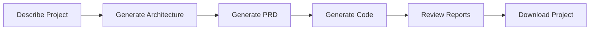

# Quick Start Guide

## Overview

G-Rump transforms natural language into complete, production-ready applications using specialized AI agents. This guide will get you up and running quickly.

## Installation

### Prerequisites

- Node.js 20+
- Rust (for building intent-compiler)
- Windows 10/11 (for production builds)

### Setup

1. **Clone and install dependencies:**
   ```bash
   # Backend
   cd backend
   npm install
   
   # Frontend
   cd ../frontend
   npm install
   
   # Intent Compiler (Rust)
   cd ../intent-compiler
   cargo build --release
   ```

2. **Configure environment:**
   ```bash
   cd backend
   cp .env.example .env
   # Add your NVIDIA_NIM_API_KEY or OPENROUTER_API_KEY to .env
   ```

3. **Start development:**
   ```bash
   # From project root
   start-app.bat
   ```

## Basic Usage

### 1. Describe Your Project

Enter a natural language description:
```
Build a todo app with user authentication, real-time sync, and mobile support
```

### 2. Generate Architecture

Click "Generate Architecture" to create system architecture diagrams.

### 3. Generate PRD

Click "Generate PRD" to create a Product Requirements Document.

### 4. Generate Code

1. Select preferences:
   - Frontend: Vue or React
   - Backend: Node.js, Python, or Go
   - Database: PostgreSQL or MongoDB
   - Include tests and docs

2. Click "Generate Code"

3. Watch agents work:
   - Architect: Validates and plans
   - Frontend: Generates UI
   - Backend: Generates APIs
   - DevOps: Generates configs
   - Test: Generates tests
   - Docs: Generates documentation
   - WRunner: Analyzes and fixes

### 5. Download Project

Click "Download Project" to get a ZIP file with:
- Complete codebase
- Documentation
- Configuration files
- Work reports
- Quality analysis

## Key Features

### Intent Compiler

Automatically extracts:
- Code patterns (REST, GraphQL, microservices)
- Architecture hints
- Optimization opportunities
- Code quality requirements

### Design Mode

Each agent generates a work report documenting:
- What was created
- Why decisions were made
- Integration points
- Known issues
- Recommendations

### WRunner Quality Assurance

Automatically:
- Identifies missing components
- Detects inconsistencies
- Finds integration gaps
- Applies auto-fixes
- Provides recommendations

## Example Workflow



## Next Steps

- Read [HOW_IT_WORKS.md](HOW_IT_WORKS.md) for detailed explanation
- Read [AGENT_SYSTEM.md](AGENT_SYSTEM.md) for agent details
- Read [INTENT_COMPILER.md](INTENT_COMPILER.md) for intent compiler details
