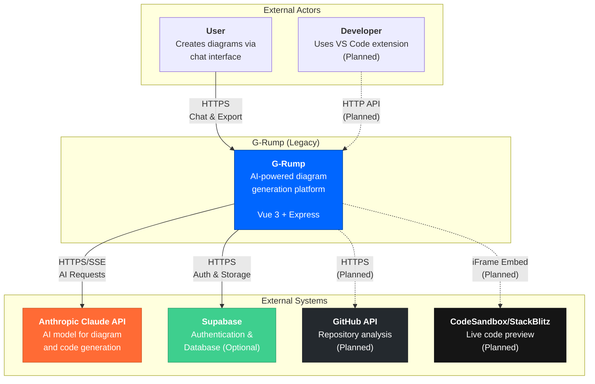
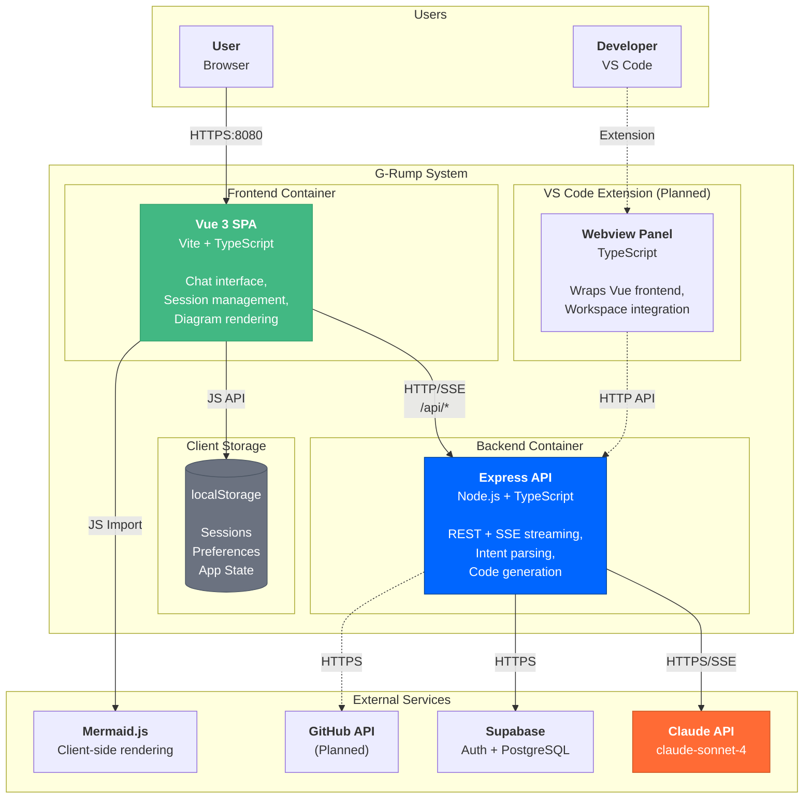
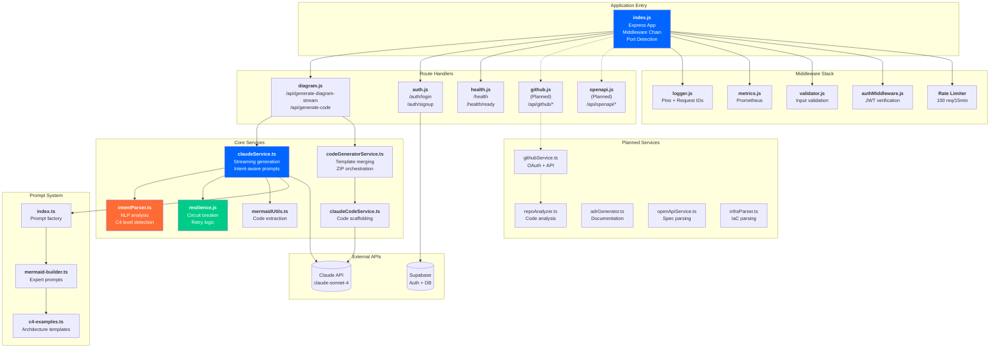
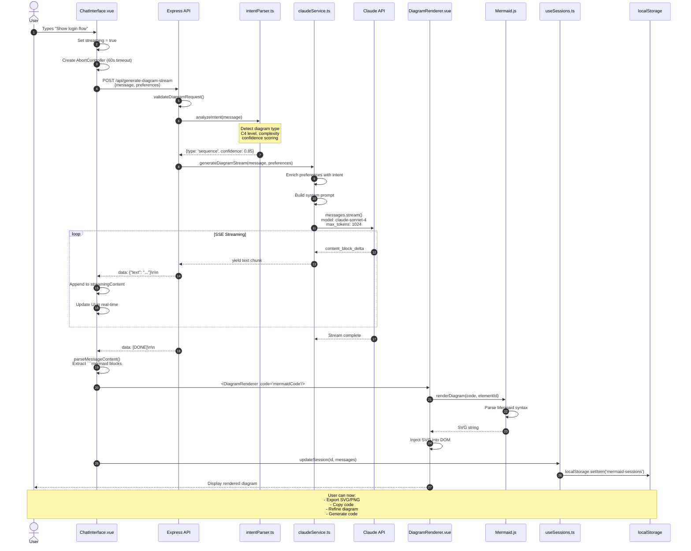
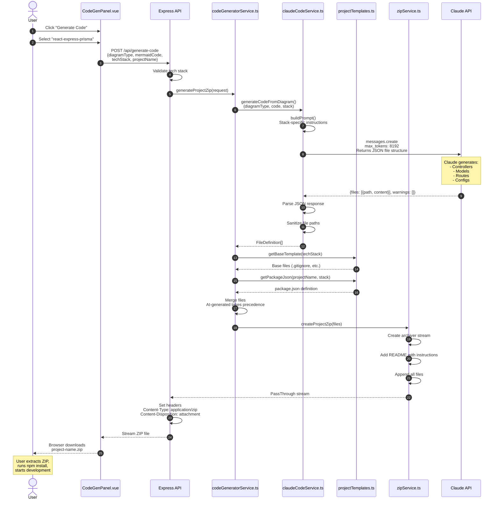
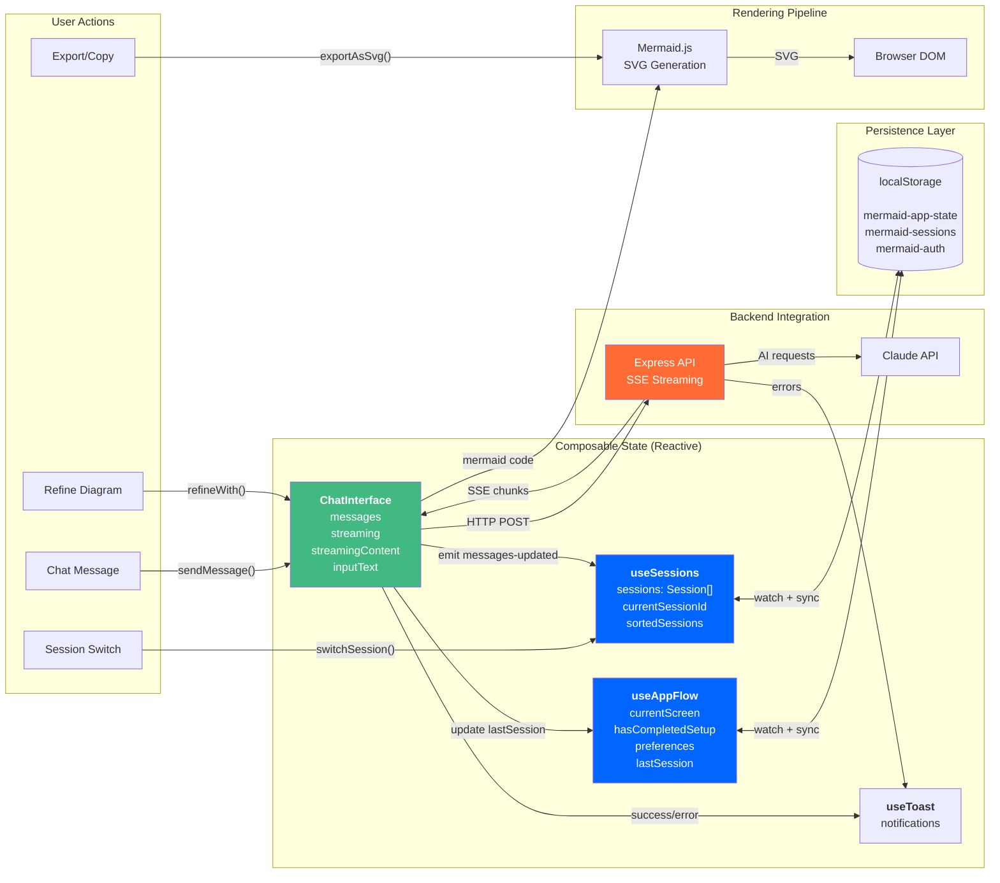
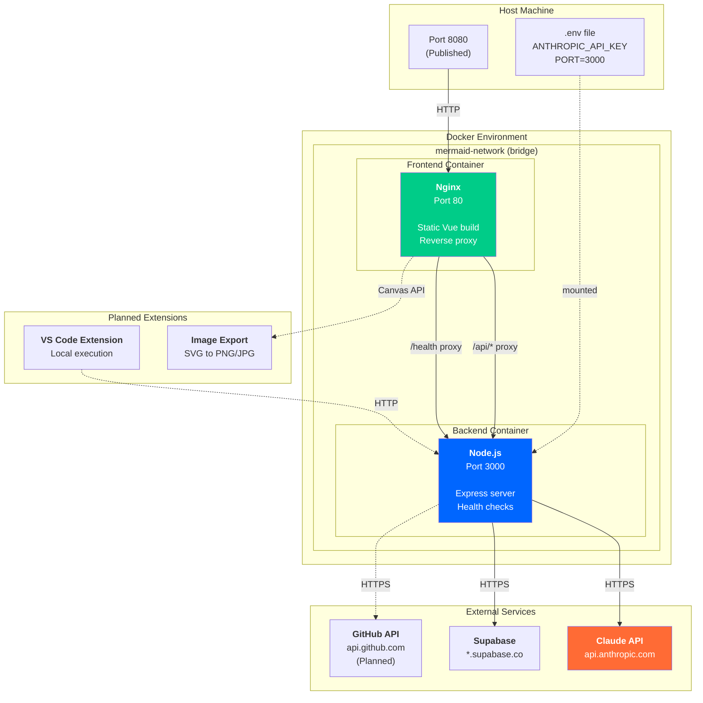
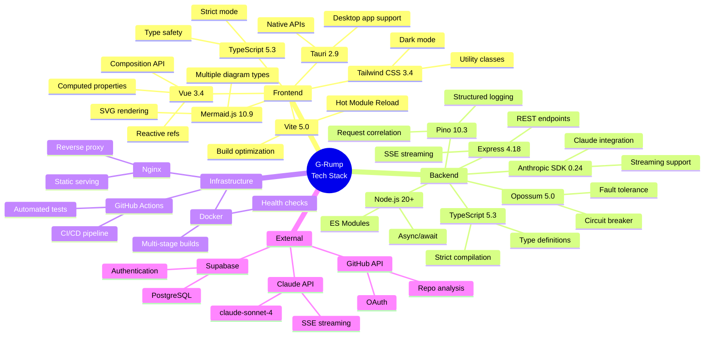
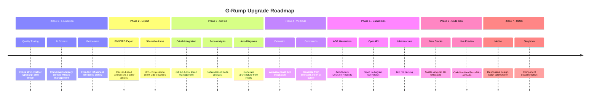

# G-Rump (Legacy) - System Architecture

> **⚠️ LEGACY DOCUMENT**: This document is outdated and references the old Vue.js frontend and Anthropic Claude as the primary LLM. The current stack uses **Svelte 5** for the frontend and **NVIDIA NIM (Kimi K2.5)** or **OpenRouter** as the LLM provider. For up-to-date architecture documentation, see [ARCHITECTURE.md](./ARCHITECTURE.md) and [OVERVIEW.md](./OVERVIEW.md).

> Comprehensive architectural documentation with visual diagrams covering current state and planned enhancements.

---

## Table of Contents

1. [System Context (C4 Level 1)](#1-system-context-c4-level-1)
2. [Container Diagram (C4 Level 2)](#2-container-diagram-c4-level-2)
3. [Frontend Component Architecture](#3-frontend-component-architecture)
4. [Backend Component Architecture](#4-backend-component-architecture)
5. [Main User Flow - Sequence Diagram](#5-main-user-flow---sequence-diagram)
6. [Code Generation Flow](#6-code-generation-flow)
7. [State Management & Data Flow](#7-state-management--data-flow)
8. [Deployment Architecture](#8-deployment-architecture)
9. [Technology Stack Overview](#9-technology-stack-overview)
10. [Planned Enhancements Roadmap](#10-planned-enhancements-roadmap)

---

## 1. System Context (C4 Level 1)

Shows the system boundaries and external actors/systems that interact with the G-Rump (Legacy).



---

## 2. Container Diagram (C4 Level 2)

Details the major containers (applications/services) and data stores within the system.



---

## 3. Frontend Component Architecture

Hierarchical view of Vue 3 components and composables.

```mermaid
flowchart TB
    subgraph root["Root"]
        App["<b>App.vue</b><br/>Screen Router<br/>Session Lifecycle"]
    end

    subgraph screens["Screen Components"]
        Splash["SplashScreen.vue<br/>Initial branding"]
        Auth["AuthScreen.vue<br/>API key validation"]
        Setup["OnboardingWizard.vue<br/>Preferences setup"]
        Resume["ResumeScreen.vue<br/>Continue session"]
        Main["Main App View<br/>Primary interface"]
    end

    subgraph mainComponents["Main View Components"]
        Header["MinimalHeader.vue<br/>Navigation"]
        Sidebar["SessionSidebar.vue<br/>Session list"]
        Chat["ChatInterface.vue<br/>Message handling"]
    end

    subgraph chatComponents["Chat Sub-Components"]
        Diagram["DiagramRenderer.vue<br/>Mermaid.js wrapper"]
        CodeGen["CodeGenPanel.vue<br/>ZIP download"]
        Refine["RefinementActions.vue<br/>Diagram modification"]
        Suggestions["SuggestionChips.vue<br/>Quick templates"]
        Feedback["FeedbackWidget.vue<br/>Rating system"]
    end

    subgraph composables["Composables (State Logic)"]
        useAppFlow["useAppFlow.ts<br/>Screen navigation"]
        useSessions["useSessions.ts<br/>Session CRUD"]
        useAuth["useAuth.ts<br/>Authentication"]
        useMermaid["useMermaid.ts<br/>Diagram rendering"]
        useCodeGen["useCodeGeneration.ts<br/>Code download"]
        useAnalytics["useAnalytics.ts<br/>Event tracking"]
    end

    subgraph planned["Planned Components"]
        GitHub["GitHubPanel.vue"]
        Share["ShareModal.vue"]
        Export["ExportModal.vue"]
        OpenAPI["OpenAPIPanel.vue"]
        Infra["InfrastructurePanel.vue"]
    end

    App --> Splash
    App --> Auth
    App --> Setup
    App --> Resume
    App --> Main
    
    Main --> Header
    Main --> Sidebar
    Main --> Chat
    
    Chat --> Diagram
    Chat --> CodeGen
    Chat --> Refine
    Chat --> Suggestions
    Chat --> Feedback
    
    Chat -.-> GitHub
    Chat -.-> Share
    Chat -.-> Export
    Chat -.-> OpenAPI
    Chat -.-> Infra

    App -.uses.-> useAppFlow
    Sidebar -.uses.-> useSessions
    Chat -.uses.-> useSessions
    Auth -.uses.-> useAuth
    Chat -.uses.-> useCodeGen
    Diagram -.uses.-> useMermaid

    style App fill:#42b883,color:#fff
    style Chat fill:#42b883,color:#fff
    style useSessions fill:#0066FF,color:#fff
    style useAppFlow fill:#0066FF,color:#fff
```



---

## 4. Backend Component Architecture

Express.js service layer and middleware organization.



---

## 5. Main User Flow - Sequence Diagram

Complete flow from user input to rendered diagram.



---

## 6. Code Generation Flow

From diagram to downloadable project ZIP.



---

## 7. State Management & Data Flow

How state flows through the application.



---

## 8. Deployment Architecture

Docker Compose orchestration and network topology.



### Docker Compose Services

```yaml
# docker-compose.yml structure
services:
  backend:
    build: ./backend
    container_name: mermaid-backend
    expose: ["3000"]
    healthcheck:
      test: ["CMD", "wget", "-q", "--spider", "http://localhost:3000/health"]
      interval: 30s
      timeout: 10s
      retries: 3
    restart: unless-stopped
    
  frontend:
    build: ./frontend
    container_name: mermaid-frontend
    ports: ["8080:80"]
    depends_on:
      backend:
        condition: service_healthy
    healthcheck:
      test: ["CMD", "wget", "-q", "--spider", "http://localhost:80/"]
      interval: 30s
      timeout: 10s
      retries: 3
    restart: unless-stopped

networks:
  mermaid-network:
    driver: bridge
```

---

## 9. Technology Stack Overview

Complete technology inventory with versions.



---

## 10. Planned Enhancements Roadmap

Visual overview of upgrade phases.



---

## API Endpoints Reference

### Current Endpoints

| Method | Path | Description |
|--------|------|-------------|
| POST | `/api/generate-diagram` | Non-streaming diagram generation |
| POST | `/api/generate-diagram-stream` | SSE streaming diagram generation |
| POST | `/api/generate-code` | Generate project ZIP |
| POST | `/auth/signup` | User registration |
| POST | `/auth/login` | User authentication |
| POST | `/auth/logout` | Sign out |
| GET | `/auth/me` | Current user info |
| GET | `/auth/status` | Auth configuration status |
| GET | `/health` | Liveness probe |
| GET | `/health/ready` | Readiness probe |
| GET | `/metrics` | Prometheus metrics |

### Planned Endpoints

| Method | Path | Description |
|--------|------|-------------|
| POST | `/api/github/auth` | Initiate GitHub OAuth |
| GET | `/api/github/callback` | OAuth callback handler |
| GET | `/api/github/repos` | List user repositories |
| POST | `/api/github/analyze` | Analyze repository |
| POST | `/api/openapi/to-diagram` | Convert OpenAPI to diagram |
| POST | `/api/diagram/to-openapi` | Convert diagram to OpenAPI |
| POST | `/api/generate-adr` | Generate ADR document |
| POST | `/api/infra/analyze` | Parse IaC files |

---

## File Structure Summary

```
grump/
├── frontend/                      # Vue 3 SPA
│   ├── src/
│   │   ├── App.vue               # Root component
│   │   ├── main.js               # Entry point
│   │   ├── components/           # UI components
│   │   │   ├── ChatInterface.vue
│   │   │   ├── DiagramRenderer.vue
│   │   │   └── ...
│   │   ├── composables/          # State logic
│   │   │   ├── useAppFlow.ts
│   │   │   ├── useSessions.ts
│   │   │   └── ...
│   │   └── types/                # TypeScript types
│   ├── vite.config.js
│   └── package.json
│
├── backend/                       # Express API
│   ├── src/
│   │   ├── index.js              # Server entry
│   │   ├── routes/               # API routes
│   │   │   ├── diagram.js
│   │   │   └── auth.js
│   │   ├── services/             # Business logic
│   │   │   ├── claudeService.ts
│   │   │   ├── intentParser.ts
│   │   │   └── ...
│   │   ├── middleware/           # Express middleware
│   │   └── prompts/              # AI prompt templates
│   └── package.json
│
├── docs/                          # Documentation
│   └── SYSTEM_ARCHITECTURE.md    # This file
│
├── docker-compose.yml            # Container orchestration
└── .github/workflows/            # CI/CD pipelines
```

---

## Quick Reference Cards

### Diagram Type Detection Keywords

| Diagram Type | Keywords |
|--------------|----------|
| Flowchart | flow, process, workflow, steps, decision |
| Sequence | sequence, interaction, request, response, API call |
| Class | class, object, inheritance, relationship, UML |
| ER | database, entity, schema, tables, relations |
| C4 Context | system context, high-level, external systems |
| C4 Container | containers, services, applications, deployment |
| C4 Component | components, modules, internal structure |

### Error Classification

| Error Type | HTTP Status | Retryable |
|------------|-------------|-----------|
| Circuit Open | 503 | Yes (after 60s) |
| Network Error | 503 | Yes |
| Auth Error | 401 | No |
| Rate Limit | 429 | Yes (after delay) |
| Extraction Failed | 422 | Yes (rephrase) |
| Timeout | 504 | Yes |
| Internal Error | 500 | Yes |

---

*Generated for G-Rump (Legacy) v1.0*
*Last Updated: January 2026*

