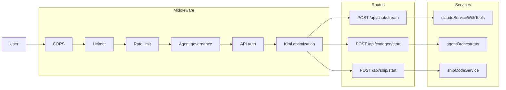
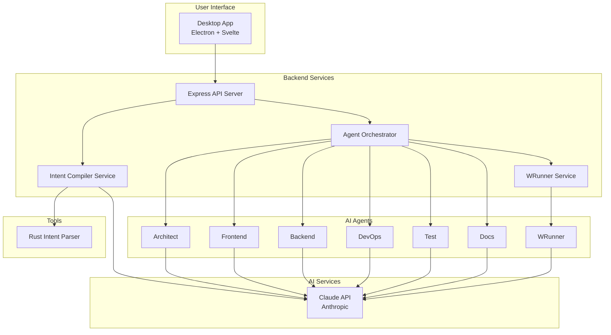
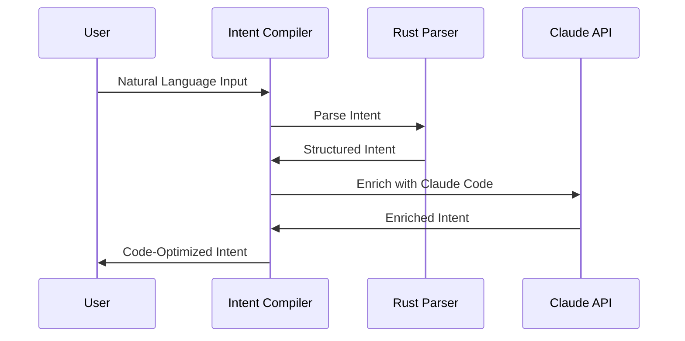
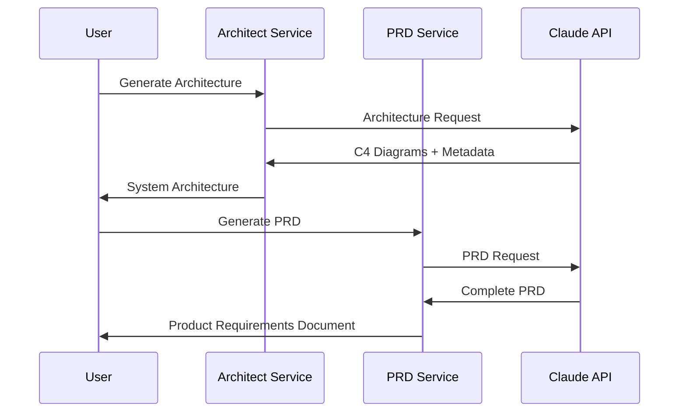
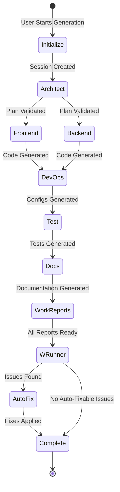
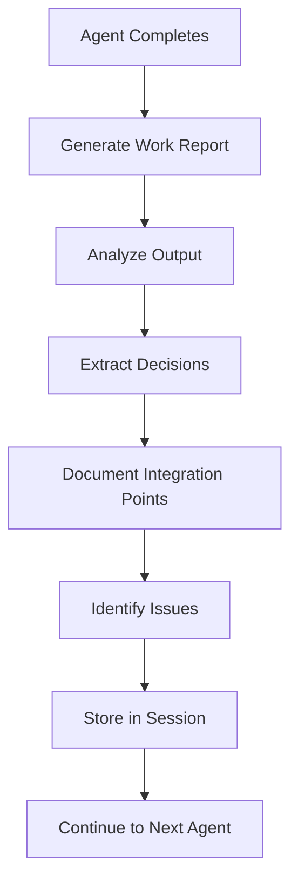
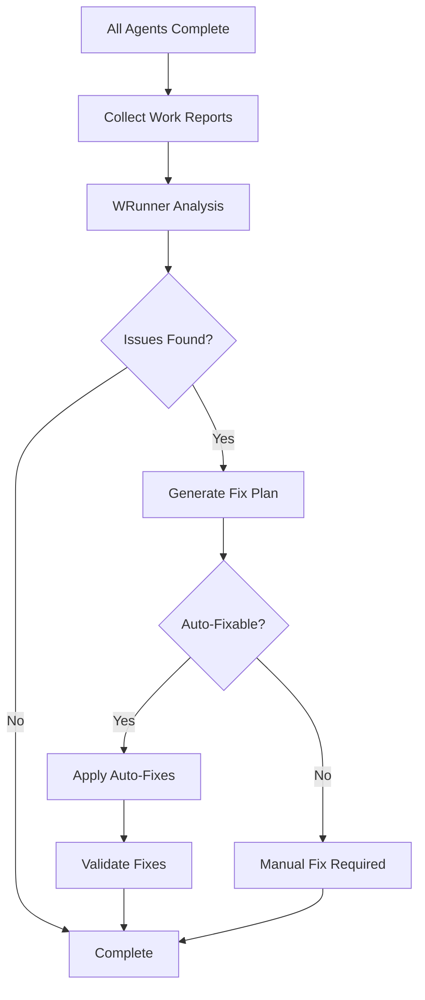
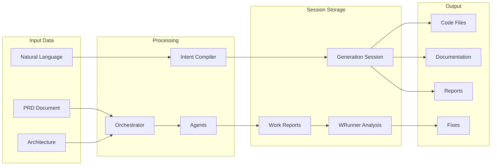
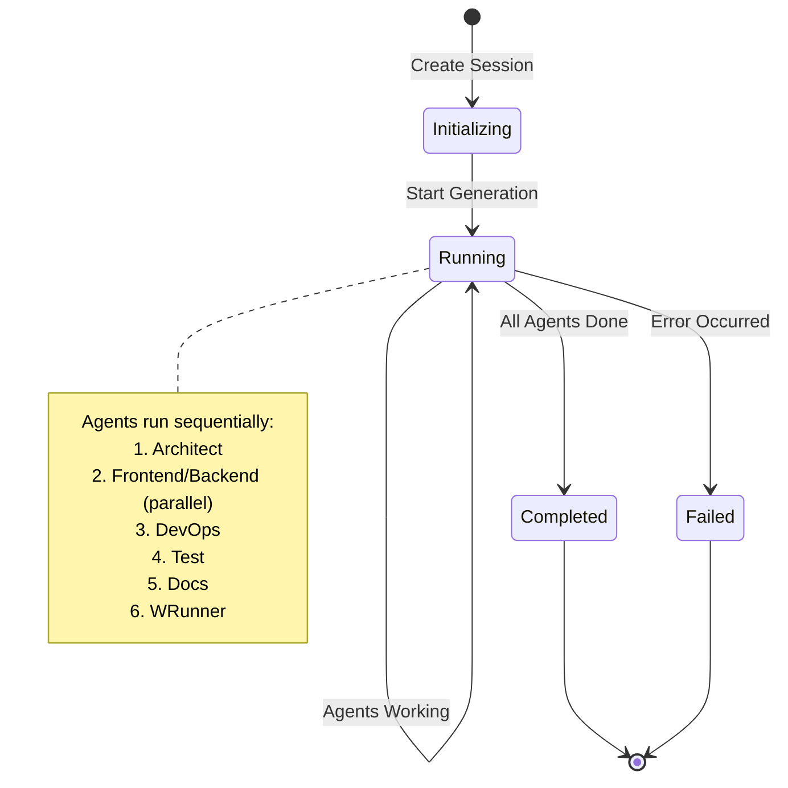
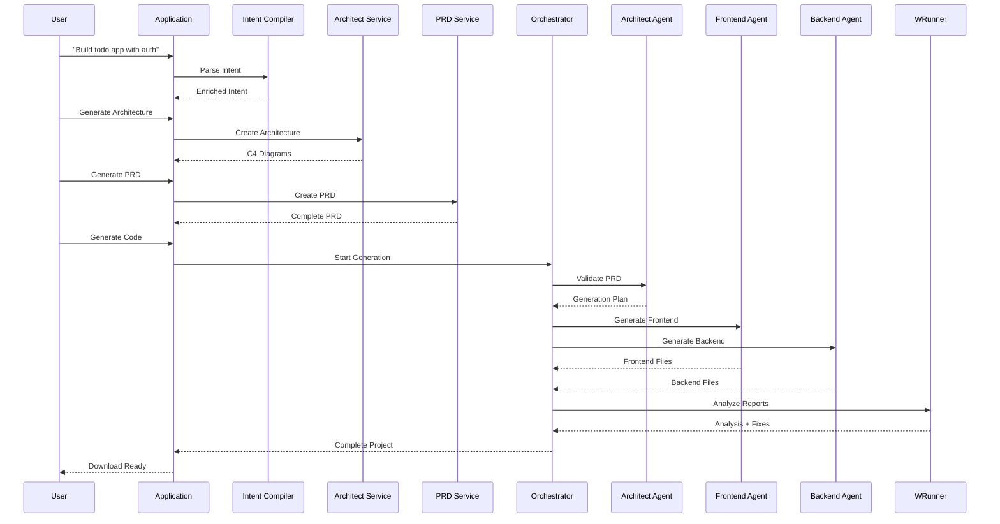

# How It Works

> **Version:** 2.1.0 | **Last Updated:** February 2026

This guide explains how G-Rump processes requests, from user input to generated code. For system architecture details, see [ARCHITECTURE.md](./ARCHITECTURE.md). For the agent system, see [AGENT_SYSTEM.md](./AGENT_SYSTEM.md). For the NVIDIA ecosystem (Nemotron, NIM, NGC, NeMo), see [NVIDIA_GOLDEN_DEVELOPER.md](./NVIDIA_GOLDEN_DEVELOPER.md).

## The Big Picture

**What G-Rump does:** You describe an app in natural language. G-Rump produces architecture diagrams, specs, PRDs, and code. You can also chat with an AI assistant that can read/write files, run commands, and use git.

**Three main flows:**

1. **Chat** — Conversational AI with tools (file read/write, bash, git). Design mode for diagrams; Code mode for coding assistance.
2. **Ship** — One-shot workflow: describe a project → design → spec → plan → generated code. Runs as a background job.
3. **Codegen** — Feed in PRD + architecture → multi-agent pipeline produces code. Can run as a job or inline.

**Architecture (one sentence):** A Svelte frontend (desktop or web) talks to a single Express backend. The backend calls LLMs (NVIDIA NIM/Nemotron, OpenRouter) and executes tools in the workspace. Ship and Codegen use a job queue (SQLite or Redis); the frontend polls status or uses SSE. **NVIDIA Golden Developer**: Full Nemotron + NIM stack, NGC-ready deployment, NeMo Curator synthetic data, NeMo Framework fine-tuning, and NIM-aligned observability.

**Key entry points:**
- `backend/src/index.ts` — API server bootstrap
- `frontend/src/App.svelte` — UI root
- `backend/src/routes/chat.ts` — Chat API
- `backend/src/routes/ship.ts` — Ship API

---

## Multi-Agent Orchestration

G-Rump is **multi-agent–first**. Two complementary orchestration paths run specialized AI agents:

### 1. Codegen Pipeline

The [agentOrchestrator](../backend/src/services/agentOrchestrator.ts) takes PRD + architecture and coordinates:
- Architect, Frontend, Backend, DevOps, Test, Docs agents
- Wired via [codegen routes](../backend/src/routes/codegen.ts) and [shipModeService](../backend/src/services/shipModeService.ts)

### 2. Kimi Swarm

The [swarmService](../backend/src/services/swarmService.ts) (`POST /api/agents/swarm`) provides:
- Kimi decomposes prompts into subtasks
- Specialist agents (arch, frontend, backend, devops, test, docs, ux, security, perf, a11y, data, review)
- Dependency ordering and concurrency
- Final summary streamed via SSE

### Agent Quality

Agent quality is measured via offline evals:

```bash
cd backend
npm run evals  # Requires running backend at EVAL_BASE_URL
```

Results are written to `frontend/test-results/agent-evals.json`. CI runs evals on PRs and main.

---

## Request Pipeline (Middleware Order)

Every API request passes through this stack (see [backend/src/index.ts](../backend/src/index.ts)):

1. **CORS** – Allowed origins from `CORS_ORIGINS`
2. **Helmet** – Security headers (CSP in production)
3. **Compression** – Response compression
4. **express.json** – JSON body parsing
5. **requestTimeout** – Route-level timeouts (streaming responses skip where applicable)
6. **Rate limiting** – On `/api` and `/auth`; per-endpoint limits (e.g. chat 10/min, codegen 5/min, ship 5/min) and global fallback; Redis-backed when `REDIS_HOST` set
7. **Agent governance** – On `/api`; blocks or governs Moltbot/OpenClaw-style agents (see [agentGovernance.ts](../backend/src/middleware/agentGovernance.ts))
8. **API auth** – On `/api`; when `REQUIRE_AUTH_FOR_API=true`, chat/ship/codegen require auth; else optional
9. **Kimi optimization** – On `/api/chat`, `/api/ship`, `/api/codegen`, `/api/plan`; auto-routing and cost tracking
10. **Route handlers** – Each route may add its own validation (e.g. validateShipRequest, validateCodegenRequest, suspicious-pattern check for chat)

**Timeouts** (from [timeout.ts](../backend/src/middleware/timeout.ts)): chat/stream 10 min, codegen 5 min, ship 5 min; streaming responses skip timeout where applicable.

---

## Route Checklist (Chat, Codegen, Ship)

| Route | Method | Validation | Flow |
|-------|--------|------------|------|
| **POST /api/chat/stream** | POST | Message count/length/format; suspicious-pattern check on `messages[].content` (when `BLOCK_SUSPICIOUS_PROMPTS=true`) | chatRoutes → claudeServiceWithTools → llmGateway + toolExecutionService |
| **POST /api/codegen/start** | POST | validateCodegenRequest, handleCodegenValidationErrors (no user free-text for suspicious check) | codegenRoutes → agentOrchestrator (initializeSession, executeCodeGeneration); serverless: jobQueue enqueue |
| **POST /api/ship/start** | POST | validateShipRequest, handleShipValidationErrors (projectDescription length + suspicious patterns) | shipRoutes → shipModeService.startShipMode; then POST /api/ship/:id/execute enqueues job → worker runs design→spec→plan→code |

---

## How Chat, Codegen, and Ship Work

### Chat (tool-enabled streaming)

- **Flow**: `POST /api/chat/stream` → [chatRoutes](../backend/src/routes/chat.ts) → [claudeServiceWithTools](../backend/src/services/claudeServiceWithTools.ts) → [llmGateway](../backend/src/services/llmGateway.ts) (streaming) and tool execution (bash, file_read, file_write, etc.) via [toolExecutionService](../backend/src/services/toolExecutionService.ts). Response is SSE.
- **Body**: `messages`, optional `workspaceRoot`, `mode`, `provider`/`modelId`, etc. Validation: message count/length/format; suspicious-pattern check on message content (when `BLOCK_SUSPICIOUS_PROMPTS=true`).

### Codegen (multi-agent code generation)

- **Flow**: `POST /api/codegen/start` → [validateCodegenRequest](../backend/src/middleware/validator.ts) + [codegenRoutes](../backend/src/routes/codegen.ts) → [agentOrchestrator](../backend/src/services/agentOrchestrator.ts) (`initializeSession` / `initializeSessionMulti`, then `executeCodeGeneration` or `executeCodeGenerationMulti`). Serverless: [jobQueue](../backend/src/services/jobQueue.ts) enqueues; worker runs codegen. Response: sessionId, agent status; client polls status or uses events.
- **Body**: `prd`, `architecture`, optional `preferences`; or multi-PRD `prds`, `architecture`, etc. Validation: validateCodegenRequest.

### Ship (design → spec → plan → code)

- **Flow**: `POST /api/ship/start` → [validateShipRequest](../backend/src/middleware/validator.ts) + [shipRoutes](../backend/src/routes/ship.ts) → [shipModeService](../backend/src/services/shipModeService.ts) `startShipMode`. Then `POST /api/ship/:sessionId/execute` enqueues a job ([jobQueue](../backend/src/services/jobQueue.ts)); worker runs design → spec → plan → code phases. Session status via `GET /api/ship/:sessionId`.
- **Body for start**: `projectDescription`, optional `preferences`. Validation: projectDescription length and suspicious patterns.

### Intent-RAG Fusion

When RAG context is used (architecture, spec, plan, chat with `RAG_CONTEXT_ENABLED`, ship), the backend uses [Intent-RAG Fusion (IRF)](./INTENT_RAG_FUSION.md): it parses the user query or project description with the Intent Compiler (Rust or fallback), expands the search query with features, tech stack, and data flows, then retrieves and optionally reranks chunks. When enriching intent via LLM, the service injects RAG-retrieved excerpts into the enrichment prompt so extracted intent aligns with the knowledge base. See [INTENT_RAG_FUSION.md](./INTENT_RAG_FUSION.md) for configuration (`RAG_INTENT_GUIDED`, `INTENT_RAG_AUGMENT_ENRICH`) and how to disable.

### Request path diagram



---

## Error handling and recovery

- **Backend:** Unhandled errors are caught by the global error handler ([backend/src/index.ts](../backend/src/index.ts)). It logs the error with `correlationId` and `requestId`, then returns 500 with a generic message (and details in development). Routes use try/catch and validation (e.g. [validator.ts](../backend/src/middleware/validator.ts)); failed validation returns 400 with a structured message. Circuit breakers and retries are used for external calls (e.g. LLM gateway, resilience layer).
- **Frontend:** API errors are surfaced via toasts and the [ErrorRecovery](../frontend/src/components/ErrorRecovery.svelte) component where applicable. User-facing messages should be clear and, where possible, suggest recovery (e.g. "Check your API key" or "Retry in a few seconds").
- **Recovery:** For transient failures (e.g. network, rate limit), the client can retry. For auth errors (401), the user should re-authenticate. For validation errors (400), the user should correct input. Server errors (500) are logged with correlation ID for support; the user sees a generic message and can retry or contact support.

---

## High-Level Architecture



## Complete Workflow

### Step 1: Intent Parsing



**What Happens**:
1. User provides natural language description
2. Rust parser extracts basic structure (actors, features, data flows)
3. Claude Code enrichment adds:
   - Code patterns (REST, GraphQL, microservices, etc.)
   - Architecture hints
   - Optimization opportunities
   - Code quality requirements

### Step 2: Architecture & PRD Generation



**What Happens**:
1. User requests architecture generation
2. System creates C4 diagrams (Context, Container, Component)
3. User requests PRD generation from architecture
4. System creates comprehensive PRD with features, user stories, APIs, data models

### Step 3: Code Generation Pipeline



**Detailed Agent Flow**:

1. **Architect Agent**:
   - Validates PRD completeness
   - Creates generation plan
   - Defines task dependencies
   - Identifies risks and mitigations
   - Generates work report

2. **Frontend Agent** (runs in parallel with Backend):
   - Generates Vue/React components
   - Creates routing structure
   - Sets up state management
   - Implements API clients
   - Generates work report

3. **Backend Agent** (runs in parallel with Frontend):
   - Generates API endpoints
   - Creates database models
   - Implements business logic
   - Adds authentication
   - Generates work report

4. **DevOps Agent**:
   - Creates Dockerfiles
   - Generates docker-compose.yml
   - Creates CI/CD workflows
   - Sets up environment configs
   - Generates work report

5. **Test Agent**:
   - Generates unit tests
   - Creates integration tests
   - Generates E2E tests
   - Sets up test infrastructure
   - Generates work report

6. **Docs Agent**:
   - Generates README
   - Creates API documentation
   - Generates setup guides
   - Creates architecture docs
   - Generates work report

### Step 4: Design Mode - Work Reports

After each agent completes, a comprehensive work report is automatically generated:



**Work Report Contains**:
- Summary of work completed
- Files generated with purposes
- Architecture decisions and rationale
- Code quality metrics
- Integration points
- Testing strategy
- Known issues
- Recommendations

### Step 5: WRunner Quality Assurance

After all agents complete, WRunner analyzes all work reports:



**WRunner Analysis**:
- Identifies missing components
- Detects inconsistencies
- Finds integration gaps
- Identifies quality concerns
- Detects security issues
- Generates fix recommendations

**Auto-Fix Process**:
- Determines which issues are auto-fixable
- Applies fixes automatically
- Validates fixes were applied
- Reports fix status

## Data Flow



## Session Lifecycle



## How to Use

### 1. Start the Application

```bash
# Development
start-app.bat

# Or manually
cd backend && npm start

# Desktop app (Electron)
cd frontend && npm run electron:dev
```

### 2. Create a Project

1. **Describe Your Project**: Enter natural language description
   - Example: "Build a todo app with user authentication and real-time sync"

2. **Generate Architecture**: Click "Generate Architecture"
   - System creates C4 diagrams
   - Review and adjust if needed

3. **Generate PRD**: Click "Generate PRD"
   - System creates comprehensive PRD
   - Review features, user stories, APIs

4. **Start Code Generation**: Click "Generate Code"
   - Select preferences (framework, runtime, database)
   - System starts agent orchestration

### 3. Monitor Progress

- Watch agent status in real-time
- Each agent shows: pending → running → completed
- View generated files as they're created

### 4. Review Results

After completion, you'll have:

1. **Generated Code**: Complete project files
2. **Work Reports**: Detailed reports from each agent
3. **WRunner Analysis**: Quality assurance report
4. **Applied Fixes**: List of auto-fixes applied

### 5. Download Project

- Click "Download Project"
- System creates ZIP file with:
  - All generated code
  - Documentation
  - Configuration files
  - Work reports
  - WRunner analysis

## Example: Complete Flow



## Key Features Explained

### Claude Code Optimization

All prompts are optimized for Claude Code, which means:
- **Type Safety**: Strict typing throughout
- **Best Practices**: Industry-standard patterns
- **Code Quality**: High-quality, maintainable code
- **Documentation**: Self-documenting code
- **Testing**: Comprehensive test coverage
- **Security**: Security-first approach

### Design Mode

Design mode automatically generates work reports for each agent:
- **Transparency**: See what each agent did
- **Traceability**: Track decisions and rationale
- **Quality**: Identify issues early
- **Learning**: Understand agent reasoning

### WRunner Quality Assurance

WRunner provides automatic quality assurance:
- **Comprehensive Analysis**: Checks all aspects
- **Issue Detection**: Finds problems automatically
- **Auto-Fixes**: Applies fixes when possible
- **Recommendations**: Suggests improvements

## Best Practices

1. **Be Specific**: Detailed descriptions yield better results
2. **Review Architecture**: Ensure architecture matches your needs
3. **Check PRD**: Verify all features are captured
4. **Review Work Reports**: Understand agent decisions
5. **Address WRunner Issues**: Fix critical issues before deployment
6. **Iterate**: Refine and regenerate as needed

## Troubleshooting

### Agents Fail

- Check API key is valid
- Review agent error messages
- Check network connectivity
- Verify PRD is complete

### Missing Files

- Check WRunner analysis for missing components
- Review work reports for gaps
- Regenerate with more specific PRD

### Quality Issues

- Review WRunner analysis
- Check work reports for known issues
- Apply recommended fixes
- Regenerate if needed

## Next Steps

- **[AGENT_SYSTEM.md](./AGENT_SYSTEM.md)** — Detailed agent documentation
- **[ARCHITECTURE.md](./ARCHITECTURE.md)** — System architecture and intent compiler details
- **[API.md](./API.md)** — Complete API reference
- **[TROUBLESHOOTING.md](./TROUBLESHOOTING.md)** — Common issues and solutions
