# 🚀 G-Rump Ship Plan — Kimi's Week

> **Goal:** Ship G-Rump v2.1.0 by **Friday Feb 14, 2026**
> **Current State:** 77/100 — strong foundation, needs proof-of-work and polish
> **Target:** 90+ and publicly launchable

---

## The 5-Day Battle Plan

```mermaid
gantt
    title Ship Week — Feb 10–14
    dateFormat YYYY-MM-DD
    section Day 1
    Code Quality & Refactoring        :d1, 2026-02-10, 1d
    section Day 2
    Docs Cleanup & Test Hardening      :d2, 2026-02-11, 1d
    section Day 3
    Production Readiness & Deploy      :d3, 2026-02-12, 1d
    section Day 4
    Demo, Screenshots & Marketing      :d4, 2026-02-13, 1d
    section Day 5
    Launch Day                         :d5, 2026-02-14, 1d
```



---

## 📅 Day 1 — Monday: Code Quality Blitz

> **Theme:** *Kill mega-components, remove duplication, prove the build is clean.*
> **Points:** 77 → 82 (+5)

### Morning Block (9am–12pm)

#### Task 1.1: Extract tool-call duplication in `llmGatewayStreams.ts`
- **File:** `backend/src/services/ai-providers/llmGatewayStreams.ts`
- **What:** Tool-call emission logic is copy-pasted 3× (~lines 193-214, 262-284, 291-313). Extract into a single `emitPendingToolCalls()` generator function
- **Time:** ~30 min
- **Verify:**
  ```bash
  cd backend && npm run type-check && npm test
  ```

#### Task 1.2: Decompose `RefactoredChatInterface.svelte`
- **File:** `frontend/src/components/RefactoredChatInterface.svelte` (2038 lines → ~400)
- **Extract these new components:**

| New Component | What It Contains | Est. Lines |
|---|---|---|
| `ChatStreamingStatus.svelte` | Claude Code-style file activity tracker, streaming status display | ~150 |
| `ChatQuestionDetector.svelte` | Question parsing, option extraction, question modal | ~200 |
| `ChatMessageList.svelte` | Message rendering loop, scroll behavior, auto-scroll | ~500 |
| `ChatModelSelector.svelte` | Model picker dropdown and state | ~100 |
| `ChatImageHandler.svelte` | Image attachment state, NIM detection | ~100 |

- **Time:** ~2 hours
- **Verify:**
  ```bash
  cd frontend && npm run type-check && npm run build
  ```

### Afternoon Block (1pm–5pm)

#### Task 1.3: Reduce `lib.rs` in intent-compiler
- **File:** `intent-compiler/src/lib.rs` (1291 lines → ~400)
- **What:** Move keyword arrays (`DATA_FLOW_KEYWORDS`, `TECH_STACK_KEYWORDS`, etc.) to new `keywords.rs`. Consolidate `pub use` re-exports into `prelude.rs`
- **Time:** ~1 hour
- **Verify:**
  ```bash
  cd intent-compiler && cargo test --lib && cargo clippy
  ```

#### Task 1.4: Full build verification
- Run the complete check suite and fix anything that breaks:
  ```bash
  npm run check-all
  npm test
  ```
- **Time:** ~1 hour (buffer for fixing issues)

### ✅ Day 1 Exit Criteria
- [ ] `llmGatewayStreams.ts` has zero duplicated tool-call blocks
- [ ] `RefactoredChatInterface.svelte` is under 500 lines
- [ ] `lib.rs` is under 500 lines
- [ ] `npm run check-all` passes clean
- [ ] `npm test` passes clean
- [ ] Commit: `refactor: decompose mega-components and remove duplication`

---

## 📅 Day 2 — Tuesday: Docs & Testing

> **Theme:** *Prove everything works. Kill doc sprawl. Add missing tests.*
> **Points:** 82 → 90 (+8)

### Morning Block (9am–12pm)

#### Task 2.1: Archive stale docs
Move these to `docs/archive/`:

| File | Reason |
|---|---|
| `DOCUMENTATION_OVERHAUL_REPORT.md` | Meta-doc, not useful |
| `CODE_GENERATION_AND_ASCII_CHARTS_PLAN.md` | Plan doc, already executed |
| `IMPLEMENTATION_CHECKLIST.md` | Completed checklist |
| `IMPLEMENTATION_SUMMARY.md` | One-time summary |
| `KIMI_OPTIMIZATIONS.md` | Fold into CHANGELOG |
| `MOBILE_BLOB_FIXES.md` | Bug fix notes, fold into CHANGELOG |
| `NVIDIA_OPTIMIZATION_COMPLETE.md` | Completed task |
| `OPTIMIZATION_SUMMARY.md` | Completed task |
| `BEFORE_AFTER.md` | Archive |
| `BRAND_ACTION_PLAN.md` | Planning, done |
| `BRAND_AUDIT.md` | One-time audit |

- **Time:** ~30 min
- **Verify:** Links in remaining docs still work

#### Task 2.2: Consolidate overlapping docs

| Keep | Merge Into It |
|---|---|
| `API.md` | `API_AND_EXTERNAL_SETUP.md`, `CURSOR_GRUMP_API.md` |
| `GETTING_STARTED.md` | `ENV_SETUP.md`, `LINUX_SETUP.md` |
| `INTEGRATIONS.md` | `INTEGRATIONS_SETUP.md`, `OAUTH_INTEGRATIONS_SETUP.md` |
| `OVERVIEW.md` | `HOW_IT_WORKS.md` |

- **Time:** ~1 hour

#### Task 2.3: Update `docs/README.md` index
- Make sure every remaining doc is linked with purpose + audience
- Remove links to archived/deleted docs
- **Time:** ~30 min

### Afternoon Block (1pm–5pm)

#### Task 2.4: Add tests for new chat sub-components
After Day 1 decomposition, create tests using `@testing-library/svelte` + `vitest`:

| Test File | What To Test |
|---|---|
| `ChatStreamingStatus.test.ts` | Renders file activity, shows/hides streaming states |
| `ChatQuestionDetector.test.ts` | Extracts options, detects numbered questions |
| `ChatMessageList.test.ts` | Renders messages, handles scroll, shows hidden count |

- **Time:** ~1.5 hours
- **Verify:**
  ```bash
  cd frontend && npm run test:run
  ```

#### Task 2.5: Add property-based Rust tests
- Add `proptest` to `Cargo.toml`
- Add fuzz tests for `parse_intent` (never panics) and `extract_actors` (deterministic)
- **Time:** ~1 hour
- **Verify:**
  ```bash
  cd intent-compiler && cargo test --lib
  ```

#### Task 2.6: Run full test coverage and capture results
```bash
cd backend && npm run test:coverage
cd ../frontend && npm run test:coverage
cd ../intent-compiler && cargo test --lib
```
- Screenshot/save all results
- **Time:** ~30 min

### ✅ Day 2 Exit Criteria
- [ ] `docs/` directory reduced from 97 to ~35 essential docs
- [ ] All doc cross-links verified working
- [ ] 3+ new component tests passing
- [ ] Property-based Rust tests passing
- [ ] Full coverage report saved
- [ ] Commit: `docs: consolidate docs, add component & property tests`

---

## 📅 Day 3 — Wednesday: Production Readiness & Deploy

> **Theme:** *Make it production-real. Deploy to a real URL.*
> **Points:** 90 → 95 (+5)

### Morning Block (9am–12pm)

#### Task 3.1: Close production checklist items
- **File:** `docs/PRODUCTION.md` — check off every item:

| Item | Action |
|---|---|
| `BLOCK_SUSPICIOUS_PROMPTS=true` | Set in `.env.production` |
| `REQUIRE_AUTH_FOR_API=true` | Set in `.env.production` |
| `SECURITY_STRICT_PROD=true` | Set in `.env.production` |
| `CORS_ORIGINS` | Set to production domains |
| `ALLOWED_HOSTS` | Set to production domains |
| `OUTPUT_FILTER_PII=true` | Set in `.env.production` |
| `OUTPUT_FILTER_HARMFUL=true` | Set in `.env.production` |
| Stripe, Twilio, QStash | Mark `[N/A]` if not using |

- **Time:** ~1 hour

#### Task 3.2: Validate error handling in production mode
```bash
cd backend
NODE_ENV=production npm run build && npm run start:prod
# In another terminal:
curl http://localhost:3000/health/ready
curl http://localhost:3000/api/nonexistent  # Should return sanitized error
```
- Verify: No stack traces, no internal details in error responses
- **Time:** ~30 min

#### Task 3.3: Verify health endpoints
- `GET /health/quick` → basic ok
- `GET /health/ready` → DB, Redis, AI providers status
- `GET /health/detailed` → full diagnostic
- `GET /metrics` → Prometheus format
- **Time:** ~30 min

### Afternoon Block (1pm–5pm)

#### Task 3.4: Deploy backend to Vercel (or Render)
Target: Get a live URL at `https://api.g-rump.com` or similar

```bash
# Option A: Vercel
cd backend && npx vercel --prod

# Option B: Render (render.yaml already exists)
# Push to GitHub → Render auto-deploys
```

- Set all env vars in hosting dashboard
- Verify health endpoint responds
- **Time:** ~1 hour

#### Task 3.5: Deploy frontend / marketing site
```bash
# Marketing site
cd marketing-site && npx vercel --prod

# Or docs site
cd docs-site && npx vercel --prod
```

- Point `g-rump.com` DNS to it
- **Time:** ~1 hour

#### Task 3.6: Build Electron installer
```bash
cd frontend && npm run electron:build
```
- Verify installer creates `G-Rump.exe` in `frontend/electron-dist/`
- Test: Install → Launch → Connect to backend
- **Time:** ~1 hour

#### Task 3.7: Push to GitHub & verify CI
```bash
git add -A
git commit -m "chore: production readiness and deploy prep"
git push origin main
```
- Watch GitHub Actions — all checks should be green ✅
- Screenshot the green CI badge
- **Time:** ~30 min

### ✅ Day 3 Exit Criteria
- [ ] Production env vars documented and set
- [ ] Error responses are sanitized in production mode
- [ ] Health endpoints return meaningful status
- [ ] Live backend URL responding
- [ ] Marketing/docs site live
- [ ] Electron installer builds successfully
- [ ] GitHub CI is green (screenshot!)
- [ ] Commit: `deploy: production config, live endpoints`

---

## 📅 Day 4 — Thursday: Demo, Screenshots & Marketing

> **Theme:** *Make it look incredible. Record the demo. Prepare launch materials.*

### Morning Block (9am–12pm)

#### Task 4.1: Take real screenshots
Replace any placeholder images in `README.md`:

| Screenshot | Shows |
|---|---|
| `screenshot-dashboard.png` | Main chat UI with a conversation |
| `screenshot-architecture.png` | Architecture mode with Mermaid diagram |
| `screenshot-code.png` | Code mode with tool calling in action |
| `screenshot-ship.png` | SHIP workflow in progress |

- Save to `docs/assets/`
- **Time:** ~45 min

#### Task 4.2: Create demo script
Write `docs/DEMO.md` — a 5-minute step-by-step demo:

1. Launch app, show the boot screen
2. Chat: "Build a todo app with React and Express"
3. Show SHIP workflow: Design → Spec → Plan → Code
4. Show Mermaid diagram rendering and export
5. Show Code Mode: file read, command execution
6. Show G-Agent quality analysis

- **Time:** ~30 min

#### Task 4.3: Record demo video
- Screen record walking through DEMO.md
- Target: 2-3 minutes, with captions
- Save to `docs/assets/demo-v2.1.mp4`
- **Time:** ~1.5 hours (including retakes + editing)

### Afternoon Block (1pm–5pm)

#### Task 4.4: Update README with real badges
Verify all badge links point to the actual GitHub repo (not placeholder):
```markdown
[]
[]
```

#### Task 4.5: Create launch email template
- Subject: "G-Rump is Live — The AI Product Operating System"
- Include: 3 screenshots, key features, CTA to try live demo
- **Time:** ~45 min

#### Task 4.6: Prepare social media posts

| Platform | Content | Status |
|---|---|---|
| Twitter/X | 280-char announcement + screenshot | Draft ✅ (in marketing/) |
| LinkedIn | Long-form post with architecture story | Draft ✅ |
| Product Hunt | Full listing with gallery | Prepare |
| Hacker News | "Show HN: G-Rump — Architecture-as-Code AI platform" | Draft |
| Reddit | r/SaaS, r/webdev, r/programming | Draft |
| Discord | Community announcement | Draft |

- **Time:** ~1.5 hours

#### Task 4.7: Final smoke test
Run through every feature manually:
- [ ] Chat sends and receives messages
- [ ] SHIP workflow: Describe → Architecture → Spec → Plan → Code
- [ ] Mermaid diagrams render as SVG
- [ ] Code mode: file read/write, bash execution
- [ ] Model switching works
- [ ] Settings persist
- [ ] GitHub auth works
- [ ] Session management (create, rename, delete)

### ✅ Day 4 Exit Criteria
- [ ] 4+ real screenshots in `docs/assets/`
- [ ] Demo video recorded and linked
- [ ] Launch email template ready
- [ ] All social posts drafted
- [ ] Product Hunt listing prepared
- [ ] Full smoke test passes
- [ ] Commit: `docs: demo, screenshots, launch materials`

---

## 📅 Day 5 — Friday: LAUNCH DAY 🚀

> **Theme:** *Ship it. Tell the world.*

### Pre-Launch (6am–9am)

- [ ] Final smoke test on production URL
- [ ] Monitoring dashboards up (Prometheus/Grafana or health endpoints)
- [ ] Support channels ready (GitHub Issues, Discord)
- [ ] All team logged into social accounts

### Launch (9am CST)

- [ ] **GitHub:** Publish release `v2.1.0` with release notes
- [ ] **Marketing site:** Switch to "Live" mode
- [ ] **Product Hunt:** Submit listing (12:01 AM PST posting is ideal)
- [ ] **Hacker News:** "Show HN" post
- [ ] **Twitter/X:** Launch tweet with screenshot
- [ ] **LinkedIn:** Long-form post
- [ ] **Reddit:** Posts in r/SaaS, r/webdev
- [ ] **Discord/Telegram:** Community announcements
- [ ] **Launch email:** Send to full list

### Monitor (all day)

- Check error rates every hour
- Respond to social media mentions and comments
- Fix any critical bugs immediately
- Track: website visitors, GitHub stars, sign-ups, API calls

### End of Day

- [ ] Thank early supporters
- [ ] Collect feedback
- [ ] Plan first post-launch update
- [ ] Team retrospective: What worked? What didn't?

---

## 📊 Score Progression

| Day | Focus | Expected Score |
|-----|-------|---------------|
| Start | Current state | **77** |
| Day 1 | Code quality + refactoring | **82** |
| Day 2 | Docs + testing | **90** |
| Day 3 | Production readiness + deploy | **95** |
| Day 4 | Demo, polish, marketing | **98** |
| Day 5 | Launch | **100** 🎉 |

---

## 🔑 Key Files Quick Reference

| Area | Key Files |
|------|-----------| 
| **Backend entry** | `backend/src/index.ts` |
| **Frontend entry** | `frontend/src/App.svelte` |
| **Chat UI** | `frontend/src/components/RefactoredChatInterface.svelte` |
| **LLM Gateway** | `backend/src/services/ai-providers/llmGatewayStreams.ts` |
| **Intent Compiler** | `intent-compiler/src/lib.rs` |
| **Config** | `backend/.env.example` |
| **CI** | `.github/workflows/ci.yml` |
| **Docker** | `docker-compose.yml`, `Dockerfile.backend` |
| **Deploy** | `deploy/`, `render.yaml`, `vercel.json` |
| **Package root** | `package.json` (scripts: `dev`, `build`, `check-all`, `test`) |

---

## 🛟 Emergency Playbook

| Problem | Fix |
|---------|-----|
| Build fails | `npm run check-all` to find the error, fix type/lint issues |
| Tests fail | `npm test` — check backend and frontend independently |
| Backend won't start | Check `.env` exists, check port 3000 isn't in use |
| Frontend blank | Clear Vite cache: `rm -rf node_modules/.vite` |
| Electron crash | Check `frontend/electron-dist/` logs |
| CI red | Check GitHub Actions logs, most likely type-check or lint |
| Redis unavail. | App degrades gracefully — in-memory fallback, just note in docs |

---

> **Daily ritual:** Start each morning by running `npm run check-all && npm test`. End each day with a clean commit. This keeps the ship moving forward without accumulating breakage.

---

**Go get it, Kimi. You've got this. 💪**
